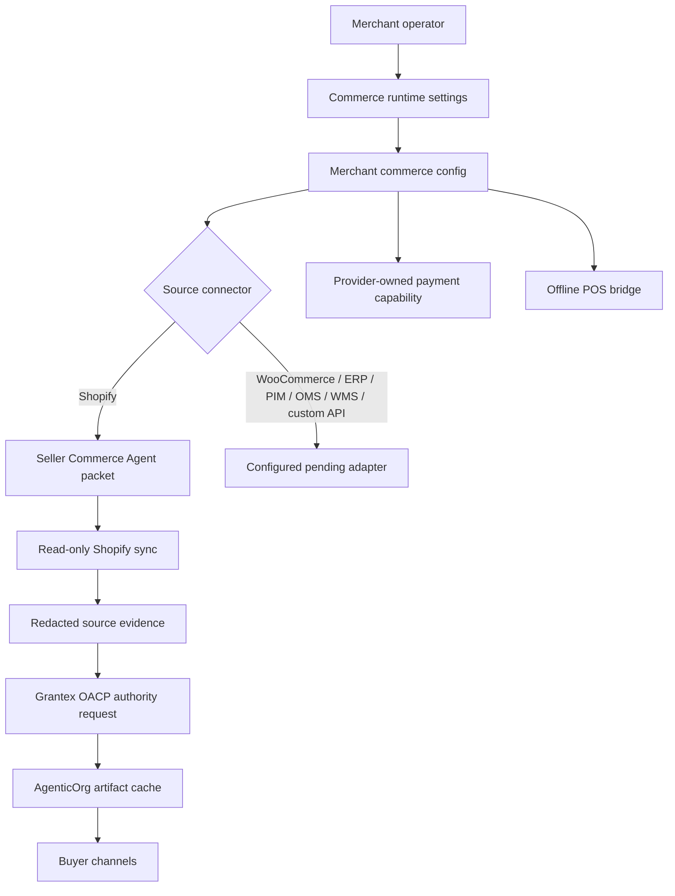

# Merchant Commerce Configuration

Canonical end-to-end flow: [OACP end-user flow](end-user-flow.md).

Merchant commerce configuration is tenant, merchant, and seller-agent scoped. It records how a merchant wants AgenticOrg to connect to source systems, buyer channels, provider-owned payment rails, public publishing, and Offline POS handoff without storing raw secrets or making Grantex a transaction toll booth.

Merchants can create this configuration during Seller Commerce Agent onboarding and can update it later from the same Commerce Runtime settings page. Updates are idempotent at the tenant, merchant, and seller-agent scope, so a merchant store can revise channel readiness, switch provider refs, disable public publishing, or add POS metadata without affecting another tenant or merchant.

## Gap Closure

| Area | Previous gap | Current implementation |
| --- | --- | --- |
| Tenant/store scoping | Shopify credentials were merchant-scoped, but source/channel/payment/POS setup was split across packets and global env readiness. | `commerce_c6z_merchant_configs` stores a durable config per `tenant_id`, `merchant_id`, and `seller_agent_id` with a uniqueness guard. |
| Merchant UI | `/dashboard/commerce-runtime` was closer to a demo/smoke page than a settings console. | The page now exposes editable controls for merchant identity, source connector, buyer channels, payment provider, public catalog, Offline POS, Shopify credentials, and runtime actions. |
| Future source systems | Runtime packet builder assumed Shopify. | Config accepts Shopify, WooCommerce, ERP, PIM, OMS, WMS, and custom API metadata. Only Shopify is runtime-supported today; other systems are saved as `configured_pending_adapter`. |
| Bank providers | Payment setup centered on Pine Labs Plural/P3P. | Config accepts `plural_pine`, `bank`, `fintech_rail`, `custom_provider`, and `none`. Bank-owned rails are marked provider-owned and non-executing until an approved adapter exists. |
| Public publishing | Public catalog enablement was effectively platform-global. | Public catalog routes require the merchant config `public_publishing.enabled=true`; `OACP_PUBLIC_CATALOG_PLATFORM_DISABLED=true` remains a kill switch. |
| Operator access | The runtime route was admin-only. | Merchant operators can be issued the `merchant` role with `commerce.merchant_config.write`; high-risk runtime actions still use the existing admin-protected runtime router. |

## UI Surface

Route: `/dashboard/commerce-runtime`

Allowed UI roles:

| Role | Access |
| --- | --- |
| `admin` | Full page access through existing admin scope. |
| `merchant` | Commerce configuration page access. Tokens receive `commerce.merchant_config.write`, not `agenticorg:admin`. |

The page includes these editable groups:

| Group | Merchant-controlled fields |
| --- | --- |
| Merchant scope | merchant id, seller agent id, buyer agent id, display name, commerce categories |
| Source connector | connector type, store id, Shopify domain, base URL, API version, credential custody, credential ref |
| Buyer channels | Web, ChatGPT, Claude, Gemini, Perplexity, WhatsApp, Telegram, external approval state, channel credential refs |
| Payment provider | provider type, provider key, display name, environment, custody, credential ref |
| Public publishing | public catalog enablement and base URL |
| Offline POS | store id, display name, provider, city, country code, webhook secret ref |
| Runtime actions | onboarding packet create, Shopify sync, Grantex authority request, buyer Q&A, adapters, provider capability, POS handoff |

The UI clears submitted Shopify secret values after save and never renders them back.

Merchant edits are intentionally separated from runtime execution. Saving a WooCommerce, ERP, bank, fintech, or custom-provider config records the merchant's intended setup and readiness blockers; it does not mark that adapter live or execute payment/order/POS rails.

## API

| Endpoint | Scope | Purpose |
| --- | --- | --- |
| `PUT /api/v1/commerce/runtime/merchant-configs/{merchant_id}` | `commerce.merchant_config.write` or `agenticorg:admin` | Create or update tenant/merchant/seller scoped config. |
| `GET /api/v1/commerce/runtime/merchant-configs/{merchant_id}` | `commerce.merchant_config.write` or `agenticorg:admin` | Load saved config or a safe template. |
| `GET /api/v1/commerce/runtime/merchant-configs/{merchant_id}/readiness` | `commerce.merchant_config.write` or `agenticorg:admin` | Return merchant-facing readiness. |

Shopify-specific credential custody remains separate:

| Endpoint | Purpose |
| --- | --- |
| `POST /api/v1/commerce/runtime/seller-agents/connectors/shopify/credentials` | Store merchant-scoped encrypted Shopify credential material. |
| `GET /api/v1/commerce/runtime/seller-agents/connectors/shopify/status` | Return redacted Shopify connector status. |

## Stored Data

Config rows store:

- tenant id, merchant id, seller agent id
- public merchant profile metadata
- source connector metadata and credential refs
- buyer channel enablement and approval refs
- provider-owned payment capability metadata and credential refs
- Offline POS store refs and webhook secret refs
- public publishing preference
- readiness summary
- non-execution flags

Config rows do not store:

- Shopify Admin API tokens
- OAuth client secrets
- raw provider or POS payloads
- card, bank, UPI, mandate, checkout, or order secrets
- raw Grantex artifacts
- executable checkout, payment, refund, order, return, or shipping targets

## Runtime Semantics

Shopify can sync into the runtime packet today. Other source connectors are accepted for merchant-owned setup and future adapter work, but the runtime does not pretend they are live.

## Payment Providers

Provider config is capability metadata, not payment execution.

| Provider type | Meaning |
| --- | --- |
| `plural_pine` | Pine Labs Plural/P3P provider-owned capability verification and handoff path. |
| `bank` | Bank-owned mandate/payment rail metadata. Runtime marks this provider-owned and non-executing. |
| `fintech_rail` | Future provider-owned fintech rail metadata. |
| `custom_provider` | Future custom provider metadata. |
| `none` | No payment/mandate provider configured. |

AgenticOrg may prepare a provider-owned handoff only when the specific adapter and environment are configured. Grantex may sign or verify non-sensitive evidence refs; it must not execute payment.

## Public Publishing

Public catalog endpoints now require merchant-level enablement:

1. Merchant saves config with `public_publishing.enabled=true`.
2. Source evidence and OACP artifacts must still be fresh enough for the publishing route.
3. The platform can still disable all public commerce publishing with `OACP_PUBLIC_CATALOG_PLATFORM_DISABLED=true`.

## Future Adapter Checklist

Before marking a non-Shopify source or non-Plural provider live:

1. Add a provider/source adapter implementation.
2. Store credentials only through an approved vault or merchant-approved integration provider.
3. Add fixture-backed unit tests and env-gated sandbox tests.
4. Add webhook signature verification where the external system sends callbacks.
5. Update readiness from `configured_pending_adapter` to a precise runtime status.
6. Update docs and channel/operator approval checklist.
7. Run production-safe smoke without printing secrets.
