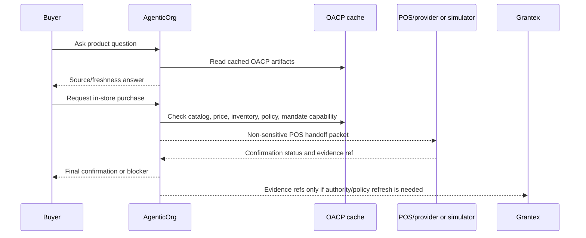

# Offline POS Bridge

Canonical end-to-end flow: [OACP end-user flow](end-user-flow.md).

AgenticOrg now has an internal Offline POS Bridge foundation. It creates a non-executing POS handoff packet from a prepared purchase, accepts POS/provider confirmation statuses, and reconciles buyer-safe and operator-safe outcomes. It does not run POS transactions, capture payment, create orders, or store raw POS/payment payloads.

## What Works Now

| Capability | Runtime status |
| --- | --- |
| POS readiness endpoint | Implemented at `GET /api/v1/commerce/runtime/pos/offline/readiness`. |
| Handoff packet builder | Implemented at `POST /api/v1/commerce/runtime/pos/offline/handoffs`. |
| Confirmation intake | Implemented at `POST /api/v1/commerce/runtime/pos/offline/confirmations`. |
| Local simulator | Implemented at `POST /api/v1/commerce/runtime/pos/offline/simulator/confirm`. |
| Persistence | Tenant-scoped tables store packets and confirmations with RLS. |
| Reconciliation | Returns buyer-safe status, seller/operator status, refresh flags, and evidence refs. |

## Packet Contents

The handoff packet contains:

| Field group | Examples |
| --- | --- |
| Scope | `tenant_id`, `merchant_id`, `seller_agent_id`, `buyer_session_ref` |
| Store | `store_id`, POS location metadata |
| Product | product ref, variant ref, SKU, quantity |
| Display | displayed price, currency, source/freshness labels |
| OACP evidence | catalog, price, inventory, and provider capability refs |
| Policy | expiry window, risk tier, allowed and blocked action labels |
| Safety | `allowed_to_execute=false`, `no_payment_execution=true`, no raw payload storage |

## Confirmation Statuses

| POS status | Buyer-safe behavior |
| --- | --- |
| `accepted` | Store accepted the handoff; staff must still confirm final price and payment. |
| `price_changed` | Buyer confirmation and artifact refresh are required. |
| `out_of_stock` | Purchase is blocked and inventory refresh is required. |
| `payment_pending` | Payment is not final yet. |
| `payment_confirmed` | Accepted only when a verified POS/provider callback and evidence ref exist. |
| `receipt_available` | Accepted only with verified callback and non-sensitive receipt evidence ref. |
| `needs_staff_review` | Staff review required before the buyer treats anything as final. |

Simulator results cannot claim production paid state. If the simulator asks for `payment_confirmed`, the runtime downgrades it to `needs_staff_review`.

## Safe Buyer Wording

- "I can prepare this for in-store checkout. Store staff or the POS/provider must confirm final price, inventory, and payment."
- "Source: Shopify catalog. Updated 4 min ago. Final price confirmed at POS."
- "The POS reported out of stock. I cannot complete the purchase."
- "Payment is pending at the POS/provider. No success is confirmed yet."

## External Requirements

| Owner | Action |
| --- | --- |
| Merchant/POS provider | Approve real POS callback contract and provide verified evidence refs. |
| AgenticOrg operator | Configure `OFFLINE_POS_PROVIDER_ID` and `OFFLINE_POS_WEBHOOK_SECRET` for a real provider. |
| Grantex | Verify OACP artifact and policy/evidence references when authority refresh is needed. |
| Payment/POS provider | Confirm payment or receipt status. AgenticOrg does not invent it. |
