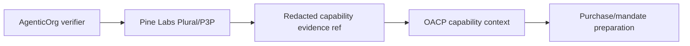

# Plural/Pine P3P Capability Verifier Guide

Canonical end-to-end flow: [OACP end-user flow](end-user-flow.md).

AgenticOrg verifies provider-owned Pine Labs Plural/P3P capability metadata without storing raw payment secrets in OACP artifacts.

Merchants configure payment provider metadata in `/dashboard/commerce-runtime`. Supported config types are `plural_pine`, `bank`, `fintech_rail`, `custom_provider`, and `none`. Only the Plural/Pine verifier has a runtime capability path today. Bank-owned and other provider-owned rails stay metadata-only until their adapters and provider approvals are implemented.

## Endpoint

`POST /api/v1/commerce/runtime/providers/plural-pine/mandate-capability/verify`

## Evidence Flow

## Results

The verifier can return available capability evidence, missing-env evidence, non-sandbox blocked evidence, or provider error evidence. Each result is public-safe and redacted.

## Boundary

Capability evidence is not mandate creation, payment capture, checkout creation, or order success.

Grantex may verify or sign non-sensitive evidence refs. It does not execute provider rails.
