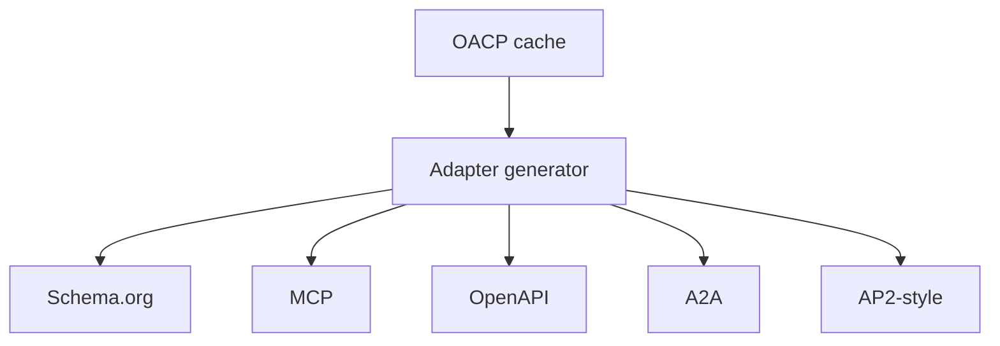

# Protocol Adapter Consumption Guide

Canonical end-to-end flow: [OACP end-user flow](end-user-flow.md).

AgenticOrg consumes Grantex `protocol_adapter` artifacts and generates buyer-safe protocol payloads.

## Adapter Matrix

| Adapter | Consumer | Runtime rule |
| --- | --- | --- |
| Schema.org | Search and product discovery clients | Product/Offer data must cite OACP source/freshness. |
| UCP-style | Capability clients | Compatibility mapping only. |
| ACP-style | Commerce client previews | Does not create checkout/payment. |
| AP2-style | Mandate/evidence clients | Does not create mandate/payment. |
| A2A | Agent discovery | Agent card metadata only. |
| MCP | ChatGPT/Claude-style clients | Tool calls still hit AgenticOrg runtime checks. |
| OpenAPI | Gemini/Perplexity-style clients | Buyer-safe request/response schema only. |

## Unsupported Fields

If a field would imply order, checkout, payment, mandate, refund, return, shipment, or provider execution, omit it or mark it unsupported.
