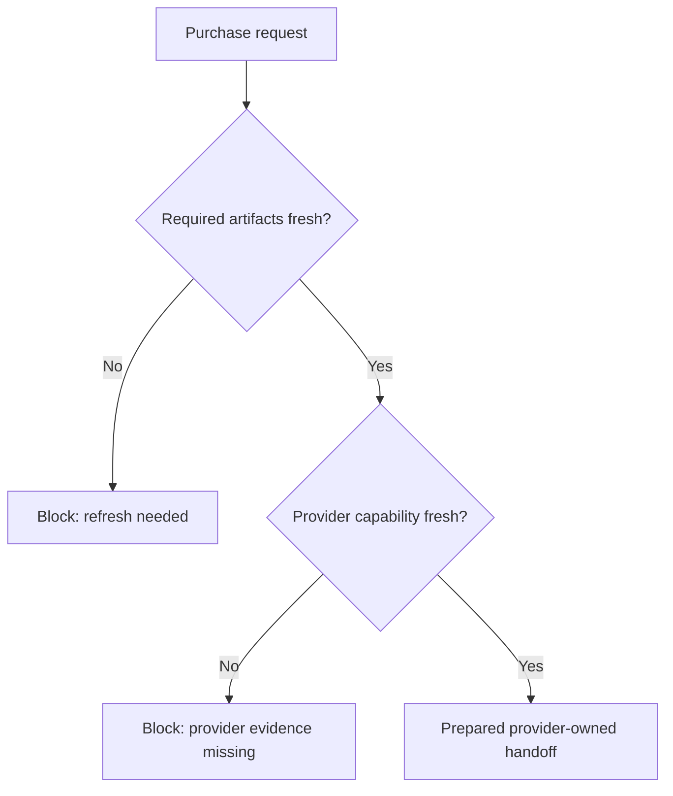

# Purchase And Mandate Handoff Guide

Canonical end-to-end flow: [OACP end-user flow](end-user-flow.md).

Purchase requests are commitment-bound. AgenticOrg prepares handoff or returns a blocker; it must not fake payment/order success.

## Endpoint

`POST /api/v1/commerce/runtime/purchase/prepare`

## Required Fresh Inputs

- Catalog snapshot.
- Price snapshot.
- Inventory snapshot.
- Policy scope.
- Mandate capability when the action needs it.
- Protocol adapter context.
- Buyer/seller/tenant/merchant scope.

## Safe Output

Return product, variant, source refs, freshness, idempotency key, provider evidence ref, and next human/system steps. Do not return checkout/payment URLs or success claims unless an approved external execution path later confirms them.
