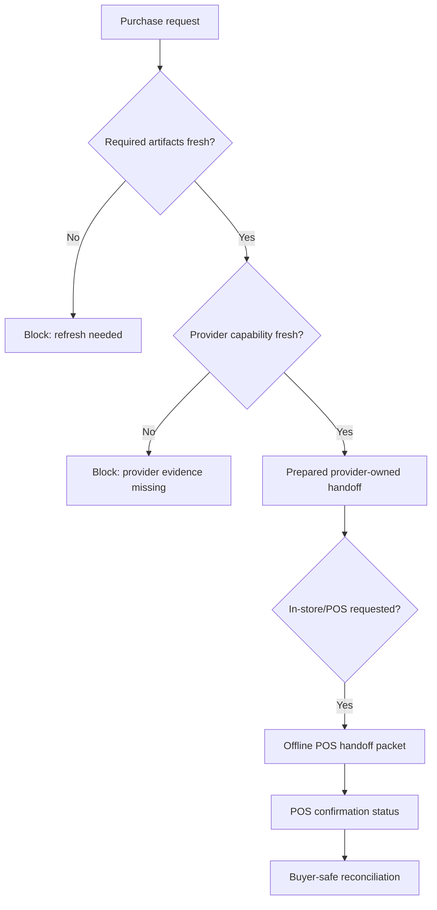

# Purchase And Mandate Handoff Guide

Canonical end-to-end flow: [OACP end-user flow](end-user-flow.md).

Purchase requests are commitment-bound. AgenticOrg prepares handoff or returns a blocker; it must not fake payment/order success.

## Endpoint

`POST /api/v1/commerce/runtime/purchase/prepare`

Offline POS Bridge endpoints:

- `GET /api/v1/commerce/runtime/pos/offline/readiness`
- `POST /api/v1/commerce/runtime/pos/offline/handoffs`
- `POST /api/v1/commerce/runtime/pos/offline/confirmations`
- `POST /api/v1/commerce/runtime/pos/offline/simulator/confirm`

## Required Fresh Inputs

- Catalog snapshot.
- Price snapshot.
- Inventory snapshot.
- Policy scope.
- Mandate capability when the action needs it.
- Protocol adapter context.
- Buyer/seller/tenant/merchant scope.

## Safe Output

Return product, variant, source refs, freshness, idempotency key, provider evidence ref, and next human/system steps. Do not return checkout/payment URLs or success claims unless an approved external execution path later confirms them.

## Offline POS Output

The POS handoff packet includes tenant, merchant, seller agent, store/POS location, buyer session, product/variant, quantity, displayed price, catalog/price/inventory artifact refs, freshness timestamps, expiry window, risk tier, allowed action labels, blocked action labels, and non-sensitive evidence refs.

Confirmation intake accepts `accepted`, `price_changed`, `out_of_stock`, `expired`, `needs_staff_review`, `unsupported`, `payment_pending`, `payment_confirmed`, `payment_failed`, and `receipt_available`. `payment_confirmed` and `receipt_available` require verified POS/provider callback evidence and are not accepted from the local simulator.
