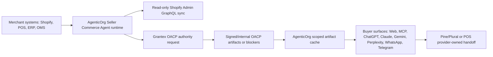

# OACP Runtime Launch Closure PRD

Status date: 2026-06-30

This is the canonical AgenticOrg closure PRD for turning OACP from audit-chain plumbing into a Shopify merchant commerce runtime. Older C6/C6W/C6X/C6Y reports are historical implementation context and are superseded by this document plus the runtime docs in this folder.

## Corrected Ownership



| Owner | Owns | Must not own |
| --- | --- | --- |
| AgenticOrg | Seller Commerce Agent runtime, buyer agents, channel bridges, Shopify/WooCommerce/ERP connector runtime, artifact cache, buyer conversations, public catalog pages, provider-owned payment/POS handoff orchestration. | Grantex authority decisions, live payment execution, POS payment capture, merchant system truth. |
| Grantex | Trust, protocol, policy, OACP artifact authority, verification, adapter governance, AgenticOrg tenant allowlist. | Shopify credentials, merchant connector runtime, buyer-channel hot path, payment/POS execution. |
| Merchant systems | Product, variant, price, inventory, status, fulfillment, POS, and order source of record. | OACP trust authority. |
| Provider rails | Pine Labs Plural/P3P, bank, payment, and POS execution. | AgenticOrg/Grantex artifact truth. |

## Hard Truth Inventory

Implemented in repo:

- Merchant commerce config API/UI for tenant, merchant, seller-agent scoped source connectors, buyer channels, payment providers, public publishing, and Offline POS metadata.
- Seller Commerce Agent onboarding packets.
- Shopify direct token and OAuth credential storage through encrypted tenant connector config.
- Real Shopify Admin GraphQL read-only product, variant, image, price, currency, inventory snapshot, status, and timestamp sync.
- Shopify product webhook HMAC verification and stale/cache-refresh marking.
- Grantex authority payload and `POST /v1/commerce/oacp/c6z/authority-requests` client path.
- 11-family OACP cache intake, buyer Q&A from cache, protocol adapters, MCP seller facts, OpenAPI/A2A metadata, public catalog publishing, Schema.org JSON-LD, sitemap, and llms.txt helpers.
- WhatsApp and Telegram webhook verification plus outbound path when credentials are configured.
- Pine/Plural capability verification, prepared provider handoff or exact credential blocker, and non-executing purchase preparation.
- Offline POS handoff packet, signed callback verification, replay-safe semantics, simulator confirmation, and staff-review fallback.
- Redacted local evidence runner: `python scripts/oacp_runtime_launch_check.py`.

Not proven without external credentials/approvals:

- A fresh live Shopify dev-store run in this branch.
- A deployed Grantex tenant/service-token mapping for the target merchant.
- Pine/Plural sandbox credential success against provider infrastructure.
- Public listing approvals for ChatGPT/Gemini/WhatsApp/Telegram.
- Production/sandbox smoke after merge and deploy approval.

## Runtime Closure Checklist

| Requirement | AgenticOrg closure path | Status |
| --- | --- | --- |
| Merchant onboarding packet | `POST /api/v1/commerce/runtime/seller-agents/onboarding-packets` and merchant config sync. | Implemented |
| Shopify credential custody | `POST /seller-agents/connectors/shopify/credentials`, encrypted `ConnectorConfig`. | Implemented |
| Shopify read-only sync | `ShopifyAdminGraphQLClient.fetch_products`. | Implemented, env-gated live test |
| Shopify webhook stale marking | `POST /shopify/webhooks/product-update`. | Implemented |
| Grantex authority request | `request_grantex_authority_artifacts`. | Implemented |
| Artifact cache | `cache_grantex_artifacts`, `DurableOacpArtifactCacheRepository`. | Implemented |
| Buyer answer from cache | `answer_product_question_from_cache`, `/buyer-sessions/ask`. | Implemented |
| Protocol adapters | `/protocol-adapters`, Schema.org/UCP/ACP/AP2/A2A/MCP/OpenAPI payloads. | Implemented as compatibility mappings |
| Public catalog publishing | Public seller/catalog/product/schema/sitemap/llms routes. | Implemented, merchant enabled only |
| MCP seller facts | `mcp-server` `seller.*` tools only. | Implemented |
| ChatGPT/Claude | MCP package and app/operator docs. | Repo-ready, external listing approval needed |
| Gemini | OpenAPI/function schema and A2A agent-card route. | Implemented, external setup needed |
| Perplexity/search | Crawlable pages, Schema.org, sitemap, llms.txt. | Implemented when publishing enabled |
| WhatsApp | Meta verify token, X-Hub-Signature-256, outbound Business Cloud API path. | Implemented, credentials needed |
| Telegram | Secret token verification and sendMessage path. | Implemented, credentials needed |
| Pine/Plural | Sandbox verifier and prepared handoff/blocker. | Implemented, provider credentials needed |
| Offline POS | Signed callback enforcement when secret exists; unsigned does not confirm paid/order. | Implemented |
| Evidence | Redacted JSON/MD evidence generated by launch runner. | Implemented |

## Evidence Command

```bash
OACP_LAUNCH_WRITE_EVIDENCE=true python scripts/oacp_runtime_launch_check.py
```

Outputs:

- `docs/reports/oacp-runtime-launch-evidence.local.json`
- `docs/reports/oacp-runtime-launch-evidence.local.md`

The runner uses local non-live fixtures unless `OACP_LAUNCH_EXTERNAL_CHECKS=true` and Shopify/Grantex/Plural credentials are configured. External blockers are recorded with exact missing env vars or redacted error refs.

## Validation Commands

```bash
python -m pytest tests/unit/test_oacp_c6z_runtime_vertical.py tests/unit/test_oacp_public_publishing.py tests/unit/test_commerce_buyer_session.py tests/unit/test_commerce_buyer_discovery.py --no-cov
python -m pytest tests/integration/test_c6z_external_integrations.py --no-cov
python -m ruff check core/commerce/c6z_runtime_vertical.py core/commerce/oacp_public_publishing.py core/commerce/offline_pos_bridge.py api/v1/commerce_runtime.py scripts/oacp_runtime_launch_check.py tests/unit/test_oacp_c6z_runtime_vertical.py tests/unit/test_oacp_public_publishing.py tests/unit/test_commerce_buyer_session.py tests/unit/test_commerce_buyer_discovery.py tests/integration/test_c6z_external_integrations.py
python -m mypy core/commerce/c6z_runtime_vertical.py core/commerce/oacp_public_publishing.py core/commerce/offline_pos_bridge.py api/v1/commerce_runtime.py scripts/oacp_runtime_launch_check.py
npm --prefix ui test
npm --prefix mcp-server test
git diff --check origin/main...HEAD
```

## Launch Readiness Rule

Launch-ready means one real Shopify merchant or dev store completes onboarding, credential storage, read-only sync, Grantex authority issuance/refusal, cache, buyer answer, public catalog generation when enabled, protocol adapter output, MCP seller facts, Pine/Plural capability success or exact credential blocker, purchase handoff/blocker, and POS signed callback smoke with redacted evidence. Anything less is repo-ready or sandbox-ready, not launch-complete.
