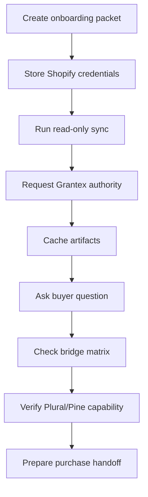

# Runtime Operations Runbook

Canonical end-to-end flow: [OACP end-user flow](end-user-flow.md).

## Smoke Test

## Monitor

- Shopify sync failures.
- Grantex authority status and refusal codes.
- Cache freshness distribution.
- Buyer answer source labels.
- Bridge route errors.
- Provider capability status.
- Purchase-preparation blockers.

## Rollback

1. Disable buyer surfaces for affected merchant.
2. Mark affected cache records stale.
3. Stop Shopify sync jobs.
4. Ask Grantex to remove tenant allowlist or rotate token if needed.
5. Re-run smoke before re-enabling.
