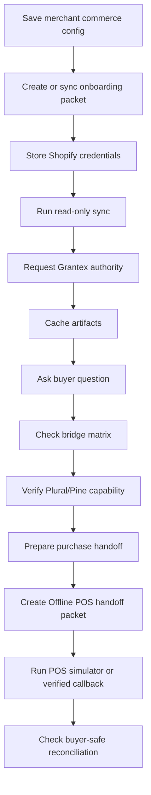

# Runtime Operations Runbook

Canonical end-to-end flow: [OACP end-user flow](end-user-flow.md). Launch closure source of truth: [OACP Runtime Launch Closure PRD](runtime-launch-closure-prd.md).

## Smoke Test



## Redacted Evidence Run

Local non-live closure evidence:

```bash
OACP_LAUNCH_WRITE_EVIDENCE=true python scripts/oacp_runtime_launch_check.py
```

Outputs:

- `docs/reports/oacp-runtime-launch-evidence.local.json`
- `docs/reports/oacp-runtime-launch-evidence.local.md`

Set `OACP_LAUNCH_EXTERNAL_CHECKS=true` only when Shopify, Grantex, and Plural/Pine credentials are configured for sandbox/live smoke. Missing credentials must be recorded as exact blockers, not converted into success.

## Production/Sandbox Smoke After Deploy Approval

1. Health and auth login.
2. Merchant config saved and read back without secret values.
3. Shopify connector status and read-only sync.
4. Shopify webhook signed test marks source stale/refresh-required.
5. Grantex authority request returns 11 artifacts or an exact refusal.
6. Artifact cache count and buyer answer with source/freshness labels.
7. Public catalog page, product page, catalog JSON, Schema.org JSON-LD, sitemap, and llms.txt when merchant publishing is enabled.
8. Protocol adapter endpoints and MCP seller fact read.
9. A2A agent card and OpenAPI bridge schema.
10. WhatsApp and Telegram signed webhook smokes when credentials are present.
11. Pine/Plural capability verifier and purchase prepare handoff/blocker.
12. Offline POS fake packet 404, unsigned callback rejected/downgraded, signed safe-mode callback accepted.

## Monitor

- Merchant config readiness by tenant, merchant, and seller agent.
- Shopify sync failures.
- Grantex authority status and refusal codes.
- Cache freshness distribution.
- Buyer answer source labels.
- Bridge route errors.
- Provider capability status.
- Purchase-preparation blockers.
- Offline POS handoff packet creation rate.
- POS confirmation status mix.
- Reconciliation outcomes that require inventory or artifact refresh.

## Rollback

1. Disable buyer surfaces for affected merchant.
2. Disable merchant public publishing in merchant commerce config, or set `OACP_PUBLIC_CATALOG_PLATFORM_DISABLED=true` for a platform-wide stop.
3. Mark affected cache records stale.
4. Stop Shopify sync jobs.
5. Ask Grantex to remove tenant allowlist or rotate token if needed.
6. Disable Offline POS handoff creation for affected merchant if POS evidence is stale or callback verification fails.
7. Re-run smoke before re-enabling.

## Merchant Config Smoke

1. Open `/dashboard/commerce-runtime` as an `admin` or `merchant` role user.
2. Save config for the merchant with source connector `Shopify`, buyer channels, provider-owned payment config, and optional Offline POS store.
3. Load config and verify the same tenant, merchant, seller agent, source connector, channel, provider, and POS refs return without secret values.
4. Check readiness. Shopify should be `runtime_ready`. WooCommerce, ERP, PIM, OMS, WMS, and custom API should stay `configured_pending_adapter` until real adapters exist.
5. Enable public publishing only for merchants that have source evidence and approved public surfaces.

## Offline POS Smoke

1. Prepare a purchase from fresh OACP cache records.
2. Create an Offline POS handoff packet.
3. Confirm simulator `accepted`; verify buyer wording says staff/payment confirmation is still required.
4. Submit fake or missing packet ids to the POS routes; they must return safe `404` or auth errors, not `500`.
5. Submit `payment_confirmed` without `X-AgenticOrg-POS-Signature` when `OFFLINE_POS_WEBHOOK_SECRET` is configured; it must return a safe authorization failure.
6. Submit `payment_confirmed` with `X-AgenticOrg-POS-Timestamp` and `X-AgenticOrg-POS-Signature: sha256=<hmac>` over `<timestamp>.<raw body>` plus a non-sensitive evidence ref; it may reconcile as confirmed, but must still report `allowed_to_execute=false`.
