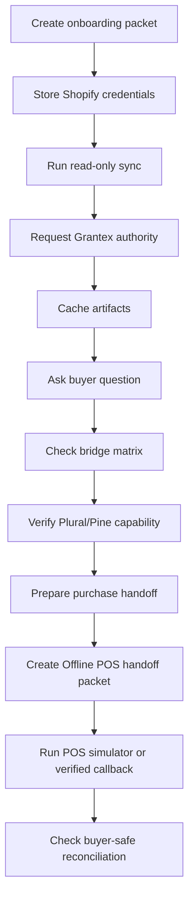

# Runtime Operations Runbook

Canonical end-to-end flow: [OACP end-user flow](end-user-flow.md).

## Smoke Test

## Monitor

- Shopify sync failures.
- Grantex authority status and refusal codes.
- Cache freshness distribution.
- Buyer answer source labels.
- Bridge route errors.
- Provider capability status.
- Purchase-preparation blockers.
- Offline POS handoff packet creation rate.
- POS confirmation status mix.
- Reconciliation outcomes that require inventory or artifact refresh.

## Rollback

1. Disable buyer surfaces for affected merchant.
2. Mark affected cache records stale.
3. Stop Shopify sync jobs.
4. Ask Grantex to remove tenant allowlist or rotate token if needed.
5. Disable Offline POS handoff creation for affected merchant if POS evidence is stale or callback verification fails.
6. Re-run smoke before re-enabling.

## Offline POS Smoke

1. Prepare a purchase from fresh OACP cache records.
2. Create an Offline POS handoff packet.
3. Confirm simulator `accepted`; verify buyer wording says staff/payment confirmation is still required.
4. Submit fake or missing packet ids to the POS routes; they must return safe `404` or auth errors, not `500`.
5. Submit `payment_confirmed` without `X-AgenticOrg-POS-Signature` when `OFFLINE_POS_WEBHOOK_SECRET` is configured; it must return a safe authorization failure.
6. Submit `payment_confirmed` with `X-AgenticOrg-POS-Timestamp` and `X-AgenticOrg-POS-Signature: sha256=<hmac>` over `<timestamp>.<raw body>` plus a non-sensitive evidence ref; it may reconcile as confirmed, but must still report `allowed_to_execute=false`.
