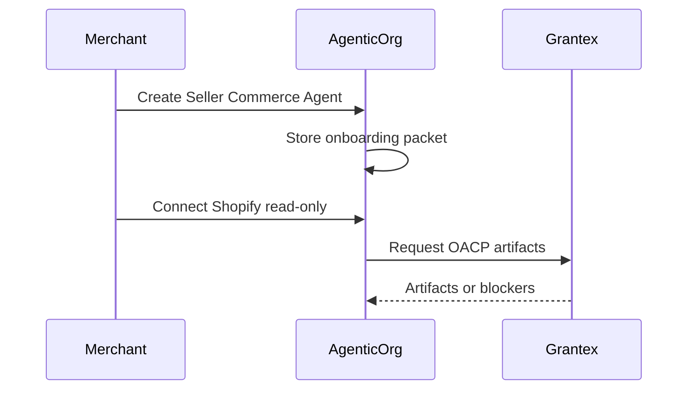

# Seller Commerce Agent Onboarding

Canonical end-to-end flow: [OACP end-user flow](end-user-flow.md).

A Seller Commerce Agent is the merchant-facing AgenticOrg runtime that prepares a store for buyer-agent discovery.

## Steps

1. Create onboarding packet with merchant id, seller agent id, Shopify domain, requested OACP artifact families, cache scope, buyer surfaces, and `plural_pine_p3p` preference when needed.
2. Store the packet through `POST /api/v1/commerce/runtime/seller-agents/onboarding-packets`.
3. Connect Shopify credentials through the Shopify connector setup flow.
4. Run read-only sync.
5. Request Grantex authority.
6. Cache returned artifacts.
7. Run buyer Q&A and purchase-preparation smoke.

## Ready Vs Gated

Implemented: packet creation, storage, read-only connector flow, authority request payload, cache intake, and buyer answer path.

Gated: merchant approvals, provider approvals, public channel launch, and any payment/order execution path.
