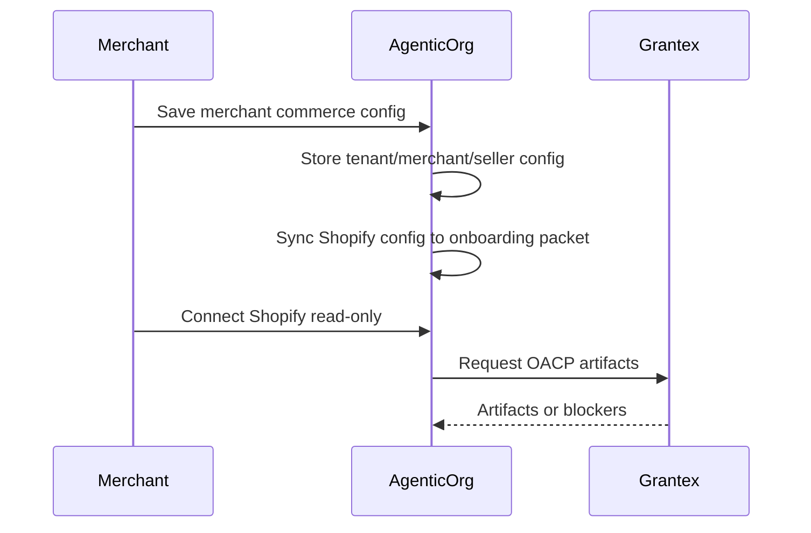

# Seller Commerce Agent Onboarding

Canonical end-to-end flow: [OACP end-user flow](end-user-flow.md).

A Seller Commerce Agent is the merchant-facing AgenticOrg runtime that prepares a store for buyer-agent discovery.

Merchant operators should start in `/dashboard/commerce-runtime` and save merchant commerce configuration before running source sync or public publishing. The config is scoped by tenant, merchant, and seller agent. It can be edited during onboarding or later.

## Steps

1. Save merchant commerce configuration with merchant identity, source connector, buyer channels, payment provider, public publishing, and Offline POS metadata.
2. If the source connector is Shopify, sync the config into a Seller Commerce Agent onboarding packet.
3. Connect Shopify credentials through the Shopify connector setup flow.
4. Run read-only sync.
5. Request Grantex authority.
6. Cache returned artifacts.
7. Run buyer Q&A and purchase-preparation smoke.

WooCommerce, ERP, PIM, OMS, WMS, and custom API connectors can be saved as merchant configuration, but they stay `configured_pending_adapter` until their runtime adapters are implemented. Do not mark those channels live from config alone.

## Ready Vs Gated

Implemented: merchant self-service config, packet creation, storage, read-only Shopify connector flow, authority request payload, cache intake, and buyer answer path.

Gated: merchant approvals, provider approvals, public channel launch, and any payment/order execution path.
