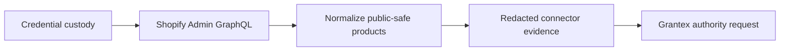

# Shopify Connector Setup Guide

Canonical end-to-end flow: [OACP end-user flow](end-user-flow.md).

## Runtime Endpoints

| Endpoint | Purpose |
| --- | --- |
| `POST /api/v1/commerce/runtime/seller-agents/connectors/shopify/credentials` | Store merchant-scoped Shopify credentials. |
| `GET /api/v1/commerce/runtime/seller-agents/connectors/shopify/status` | Confirm credential metadata without exposing secrets. |
| `POST /api/v1/commerce/runtime/seller-agents/shopify/sync` | Run read-only source sync. |
| `POST /api/v1/commerce/runtime/shopify/webhooks/product-update` | Verify product-update webhook HMAC and enqueue refresh path. |

## Secret Handling

Do not show Shopify tokens in UI, docs, logs, OACP artifacts, cache records, or error messages. The UI test verifies credential submission without rendering secrets.

## Sync Diagram

## Blockers

- Missing credential.
- Invalid Shopify domain.
- Credential validation failure.
- HMAC secret missing for webhook intake.
- Source evidence contains private or executable fields.
