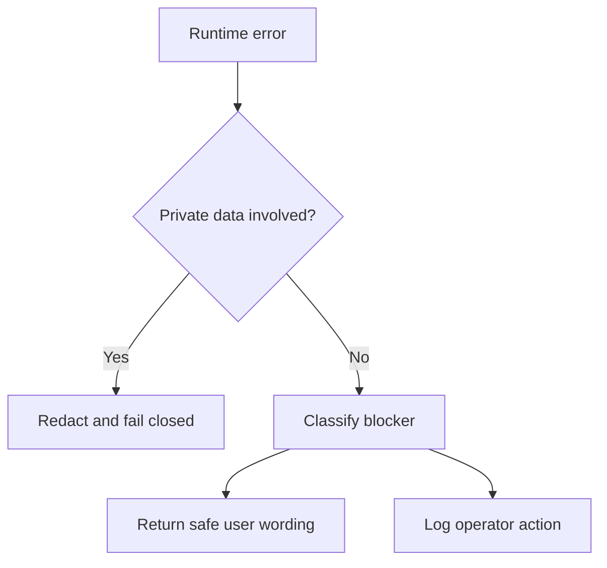

# OACP Troubleshooting

Canonical end-to-end flow: [OACP end-user flow](end-user-flow.md).

| Symptom | Likely cause | Action |
| --- | --- | --- |
| Shopify sync blocked | Missing credential, invalid domain, decrypt failure, or read validation failure. | Reconnect Shopify and confirm status endpoint hides secrets. |
| Grantex authority returns 202 | Connector evidence missing. | Run Shopify sync and resubmit authority request. |
| Grantex authority returns 422 | Stale, private, executable, or invalid scope request. | Inspect requested artifact families and source observed time. |
| Buyer answer missing | Cache lacks valid catalog/price/inventory artifacts. | Refresh Grantex artifacts and cache. |
| Source label missing | UI or bridge dropped cache metadata. | Fix bridge response mapping before public use. |
| WhatsApp/Telegram blocked | Webhook secret missing or invalid. | Configure secrets and rerun webhook smoke. |
| Purchase prepare blocked | Fresh artifact or provider capability evidence missing. | Refresh source artifacts and run Plural/Pine verifier. |
| User asks for payment success | Unsupported from OACP cache. | Return safe wording: no payment/order was created. |

## Failure/Refusal Flow

