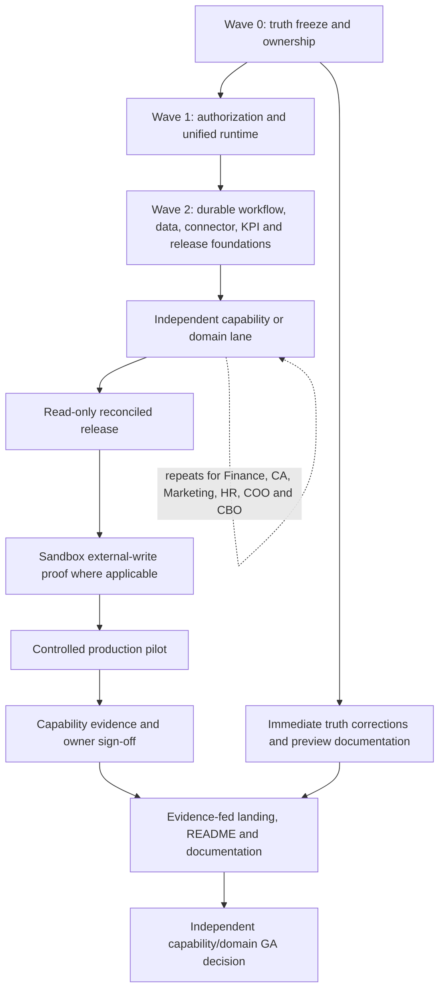
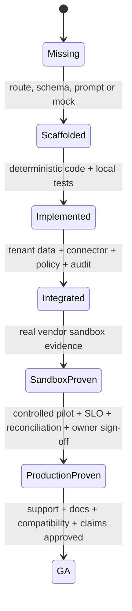
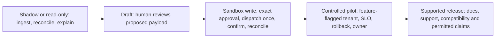
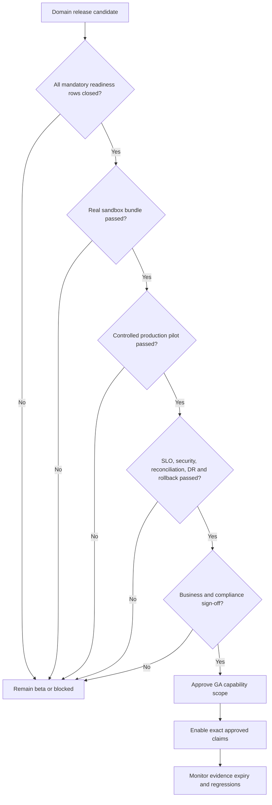

# Comprehensive Build Roadmap

**Baseline:** 2026-07-13
**Repository baseline:** `384543788bcd1f66aed8cff8ab03699ae384926e`
**Status:** proposed planning baseline pending `W0-04/05` scope, owner, capacity, and approver sign-off.
**Accountable owner:** unassigned until `W0-05` closes
**Last reviewed:** 2026-07-15
**Next review:** owner assignment or 2026-07-27, whichever occurs first
**Inputs/prerequisites:** [GAP_ANALYSIS.md](GAP_ANALYSIS.md), [DOMAIN_READINESS_STANDARD.md](DOMAIN_READINESS_STANDARD.md), [CAPABILITY_READINESS_REGISTER.md](CAPABILITY_READINESS_REGISTER.md), and [LANDING_AND_DOCUMENTATION_BLUEPRINT.md](LANDING_AND_DOCUMENTATION_BLUEPRINT.md)
**Limitations:** sequence is dependency-based; dates, scope, and commitments require `W0-04/05` sign-off
**Related test:** `tests/regression/test_readiness_documentation.py`
**Related runbook:** this document's promotion lifecycle, evidence bundle, CI gate, RACI, and risks.

## Outcome

Deliver evidence-backed Finance, CA firm, Marketing, HR, COO, and CBO products that share one governed runtime, one data/evidence model, one release process, and one honest public narrative.

This roadmap is dependency-driven. Calendar dates should be assigned only after owners, staffing, vendor accounts, and regulatory reviewers are confirmed.

## Program principles

1. Safety and authorization precede external actions.
2. Read-only, reconciled intelligence precedes write automation.
3. One executor serves UI, API, workflow, A2A, and MCP.
4. Domain data models precede role dashboards.
5. Vendor-sandbox proof precedes a production pilot.
6. Production-pilot evidence precedes GA and outcome claims.
7. Documentation, tests, SLOs, and runbooks are product deliverables, not release cleanup.
8. A missing mandatory gate blocks promotion; readiness is not an average score.

## Dependency map

## Promotion lifecycle

This diagram shows internal maturity only. `Blocked`, `InReview`, `Passed`, `Expired`, and `NotAssessed` are independent gate results; preview/beta/limited availability/GA are public states; and illustrative/qualified/evidence-backed are claim treatments. The [capability register](CAPABILITY_READINESS_REGISTER.md) defines the conservative mapping.

## Per-capability staged delivery

Every work package that includes external writes is split into separately promotable readiness records; completing code for a later stage cannot bypass an earlier gate.

`W0-06` keeps later stages disabled by default. HR lifecycle, payroll, IT remediation, vendor-master changes, Marketing sends/publishes/spend, Finance payments/write-offs, CA filing, CBO signatures/disclosures/filings/fraud actions, and all other source-of-record mutations require independent read-only, sandbox-write, and controlled-pilot evidence.

## Delivery model

The recommended model uses five parallel squads plus shared reviewers:

| Team | Core responsibility |
|---|---|
| Platform Safety and Runtime | Executor, tool resolution, policy, approvals, run ledger, workflow engine, RBAC, privacy-safe audit. |
| Data and Integrations | Domain schemas, ingestion, connector control plane, webhooks, lineage, reconciliation, KPI facts. |
| Finance and CA | Corporate finance plus CA firm workflows, statutory scope, DSC/provider integration, pilot. |
| People and Operations | HR and COO systems of record, workflows, safety, dashboards, pilots. |
| Growth and Business | Marketing and CBO systems, evidence, landing pages, documentation, analytics, pilots. |
| Shared Security/SRE/QA/Design/Docs | Threat modeling, privacy/compliance, release, DR, test automation, accessibility, research, content, and sign-off. |

This is a multi-quarter program. Publish a capacity-based forecast only after `W0-04/05` confirm scope, named staffing, work-package sizing, vendor accounts, regulatory reviewers, and pilot customers. Any earlier duration is a planning hypothesis, not a commitment.

## Wave 0 — Truth freeze, scope, and ownership

**Goal:** prevent further product-truth drift and establish the program control plane before code expansion.

| ID | Work package | Output | Exit gate |
|---|---|---|---|
| W0-01 | Canonical readiness documentation | This readiness hub, gap analysis, domain standard, roadmap, landing/docs blueprint, and program memory. | Documents linked from README; owners and review cadence assigned. |
| W0-02 | Claim freeze | Inventory every README, landing, pricing, demo, schema, blog, resource, and sales claim. | Unsupported claims removed or labeled illustrative; exact surface list retained. |
| W0-03 | Claim/evidence registry | Versioned claim schema, evidence URI, state, owner, approver, product version, expiry, and surface mapping. | CI prevents unregistered performance, certification, outcome, rating, and availability claims. |
| W0-04 | Domain scope decisions | Ratify CBO working definition/boundaries; supported Finance/CA statutes; HR/payroll/benefit jurisdictions; COO facilities/supply-chain/quality/customer-continuity modules; Marketing vendor and capability set. | Product and business owners sign supported/out-of-scope matrices. |
| W0-05 | Ownership and RACI | Named product, engineering, data, security, SRE, QA, documentation, legal/compliance, and domain owners. | No P0 work item lacks accountable and approving roles. |
| W0-06 | Unsafe-path containment | Feature flags force shadow/read-only mode for filing, payment, employment decision, access revocation, customer publish/send, destructive IT, signature, disclosure, and regulator writes. | Production configuration proves blocked actions fail closed. |
| W0-07 | Release baseline | Capture current service revisions, worker/beat drift, migrations, CI checks, branch rules, restore status, and open security findings. | Signed baseline stored with reproducible queries and no secret material. |
| W0-08 | Capability readiness/evidence ledger | Implement [CAPABILITY_READINESS_REGISTER.md](CAPABILITY_READINESS_REGISTER.md) as a versioned system of record with stable IDs, scope, owner, independent states, traceability, immutable evidence, review/expiry, promotion, and permitted claims. | Every standard row has an owner and disposition; CI blocks missing/expired evidence and state/claim overreach. |

### First pull-request sequence

1. Canonical docs, seed capability register, README links, root roadmap replacement, and stale-document banners.
2. Persisted readiness/evidence schema, promotion transaction, expiry, and CI traceability checks.
3. Claim registry/lint plus immediate removal or qualification of unsupported public claims.
4. Domain/role/action taxonomy, legacy inventory/backfill/cutover plan, and silent-fallback removal tests.
5. Feature flags and an action-risk registry that defaults unknown actions to blocked.
6. Server-side object/domain authorization middleware and negative tests.
7. Unified AgentRun/action contract, durable ledger, pre-dispatch payload snapshot, and single-use authorization.
8. Unified executor adapter for direct, workflow, A2A, and MCP paths.
9. Workflow compiler/linter plus installed-definition migration/quarantine enforced on save/install/run.
10. Tenant-bound connector resolution, real account/health/scope preflight, and certification records.
11. Release manifest, branch protection, worker/beat, post-deploy, observability-query, restore/DR, and security evidence gates.

## Wave 1 — Shared safety and runtime foundation

**Goal:** make every invocation use the same authorization, execution, persistence, and audit semantics.

| ID | Work package | Dependencies | Required behavior and evidence |
|---|---|---|---|
| PLAT-00 | Canonical domain/action taxonomy and migration | W0-04 | One versioned domain/role/action catalog across agents, workflows, records, KPI filters, RBAC, audit, A2A/MCP, and UI. Inventory/backfill legacy tags and fallback paths, dual-read if needed, reconcile, cut over, rollback, and remove silent BaseAgent/global-connector fallbacks. |
| PLAT-01 | Server authorization enforcement | PLAT-00 | Scope + tenant + company + domain + object checks on every read/run/cancel/approve/KPI/export route; 403 and denial audit tests across every CxO role. |
| PLAT-02 | Action-risk registry | W0-06 | Typed read, draft, internal-write, customer-write, money, filing, employment, access, destructive, signature, disclosure, and regulator actions; unknown is blocked. |
| PLAT-03 | Pre-dispatch policy gateway | PLAT-02 | Evaluate policy before tool dispatch; create canonical payload hash and approval snapshot; reject expired/changed/replayed authority. |
| PLAT-04 | Single-use authorization and idempotency | PLAT-03 | Reserve once, dispatch once, confirm once; accepted/rejected/unknown state; reconcile before retry; concurrency/replay tests. |
| PLAT-05 | Unified executor | PLAT-01 to PLAT-04 | UI/API/workflow/A2A/MCP share one planner, tool resolver, gateway, HITL, run state, cost, audit, and output contract. |
| PLAT-06 | Tenant-bound tool resolution | PLAT-05 | Explicit linked connector IDs, healthy credentials, account/scope validation, deterministic tool names; no global credentialless scan. |
| PLAT-07 | Durable run ledger | PLAT-05 | One authoritative invocation/run/step/action/result record with domain, company, inputs refs, status, timing, cost, HITL, errors, confirmations, and evidence refs. |
| PLAT-08 | Privacy-safe trace and audit | PLAT-07 | Stored traces remain redacted; field classification, purpose, retention, deletion, access, legal hold, and signature/integrity tests. |
| WF-01 | Workflow definition contract | PLAT-02 | Versioned schema for triggers, steps, agents, tools, inputs, outputs, retry, wait, approval, policy, compensation, and evidence. |
| WF-02 | Compile/lint gate | WF-01 | Reject unknown agents/tools/actions, maturity violations, missing connector bindings, malformed notifications, and missing write controls before persistence/run. |
| WF-03 | Durable execution and legacy migration | PLAT-04, PLAT-07, WF-02 | Restart-safe waits, queueing, pause/resume, retries, timeouts, event correlation, sagas/compensation, definition migration, and replay. Enumerate installed/checked-in legacy definitions, quarantine unsafe versions, migrate or reinstall idempotently, and prove no legacy run bypasses the compiler or pre-dispatch approval gate. |

### Wave 1 acceptance suite

- One scenario invoked through all five entry points yields the same tool plan, approval request, connector binding, run record, and audit package.
- Every high-risk action shows zero tool calls before approval, zero after rejection/expiry, and one after valid approval.
- A replay, concurrent approval, connector timeout, and unknown provider outcome cannot duplicate an external action.
- Cross-role and cross-company object access is denied server-side and audited.
- Logs, traces, metrics, HITL context, and exports contain no raw secrets or restored sensitive reasoning.
- Existing tenant workflows and checked-in examples are version-inventoried; unsafe CA definitions are blocked or migrated, and challan/payment/filing review occurs before dispatch.

## Wave 2 — Data, connector, KPI, observability, and release foundations

**Goal:** create reusable production infrastructure that domain teams do not reimplement differently.

| ID | Work package | Output | Exit gate |
|---|---|---|---|
| DATA-01 | Shared identity and organization model | Tenant, company/entity, person/party, role, account, location, currency, fiscal/time context, source identity, consent, and effective dates. | Data governance and migration review; no cross-company leakage. |
| DATA-02 | Domain event and fact store | Versioned source events, normalized facts, source refs, checksums, freshness, quality, retention, and replay. | Idempotent ingestion and backfill tests. |
| DATA-03 | Reconciliation service | Source-to-source and source-to-ledger comparisons, tolerances, breaks, ownership, resolution, and evidence. | Golden cases and unresolved-break gating. |
| DATA-04 | Cross-domain source and event contracts | HR→Finance payroll/GL, HR↔COO identity/assets, COO→Finance procurement/AP, COO↔CBO contracts/risk, Marketing↔Finance spend/revenue, including owner, source of truth, schema, consent, ordering, replay, reconciliation, and deletion. | Contract tests and owner sign-off for every producer/consumer pair. |
| CONN-01 | Connector lifecycle | Configure, authorize, validate account/scopes, sync, backfill, health, rate limit, retry, rotate, revoke, disconnect, and delete. | Real sandbox validation; credentials alone never imply healthy. |
| CONN-02 | Webhook/event gateway | Signature, timestamp, tenant/account resolution, replay protection, dedupe, ordering, dead letter, retry, and audit. | Provider replay and malformed-event tests. |
| CONN-03 | Certification matrix | Provider, feature, read/write methods, sandbox/live, supported regions, scopes, limits, idempotency, callbacks, evidence, owner, and review date. | Public connector claims generated from matrix. |
| KPI-01 | Metric catalog | Formula, unit, dimensions, owner, source, period, currency, effective version, privacy rule, and thresholds. | Domain/business owner approval. |
| KPI-02 | KPI evaluation and lineage | Facts → formula → reconciliation → confidence/freshness → drill-down. | No ready KPI from demo/config-only facts in strict runtime. |
| GOV-01 | AI/model/prompt/tool governance | Versioned model, prompt, tool, policy, retrieval source, and eval registry; domain thresholds; hallucination/citation rules; prompt-injection/tool-output-poisoning tests; drift, fallback, rollback, provider-change review, and model-incident response. | Domain evals and adversarial suites pass for the frozen release; owner/security approval and rollback drill retained. |
| PRIV-01 | Domain privacy and threat models | Employment, confidential HR cases, customer support, physical access/visitors, monitoring, financial/statutory, marketing consent, contracts, and fraud data: purpose, legal basis, minimization, field classification, access, retention/deletion, subject rights, legal hold, abuse cases, and mitigations. | Privacy/security/legal review plus negative access, leakage, export, deletion, and retention tests. |
| OBS-01 | Domain observability | Run/action, connector, approval, data quality, reconciliation, business process, and SLO metrics with PII-safe logs/traces. | Alert routing and runbook links verified; every shipped Grafana query is tested against the emitted Prometheus label schema, including the known `tenant_id` mismatch. |
| REL-01 | Immutable release manifest | API, UI, worker, beat, migration, image digests, config schema, DB compatibility, and commit metadata. | All production services prove the same release. |
| REL-02 | Protected release pipeline | Required reviews/checks, migration compatibility, staging/canary, security scans, post-deploy E2E, rollback, evidence publication. | Main and production environments enforce the gate. |
| REL-03 | Backup, restore, and DR | Automated backups, restore verifier, quarterly exercise, dependency recovery, measured RPO/RTO, corrective actions. | First retained drill report and closed material findings. |
| COM-01 | Offer, entitlement, and pricing contract | Versioned plan IDs, currencies, minor-unit amounts, intervals, entitlements, limits, signup/checkout modes, taxes, discounts, effective dates, signed-order precedence, and public-surface generation. | API, billing UI, pricing page, invoice/provider maps, limits, and signed terms reconcile to one reviewed catalog; CI blocks drift and unsupported offer claims. |
| COM-02 | Billing, payment, invoice, and revenue operations | Customer/account mapping, checkout, payment-provider confirmation, invoice/tax/credit/refund, dunning, entitlement activation/suspension, webhook idempotency, reconciliation, dispute, and finance handoff. | Provider sandbox, ledger reconciliation, failure/replay/refund tests, Finance/Legal approval, and no activation from an unverified payment. |
| CS-01 | Customer onboarding, implementation, adoption, and training | Qualification, data/connector readiness, scope and responsibilities, migration/cutover, administrator/operator/domain-user training, accessibility, acceptance, adoption, and handoff to support. | Versioned implementation plan, training completion, customer acceptance, rollback, and owner sign-off for the supported scope. |
| CS-02 | Support, entitlement, incident, and escalation service | Support tiers, hours/channels, severity, response/restoration targets, named on-call and domain escalation, customer communication, status page, known limitations, evidence expiry, and problem/corrective-action closure. | Signed entitlement mapping, staffed rota, monitored intake, escalation game day, communication templates, support-report reconciliation, and no public SLA beyond signed/current evidence. |
| CS-03 | Renewal, suspension, offboarding, export, and deletion | Renewal/expansion, downgrade, nonpayment and safe suspension, connector revocation, data export/portability, retention/legal hold, deletion verification, billing close, access removal, and customer receipts. | Contract/privacy/finance-approved lifecycle; sandbox E2E for downgrade, failed payment, export, revocation and deletion; immutable completion evidence. |

## Wave 3A — Finance and CA vertical

**Release strategy:** one shared accounting foundation; corporate Finance and CA practice surfaces use separate authorization, workflows, and claims.

| ID | Work package | Dependencies | Exit gate |
|---|---|---|---|
| FIN-01 | Accounting foundation | DATA-01 to DATA-03 | Entity/COA/period/currency/dimension/policy/opening-balance model reconciles to at least one ERP sandbox. |
| FIN-02 | AP and expenses | FIN-01, CONN-01, PLAT-04 | Capture → validate → match → exception → approve → post/propose payment → reconcile; exact-payload approvals and ERP receipts. |
| FIN-03 | AR and cash application | FIN-01, PLAT-04, CONN-01 | Invoice/customer/cash/dispute/collection/write-off lifecycle reconciles to ERP/bank; write-offs and external collection actions use exact-payload approval and confirmed connector writes. |
| FIN-04 | Bank reconciliation and treasury read layer | FIN-01 | Multi-account balances, matching/breaks, liquidity/cash forecast, source freshness; no money movement in first pilot. |
| FIN-05 | Close, consolidation, fixed assets, leases, and revenue | FIN-01, WF-03 | Versioned checklists, journals, intercompany, consolidation, fixed-asset and right-of-use asset/lease-liability schedules, modifications/remeasurement, impairment, revenue schedules, review, lock/reopen, disclosures, reconciliation, and evidence. |
| FIN-06 | FP&A and CFO command center | KPI-01/02, FIN-01 to FIN-05 | Cash/runway, working capital, aging, statements, forecast, variance, close, tax, risk, and action queue all drill to reconciled facts. |
| FIN-07 | Corporate Finance pilot | FIN-01 to FIN-06, REL-02 | Controller/CFO sign-off, reconciled ERP/bank sandbox evidence, two dry-run close/reporting periods, controlled tenant pilot, SLO/incident evidence, and no implied statutory filing sign-off. |
| CA-01 | Firm/client/engagement foundation | DATA-01, PLAT-01 | Verified identities, client scope, partner/staff roles, engagement authority, consent, and isolation. |
| CA-02 | Books intake and partner workbench | CA-01, FIN-01, CONN-01 | Completeness, mapping, backfill, document requests, deadlines, breaks, staff capacity, and review queue across clients. |
| CA-03 | Statutory rules governance | CA-01 | Effective-dated supported-scope service, sources, applicability, exceptions, extensions/amendments, qualified CA review, golden cases. |
| CA-04 | GST/TDS/PT workflows | CA-02/03, PLAT-04/06, WF-03, CONN-03 | Draft → reconcile → exact approval → DSC/provider preflight → submit once → receipt/poll/reconcile; manual mode explicit where adapters are absent. Live-mode negative tests cover missing, expired, revoked, wrong-identity, and invalid-chain DSC, strict sandbox/live endpoint isolation, and removal of every unsigned live fallback. Missing or provisional statutory facts can produce only a draft/refusal/HITL outcome with zero filing or payment calls. |
| CA-05 | Calendar, notices, portal, and communications | CA-02/03, WF-03, CONN-02 | Effective due dates/extensions drive durable schedules, delivery receipts, escalation, secure client requests/uploads/approvals/status/receipts. |
| CA-06 | Practice billing and collection | CA-01, FIN-03, PLAT-04, CONN-01/02 | Engagement pricing, invoices, tax, delivery, approved payment link/manual payment, webhook reconciliation, credit notes, aging. |
| CA-07 | CA statutory pilot | CA-01 to CA-06, REL-02 | Qualified-CA sign-off for the explicitly supported statutes, provider sandbox evidence, two dry-run filing periods, controlled client pilot, filing SLO/incident evidence, and verified manual handoff for unsupported paths. |

## Wave 3B — Marketing / CMO vertical

| ID | Work package | Dependencies | Exit gate |
|---|---|---|---|
| MKT-01 | Contract/UI truth alignment | W0-03 | Capability rows derive from agent contracts; beta/unavailable/production states and limitations agree everywhere. |
| MKT-02 | Runtime readiness enforcement | PLAT-05, WF-02 | Lint, maturity, connector contract, mapping/backfill, activation, policy, approvals, escalation, audit, and proof pass before run creation. |
| MKT-03 | Durable source sync and KPI facts | DATA-02, CONN-01/02, KPI-02 | CRM/ads/analytics/email facts come from durable vendor sync/events, not operator config metadata. |
| MKT-04 | Campaign/content/send ledgers | DATA-02 | Versioned brief, audience, creative, budget, content, send, external object, status, experiment, attribution, and evidence records. |
| MKT-05 | ABM and A/B completion | MKT-02 to MKT-04 | No seeded intent in production; real adapter launch confirmation; A/B create → split → signed events → evaluate → override → final send. |
| MKT-06 | Vendor validation | CONN-01 | CRM, Ads, Analytics, Email, CMS/SEO, social/brand, and intent connectors validate account/scopes and required read/write methods. |
| MKT-07 | CMO sandbox and pilot | All above | Persisted sandbox proof followed by controlled real-vendor proof; no demo/test-double evidence can pass. |
| MKT-08 | Strategy, research, SEO, social, and brand operations | MKT-03/04/06 | Versioned plans/budgets, cited research/VOC, governed SEO/site changes, social moderation/crisis escalation, and brand evidence; public scope explicitly marks unavailable rows. |
| MKT-09 | Product marketing, launches, events, partners, and field | MKT-04/06, DATA-04 | Versioned positioning/enablement/launch artifacts and consented event/partner lead lifecycle; cross-functional sign-off, CRM routing, cost, and attribution evidence. |
| MKT-10 | Analytics, attribution, and CMO command center | KPI-01/02, MKT-03 to MKT-09 | Reconciled funnel/spend/revenue/content/brand/experiment facts, explicit attribution policy, limitations, freshness, drill-down, approvals, incidents, and work queue. |

## Wave 3C — HR / CHRO vertical

| ID | Work package | Dependencies | Exit gate |
|---|---|---|---|
| HR-01 | HR system of record | DATA-01/02 | Employee, candidate, job, position, payroll run/line, leave, performance, compensation, training, case, onboarding, and offboarding effective-dated models/APIs. |
| HR-02 | Recruiting governance | HR-01, PLAT-03 | Consent/minimization, versioned rubric, evidence-only scoring, human adverse decision, explanation, fairness/adverse-impact review, appeal, deletion. |
| HR-03 | On/offboarding sagas | HR-01, HR-05, HR-07, WF-03, CONN-01, DATA-04, OPS-01 | Preboarding, documents, payroll/benefits, training, equipment, knowledge transfer, final pay, legal hold/retention, and employee receipts are durable. Approved termination has a coordinated effective-time revoke; pre-authorized emergency isolation is separate, time-limited, reversible, notified, and reviewed. |
| HR-04A | Time, attendance, and leave | HR-01, HR-07 | Effective-dated policy, calendars, shifts, accrual, requests, exceptions, approvals, export, privacy, and payroll reconciliation. |
| HR-04B | Performance, promotion, and compensation | HR-01, HR-07 | Goals, evidence, calibration, promotion/merit/bonus, explanation, fairness review, human authority, acknowledgement, appeal, and payroll handoff. |
| HR-04C | Learning, skills, and succession | HR-01 | Skills/role taxonomy, assignments, paths, certification/expiry, effectiveness, succession scenarios, LMS integration, privacy, and owner approval. |
| HR-04D | Employee service, grievance, and investigations | HR-01, HR-07, PRIV-01 | Restricted case partitions, SLA, grievance/investigation/discipline, witness protection, anti-retaliation, legal hold, appeal, retention, and limited reporting. |
| HR-04E | Labor compliance, accommodation, and wellbeing | HR-01, HR-07 | Jurisdiction matrix, policy acknowledgements, POSH/local obligations, accommodation privacy, human/legal ownership, change SLA, and evidence. |
| HR-05 | Payroll and benefits | HR-01, FIN-01, DATA-04 | Qualified payroll/labor rules owner; effective-dated jurisdiction matrix; earnings/deductions/arrears/off-cycle/reversal/final pay; plans, eligibility, dependents, enrollment/life events, carrier feeds, continuation, immutable lines, penny reconciliation, dual approval, and bank/file/GL/filing receipts. |
| HR-06 | Workforce planning and org design | HR-01, FIN-01, KPI-01 | Positions, budget, skills, location, spans/layers, capacity, succession, scenarios, approvals, and finance reconciliation. |
| HR-07 | Employment decision governance | PLAT-03, PRIV-01, GOV-01 | Hiring, scheduling/accommodation, performance, promotion, compensation, discipline, and termination decisions preserve human authority, evidence-only criteria, explanation, protected-data controls, fairness/adverse-impact review, appeal, anti-retaliation, retention, and legal sign-off. |
| HR-08 | CHRO command center | KPI-01/02, HR-01 to HR-07 | Traceable workforce, hiring, attrition, payroll/benefits, leave, performance, skills, engagement, cases, and compliance metrics with small-cohort privacy. |
| HR-09 | HR sandbox and pilot | All above | HR/legal/privacy sign-off, ATS/HRIS/IdP/payroll/benefits/ITSM sandbox evidence, parallel payroll, controlled employee lifecycle pilot, and no autonomous final employment decision. |

## Wave 3D — COO vertical

| ID | Work package | Dependencies | Exit gate |
|---|---|---|---|
| OPS-01 | Operations systems of record and domain migration | PLAT-00, DATA-01/02/04 | Service/process, customer/ticket, incident/SLA/change/problem, vendor/contract, asset/facility, supported order/inventory, quality/CAPA, risk/control, and customer-continuity models. Migrate `ops`/`operations`/IT/support/facilities tags, agents, workflows, KPI filters, RBAC, and historical telemetry. |
| OPS-02 | Intake, identity, dedupe, SLA, and work queue | OPS-01, CONN-02, PRIV-01 | Authenticated customer/source context, PII/PCI redaction, normalized events, persisted SLA clocks, dedupe, routing, escalation, source refs, and restricted access. |
| OPS-03 | Customer support operations | OPS-02, GOV-01 | Governed/versioned KB with citations and staleness, suggested-response review policy, outbound confirmation, closure, QA, appeal/reopen, and CSAT; no unsupported answer is presented as fact. |
| OPS-04 | IT service, incident, and governed remediation | PLAT-03/04, OPS-02 | Read-only diagnosis first; typed allowlisted changes; approver/change window; blast-radius limit, kill switch, verification/rollback, status/customer communication approval, no blind retry, postmortem and corrective-action closure. Break-glass is pre-authorized, bounded, logged, reversible, and reviewed. |
| OPS-05 | Vendor/procurement lifecycle | OPS-01, FIN-02, CBO-03, DATA-04 | KYC/sanctions/beneficial-owner/conflict/insurance/security/DPA checks; maker-checker vendor-master and bank-detail changes; approved create-once ERP; contract/SLA/continuous refresh/renewal; access and data-return proof at offboarding. |
| OPS-06A | Facilities and physical operations | W0-04, OPS-01, HR-01, CONN-01/02 | Supported-site matrix, access/visitor privacy, work orders, inspections, safety, maintenance, assets/vendors, mobile flows, emergency escalation, and evidence; otherwise explicitly out of scope. |
| OPS-06B | Supply chain and fulfillment | W0-04, OPS-01, CONN-01/02 | Supported ERP/WMS/provider matrix, demand/inventory/order/fulfillment/return/logistics workflows, reconciliation, exceptions, and evidence; otherwise explicitly out of scope. |
| OPS-06C | Quality and CAPA | W0-04, OPS-01 | SOP/control/sampling/nonconformance/root-cause/CAPA/audit lifecycle with owner, effectiveness check, closure, and evidence; otherwise explicitly out of scope. |
| OPS-06D | Customer business continuity | W0-04, OPS-01 | Business impact/dependency/strategy/crisis-role/communications/exercise/corrective-action lifecycle, separate from platform DR; otherwise explicitly out of scope. |
| OPS-07 | Operational risk and compliance | OPS-01, CBO-04 | Risk/control/exception/attestation/remediation records, evidence, owner sign-off, and negative/failure tests. |
| OPS-08 | Operating model, capacity, cost, and productivity | OPS-01, KPI-01/02 | Service catalog, ownership, demand/staffing/capacity/forecast, backlog/throughput/cycle/quality/unit-cost formula governance, and reconciled sources. |
| OPS-09 | COO command center | KPI-01/02, OPS-01 to OPS-08 | True MTTR, incident/SLA/backlog/CSAT/vendor/facility/supply/quality/continuity/risk/capacity/cost facts and governed actions. |
| OPS-10 | COO sandbox and pilot | All supported rows above | Helpdesk/ITSM/on-call/ERP/WMS/facility sandbox evidence as scoped, incident game day, vendor scenario, continuity exercise, controlled service pilot, and operations/risk sign-off. |

## Wave 3E — CBO vertical

| ID | Work package | Dependencies | Exit gate |
|---|---|---|---|
| CBO-01 | Role and domain foundation | W0-04, PLAT-01, DATA-01 | Inviteable CBO role, explicit scopes/domains, normalized Back Office taxonomy, navigation and negative authorization tests. |
| CBO-02 | Commercial strategy and pipeline | CBO-01 | Strategy/OKR, partnership, opportunity, pricing/deal, forecast, handoff, and portfolio-economics records integrated with CRM/Finance. |
| CBO-03 | Contract/legal system | CBO-01, WF-03 | Document/version/clause/redline/risk/approval/signature/obligation/renewal/dispute/retention; counsel controls legal decisions. |
| CBO-04 | Risk, compliance, board, and corporate secretary | CBO-01 | Risk/control/finding/remediation/attestation plus entity/board/agenda/papers/minutes/resolution/action/filing/receipt workflows. |
| CBO-05 | Information governance and communications | CBO-01, PRIV-01 | Data classification/PII inventory/lineage/access/legal basis/retention/deletion/DLP incidents plus separate internal and external communication workflows. Material disclosure requires legal/comms approval; employee sentiment uses privacy/aggregation controls. |
| CBO-06 | Fraud signals and investigations | CBO-01, FIN-01, PLAT-03 | Signals, alerts, cases, evidence, human disposition, remediation/recovery/reporting/retention/appeal; measured quality and no autonomous adverse or financial action. |
| CBO-07 | Business metric governance | KPI-01/02 | Metric catalog, owner, formula, quality, reconciliation, access, retention, and decision records; distinct from information privacy governance. |
| CBO-08 | CBO command center | KPI-01/02, CBO-02 to CBO-07 | Strategy, pipeline, pricing, contracts, obligations, risk, board, internal/external communications, information governance, fraud cases, and portfolio economics with actions and lineage. |
| CBO-09 | CBO sandbox and pilot | All above | Legal/compliance/data/security sign-off, CLM/e-sign/CRM/MCA-supported-path sandbox evidence, controlled business-operations pilot, and leadership approval. |

## Wave 4 — Product experience, landing pages, README, and documentation

Truth correction starts during Wave 0: unsupported Marketing/CBO and other claims are removed or qualified immediately and current pages are labeled with conservative capability-level states. Evidence-led visual rebuilds can proceed later; higher claims only activate as individual capability evidence matures.

| ID | Work package | Exit gate |
|---|---|---|
| EXP-01 | Shared domain cockpit framework | Accessible KPI lineage, empty/stale/blocked states, approvals, work queue, connector health, evidence drawer, exports, responsive behavior. |
| WEB-01 | Route-specific rendering | Every indexable route returns its own content, metadata, canonical, social tags, and validated structured data without JavaScript. |
| WEB-02 | Shared solution-page system | Six domain pages use a maintainable workflow/proof/scope/connector/governance/CTA component system. |
| WEB-03 | Trust center | Current security, privacy, compliance posture, availability, subprocessors, incident, vulnerability disclosure, and evidence/limitations. |
| WEB-04 | Lead and analytics lifecycle | Consent, validation, bot/rate protection, dedupe, CRM sync, routing SLA, confirmation, deletion/opt-out, funnel analytics, monitoring. |
| WEB-04A | Commercial and support truth surfaces | Pricing, entitlement, checkout/contact, support, onboarding, status, legal, renewal and exit pages derive from `COM-*`/`CS-*` contracts; no trial, discount, SLA, response-time or activation promise without current evidence. |
| DOC-01 | Documentation hub | Evaluator, user, admin, developer, operator, and trust information architecture with owners, versions, review dates, tests, limitations, and runbooks. |
| DOC-02 | Six role guide sets | Finance, CA, HR, Marketing, COO, and CBO quickstarts, workflow guides, KPI dictionaries, connector setup, approvals, troubleshooting, and limitations. |
| DOC-03 | Developer and operator refresh | Tested API/SDK/MCP examples, webhooks/schemas/errors/idempotency, deploy/migrations/workers/beat/monitoring/backup/DR/incident/rollback. |
| DOC-04 | README truth alignment | Concise architecture, current inventory, readiness boundary, quickstart/test/deploy, security, roadmap, and canonical links; no unsupported claims. |
| DOC-05 | Normative workflow and trace specifications | Versioned Finance/CA, Marketing, HR lifecycle, support/incident, vendor, and CBO contracts/board/fraud diagrams plus capability → gap → package → implementation → test → evidence → claim matrices. |
| DOC-06 | Documentation metadata and review control | Every canonical document has owner, status, baseline version/commit/environment, last/next review, prerequisites, limitations, related tests/runbooks, and expiry/invalidation rules. |
| WEB-05 | Public quality gate | Links, route coverage, claim lint, schema, screenshots, visual regression, WCAG 2.2 AA, responsive/browser, performance, sitemap, robots/llms, CTA E2E. |

## Wave 5 — Evidence, pilots, and GA

### Evidence bundle required per domain

- supported and out-of-scope capability matrix;
- release manifest and environment/config fingerprint;
- connector account/scope/health and secret-rotation proof;
- data mapping, backfill, quality, freshness, and reconciliation results;
- workflow definition, policy, approval, idempotency, external confirmation, and audit samples;
- automated unit/contract/integration/E2E/security/accessibility/performance/failure results;
- sandbox execution record with provider references and redacted artifacts;
- controlled-pilot plan, consent, rollback, support, success criteria, and outcome;
- SLO/alert/runbook and incident/unknown-outcome exercise;
- business, security/privacy, SRE, QA, documentation, and legal/compliance sign-off;
- approved claim-registry entries and public-surface diff.

### GA decision flow

GA may be granted to a narrow workflow rather than an entire domain. For example, read-only bank reconciliation can be production-proven while money movement remains blocked.

## Program RACI

| Decision or artifact | Accountable | Required approvers |
|---|---|---|
| Product scope and priority | Product lead | Domain owner, Engineering lead |
| External-write risk and policy | Security/Platform lead | Domain owner, Legal/Compliance, SRE |
| Finance/CA statutory scope | Finance/CA product owner | Qualified CA, Security, Legal/Compliance |
| Employment workflow | HR product owner | HR leader, Privacy/Legal, Security |
| Operations remediation | COO product owner | Service owner, Security, SRE/Change authority |
| CBO legal/risk/board workflow | CBO product owner | Licensed counsel/Compliance, Security, Data owner |
| Marketing claim and campaign write | Marketing product owner | CMO/Brand, Legal/Privacy, Finance for spend |
| Data model and KPI formula | Data lead | Domain owner, Security/Privacy |
| Release and production rollout | SRE lead | Engineering, QA, Security, Product owner |
| Public claim | Marketing/Docs lead | Evidence owner, Product, Legal/Compliance as applicable |
| Offer, price, entitlement, tax, and billing activation | Commercial product owner | Finance, Legal, Billing Engineering, Security, Support |
| Customer onboarding, support, escalation, renewal, and exit | Customer Success/Support lead | Product, SRE, Security/Privacy, Finance, Legal, domain owner |
| GA promotion | Product executive | Domain, Engineering, QA, Security, SRE, Docs, Legal/Compliance |

## CI and release gate

Every non-document release must pass:

1. formatting, lint, type checking, schema and migration checks;
2. unit and deterministic domain golden tests;
3. authorization, tenant/company isolation, and PII/secret leakage tests;
4. workflow compile/lint and action-risk coverage;
5. connector contract, webhook replay, timeout, retry, idempotency, and unknown-outcome tests;
6. integration and production-like E2E with fake/stub flags off;
7. dependency, code, secret, container, and infrastructure security scans;
8. accessibility, route, claim, link, metadata, schema, and performance checks for public/UI changes;
9. immutable image/release manifest and migration compatibility;
10. staged health, sandbox/canary gates where applicable, post-deploy E2E, and automatic rollback criteria.

## Measures

Baseline before setting targets. Track at least:

- percentage of actions with typed risk and policy coverage;
- percentage of entry points using the unified executor;
- cross-domain authorization negative-test coverage;
- connector methods certified by real sandbox evidence;
- workflow definitions passing compile/lint and restart/replay tests;
- KPIs with complete lineage, freshness, reconciliation, and owner;
- approval latency, expiry, rejection, replay, and unknown-outcome rate;
- reconciliation-break age and duplicate-action prevention;
- sandbox/pilot evidence coverage by mandatory readiness row;
- domain SLO attainment, incident rate, restore success, and release rollback rate;
- claim-registry coverage and expired/unsupported public claims;
- documentation freshness, broken links, accessibility, and support deflection.
- offer-catalog drift, unverified activation attempts, billing reconciliation breaks, and entitlement enforcement coverage;
- onboarding acceptance, training completion, support entitlement accuracy, escalation exercises, renewal/offboarding completion, export and deletion verification.

## Principal risks and mitigations

| Risk | Mitigation |
|---|---|
| Scope remains too broad | Promote narrow workflows; explicitly defer optional industry modules. |
| Vendor API or sandbox unavailable | Keep capability manual/read-only; do not simulate certification. |
| Regulatory rules change | Effective-dated sources, qualified owner, change SLA, golden cases, supported-scope matrix. |
| Domain squads bypass shared runtime | Architecture gate and CI contract requiring the unified executor. |
| Demo data leaks into production claims | Strict environment policy, provenance badges, claim registry, no ready KPI from demo/test sources. |
| External write duplicates | Single-use authorization, idempotency reservation, receipt reconciliation, no blind retry. |
| Sensitive reasoning enters logs | Redacted durable trace, field-level access/retention, leakage tests. |
| Parallel teams create taxonomy drift | Shared schema/metric councils and versioned domain catalog. |
| Documentation falls behind | Same-PR documentation rule, owners/review dates, CI freshness and claim tests. |
| Production services drift | One immutable release manifest for API/UI/worker/beat/migrations and revision-parity alert. |

## Immediate next action

Do not begin with new dashboard cards or additional agents. Selected local components of W0-02/03/06/08 exist, but their exit gates remain open. Complete the remaining W0 scope/ownership/release evidence, then PLAT-00 through PLAT-05 and the `COM-*`/`CS-*` contracts. The first demonstrable product milestone is one read-only, reconciled workflow per domain running through the unified executor with correct authorization, provenance, failure states, audit, supported commercial terms, and an operational support path—not six visually complete dashboards backed by generic telemetry.
