# Capability Readiness and Evidence Register

**Status:** proposed seed register; no row is release approval
**Baseline:** product 4.8.0, repository commit `384543788bcd1f66aed8cff8ab03699ae384926e`, inspected 2026-07-13
**Accountable owner:** unassigned until `W0-05` closes
**Last reviewed:** 2026-07-15
**Next review:** owner assignment or 2026-07-27, whichever occurs first
**Inputs:** [gap analysis](GAP_ANALYSIS.md), [domain standard](DOMAIN_READINESS_STANDARD.md), and [build roadmap](BUILD_ROADMAP.md)
**Limitation:** states below are conservative repository-audit findings. They do not replace sandbox, pilot, regulatory, security, or business-owner evidence.
**Related test:** `tests/regression/test_readiness_documentation.py`
**Related runbook:** [promotion transaction](#promotion-transaction)

This is the row-level control ledger for the readiness program. It prevents a domain score, route, demo, agent registration, connector module, or local test from being mistaken for an approved capability.

## Three separate status dimensions

Do not put implementation maturity, public availability, and claim treatment into one field.

| Dimension | Allowed values | Purpose |
|---|---|---|
| Internal maturity | `Missing`, `Scaffolded`, `Implemented`, `Integrated`, `SandboxProven`, `ProductionProven`, `GA` | Highest lifecycle stage supported by retained evidence. |
| Gate result | `Blocked`, `InReview`, `Passed`, `Expired`, `NotAssessed` | Result of mandatory safety, data, connector, quality, release, and owner gates. A blocked row cannot promote even when code is integrated. |
| Public availability | `Unavailable`, `Preview`, `Beta`, `LimitedAvailability`, `GA`, `Deprecated` | What a user may reasonably expect and receive support for. |
| Claim treatment | `Hidden`, `Illustrative`, `Qualified`, `EvidenceBacked` | How a claim or visual may be presented. Illustrative is not a maturity state. |

Mapping is conservative: `Missing` is unavailable/hidden; `Scaffolded` is unavailable or preview; `Implemented` is preview or beta; `Integrated` is at most beta; `SandboxProven` is at most limited availability; `ProductionProven` is at most limited availability until support, documentation, release, and compatibility gates pass; only `GA` may be publicly labeled GA. A `Blocked`, `Expired`, or `NotAssessed` mandatory gate lowers public availability regardless of maturity.

## Required record schema

Every capability record must contain:

| Field group | Required fields |
|---|---|
| Identity | Stable capability ID, domain, title, description, mandatory/conditional/out-of-scope decision, supported jurisdiction/provider/tenant scope. |
| Accountability | Product owner, engineering owner, data owner, security/privacy reviewer, domain approver, SRE/support owner, documentation owner. |
| State | Internal maturity, gate result, public availability, claim treatment, limitations, feature flag, last reviewed, next review, expiry. |
| Traceability | Gap/P0 IDs, roadmap work packages, implementation refs, migration/version, tests, threat/privacy model, runbook, SLO, dashboards, release manifest. |
| Evidence | Evidence URI, immutable artifact checksum, environment/provider/account class, product and commit version, execution time, result, reviewer, expiry. |
| Promotion | Prior state, requested state, mandatory-gate results, residual risks, exception/expiry, approvers, decision time, permitted claim IDs. |

```mermaid
flowchart LR
    C[Capability ID] --> G[Gap and risk IDs]
    G --> W[Roadmap work packages]
    W --> I[Versioned implementation]
    I --> T[Automated and failure tests]
    T --> S[Real sandbox evidence]
    S --> P[Controlled pilot and SLO]
    P --> A[Domain, security and release sign-off]
    A --> R[Readiness state]
    R --> Q[Permitted claim IDs and surfaces]
```

## Owner placeholders

These codes expose missing accountability; they are not assignments.

| Code | Required owner | Current state |
|---|---|---|
| `PLAT-O` | Platform Safety product/engineering owner | Unassigned — `W0-05` |
| `FIN-O` | Finance product owner plus Controller/CFO approver | Unassigned — `W0-05` |
| `CA-O` | CA product owner plus qualified-CA approver | Unassigned — `W0-05` |
| `HR-O` | HR product owner plus HR/legal/privacy approvers | Unassigned — `W0-05` |
| `MKT-O` | Marketing product owner plus CMO/brand/legal approvers | Unassigned — `W0-05` |
| `OPS-O` | Operations product owner plus service/risk owners | Unassigned — `W0-05` |
| `CBO-O` | CBO product owner plus business/legal/risk approvers | Unassigned — `W0-04/05` |

## Seed register

All rows are mandatory unless marked `Conditional`. `Blocked` means one or more mandatory gates are known to fail; `NotAssessed` means no row-specific evidence package exists. Evidence aliases point to the matching domain section and P0 findings in [GAP_ANALYSIS.md](GAP_ANALYSIS.md).

### Shared platform

| ID | Capability | Scope | Maturity | Gate | Public | Owner | Roadmap |
|---|---|---|---|---|---|---|---|
| PLAT-C01 | Object/domain authorization | Mandatory | Implemented | Blocked | Beta | PLAT-O | PLAT-01 |
| PLAT-C02 | Action-risk classification | Mandatory | Scaffolded | Blocked | Unavailable | PLAT-O | PLAT-02 |
| PLAT-C03 | Pre-dispatch policy and exact approval | Mandatory | Implemented | Blocked | Unavailable | PLAT-O | PLAT-03/04 |
| PLAT-C04 | Unified executor and tenant tool binding | Mandatory | Scaffolded | Blocked | Unavailable | PLAT-O | PLAT-05/06 |
| PLAT-C05 | Durable run/action/evidence ledger | Mandatory | Scaffolded | Blocked | Preview | PLAT-O | PLAT-07/08 |
| PLAT-C06 | Versioned workflow compiler/runtime | Mandatory | Scaffolded | Blocked | Preview | PLAT-O | WF-01/02/03 |
| PLAT-C07 | Connector lifecycle/certification | Mandatory | Implemented | Blocked | Beta | PLAT-O | CONN-01/02/03 |
| PLAT-C08 | KPI catalog, lineage, and reconciliation | Mandatory | Scaffolded | Blocked | Preview | PLAT-O | KPI-01/02 |
| PLAT-C09 | Observability, SLO, incident, DR | Mandatory | Implemented | Blocked | Beta | PLAT-O | OBS-01, REL-03 |
| PLAT-C10 | Protected reproducible release | Mandatory | Scaffolded | Blocked | Beta | PLAT-O | REL-01/02 |
| PLAT-C11 | AI/model/prompt/tool governance | Mandatory | Scaffolded | NotAssessed | Preview | PLAT-O | GOV-01 |
| PLAT-C12 | Capability evidence and claim control | Mandatory | Scaffolded | Blocked | Preview | PLAT-O | W0-02/03/07 |
| PLAT-C13 | Commercial offer, entitlement, billing and activation truth | Mandatory | Implemented | Blocked | Preview | PLAT-O/FIN-O | COM-01/02 |
| PLAT-C14 | Customer onboarding, support, renewal and exit lifecycle | Mandatory | Scaffolded | NotAssessed | Preview | PLAT-O | CS-01/02/03 |

### Finance / CFO

| ID | Capability | Maturity | Gate | Public | Owner | Roadmap |
|---|---|---|---|---|---|---|
| FIN-C01 | Accounting foundation and policy | Scaffolded | Blocked | Preview | FIN-O | FIN-01 |
| FIN-C02 | Accounts payable and expenses | Implemented | Blocked | Beta | FIN-O | FIN-02 |
| FIN-C03 | Accounts receivable, collections, cash application | Implemented | Blocked | Beta | FIN-O | FIN-03 |
| FIN-C04 | Banking, reconciliation, and treasury intelligence | Implemented | Blocked | Beta | FIN-O | FIN-04 |
| FIN-C05 | Tax and statutory accounting | Scaffolded | Blocked | Preview | FIN-O/CA-O | FIN-01, CA-03/04 |
| FIN-C06 | Close and consolidation | Implemented | Blocked | Beta | FIN-O | FIN-05 |
| FIN-C07 | Revenue recognition | Scaffolded | NotAssessed | Preview | FIN-O | FIN-05 |
| FIN-C08 | Fixed assets and leases, including right-of-use assets and lease liabilities | Scaffolded | NotAssessed | Preview | FIN-O | FIN-05 |
| FIN-C09 | Planning, forecasting, and scenarios | Implemented | Blocked | Beta | FIN-O | FIN-06 |
| FIN-C10 | Management/statutory reporting | Scaffolded | Blocked | Preview | FIN-O | FIN-06 |
| FIN-C11 | Controls, audit, and evidence | Implemented | Blocked | Beta | FIN-O | PLAT-03/04/07, FIN-07 |
| FIN-C12 | CFO command center | Scaffolded | Blocked | Preview | FIN-O | FIN-06/07 |

### Chartered Accountant firm

| ID | Capability | Maturity | Gate | Public | Owner | Roadmap |
|---|---|---|---|---|---|---|
| CA-C01 | Firm/client/engagement and isolation | Integrated | Blocked | Beta | CA-O | CA-01 |
| CA-C02 | Books intake, mapping, and reconciliation | Implemented | Blocked | Beta | CA-O | CA-02 |
| CA-C03 | Partner/staff workbench and capacity | Implemented | Blocked | Beta | CA-O | CA-02 |
| CA-C04 | Client onboarding and authority | Implemented | Blocked | Beta | CA-O | CA-01/02 |
| CA-C05 | GST lifecycle | Integrated | Blocked | Unavailable | CA-O | CA-03/04 |
| CA-C06 | TDS lifecycle | Implemented | Blocked | Unavailable | CA-O | CA-03/04 |
| CA-C07 | Income tax and MCA | Scaffolded | Blocked | Unavailable | CA-O | CA-03/04 |
| CA-C08 | Compliance calendar/notices/communications | Implemented | Blocked | Beta | CA-O | CA-05 |
| CA-C09 | Billing, collection, and practice quality | Implemented | Blocked | Beta | CA-O | CA-06/07 |

### Human Resources / CHRO

| ID | Capability | Maturity | Gate | Public | Owner | Roadmap |
|---|---|---|---|---|---|---|
| HR-C01 | Workforce planning, org design, succession | Scaffolded | NotAssessed | Preview | HR-O | HR-01/06 |
| HR-C02 | Recruiting and hiring decisions | Scaffolded | Blocked | Preview | HR-O | HR-02/07 |
| HR-C03 | Onboarding and provisioning | Scaffolded | Blocked | Preview | HR-O | HR-03/07 |
| HR-C04 | Employee master and HRIS | Missing | Blocked | Unavailable | HR-O | HR-01 |
| HR-C05 | Time, attendance, and leave | Scaffolded | NotAssessed | Preview | HR-O | HR-04A |
| HR-C06 | Payroll and benefits | Scaffolded | Blocked | Preview | HR-O/FIN-O | HR-05 |
| HR-C07 | Performance, promotion, and compensation | Scaffolded | Blocked | Preview | HR-O | HR-04B/07 |
| HR-C08 | Learning and skills | Scaffolded | NotAssessed | Preview | HR-O | HR-04C |
| HR-C09 | Employee service, grievance, and investigations | Scaffolded | Blocked | Preview | HR-O | HR-04D/07 |
| HR-C10 | Compliance, accommodation, and wellbeing | Scaffolded | Blocked | Preview | HR-O | HR-04E/07 |
| HR-C11 | Offboarding, final pay, benefits, assets, access | Scaffolded | Blocked | Preview | HR-O/OPS-O/FIN-O | HR-03/05/07 |
| HR-C12 | CHRO command center | Scaffolded | Blocked | Preview | HR-O | HR-08 |

### Marketing / CMO

| ID | Capability | Maturity | Gate | Public | Owner | Roadmap |
|---|---|---|---|---|---|---|
| MKT-C01 | Strategy, planning, budget | Scaffolded | NotAssessed | Preview | MKT-O | MKT-08 |
| MKT-C02 | Research, VOC, win/loss, competitors | Implemented | Blocked | Beta | MKT-O | MKT-08 |
| MKT-C03 | Campaign operations | Implemented | Blocked | Beta | MKT-O | MKT-02/04 |
| MKT-C04 | Content and editorial | Implemented | Blocked | Beta | MKT-O | MKT-04/08 |
| MKT-C05 | SEO and website growth | Implemented | Blocked | Beta | MKT-O | MKT-08 |
| MKT-C06 | Lifecycle and email | Scaffolded | Blocked | Beta | MKT-O | MKT-04/05 |
| MKT-C07 | Paid media | Implemented | Blocked | Beta | MKT-O/FIN-O | MKT-03/04/06 |
| MKT-C08 | ABM and CRM | Implemented | Blocked | Beta | MKT-O | MKT-05/06 |
| MKT-C09 | Social, community, and brand | Implemented | Blocked | Beta | MKT-O | MKT-08 |
| MKT-C10 | Product marketing and launches | Scaffolded | NotAssessed | Preview | MKT-O | MKT-09 |
| MKT-C11 | Events, partners, and field | Missing | NotAssessed | Unavailable | MKT-O | MKT-09 |
| MKT-C12 | Experimentation and CRO | Implemented | Blocked | Beta | MKT-O | MKT-05 |
| MKT-C13 | Marketing analytics and attribution | Implemented | Blocked | Beta | MKT-O/FIN-O | MKT-03/10 |
| MKT-C14 | CMO command center | Implemented | Blocked | Beta | MKT-O | MKT-01/07/10 |

### Chief Operating Officer

| ID | Capability | Scope | Maturity | Gate | Public | Owner | Roadmap |
|---|---|---|---|---|---|---|---|
| OPS-C01 | Operating model, service catalog, capacity/cost | Mandatory | Scaffolded | Blocked | Preview | OPS-O | OPS-01/08 |
| OPS-C02 | Customer support operations | Mandatory | Scaffolded | Blocked | Preview | OPS-O | OPS-02/03 |
| OPS-C03 | IT service and incident/change operations | Mandatory | Scaffolded | Blocked | Preview | OPS-O | OPS-04 |
| OPS-C04 | Vendor and procurement operations | Mandatory | Scaffolded | Blocked | Preview | OPS-O/FIN-O/CBO-O | OPS-05 |
| OPS-C05 | Facilities and physical operations | Conditional | Scaffolded | NotAssessed | Preview | OPS-O/HR-O | OPS-06A |
| OPS-C06 | Supply chain and fulfillment | Conditional | Missing | NotAssessed | Unavailable | OPS-O | OPS-06B |
| OPS-C07 | Quality and CAPA | Conditional | Scaffolded | NotAssessed | Preview | OPS-O | OPS-06C |
| OPS-C08 | Customer business continuity | Conditional | Missing | NotAssessed | Unavailable | OPS-O | OPS-06D |
| OPS-C09 | Operational risk and compliance | Mandatory | Scaffolded | Blocked | Preview | OPS-O/CBO-O | OPS-07 |
| OPS-C10 | Governed automation and runbooks | Mandatory | Scaffolded | Blocked | Unavailable | OPS-O | OPS-04/07 |
| OPS-C11 | COO command center | Mandatory | Scaffolded | Blocked | Preview | OPS-O | OPS-08/09 |

Conditional OPS rows remain blocking until `W0-04` explicitly marks each supported or out of scope. Customer business continuity is distinct from AgenticOrg platform DR (`REL-03`).

### Chief Business Officer / back office

| ID | Capability | Maturity | Gate | Public | Owner | Roadmap |
|---|---|---|---|---|---|---|
| CBO-C01 | Strategy, OKRs, and portfolio economics | Scaffolded | NotAssessed | Preview | CBO-O | CBO-02/08 |
| CBO-C02 | Business development and partnerships | Scaffolded | NotAssessed | Preview | CBO-O | CBO-02 |
| CBO-C03 | Commercial pipeline and forecasting | Scaffolded | Blocked | Preview | CBO-O | CBO-02/08 |
| CBO-C04 | Pricing and deal desk | Missing | NotAssessed | Unavailable | CBO-O/FIN-O | CBO-02 |
| CBO-C05 | Contract and legal operations | Scaffolded | Blocked | Preview | CBO-O | CBO-03 |
| CBO-C06 | Enterprise risk and compliance | Scaffolded | Blocked | Preview | CBO-O | CBO-04 |
| CBO-C07 | Corporate secretarial and board | Missing | Blocked | Unavailable | CBO-O | CBO-04 |
| CBO-C08 | Internal and corporate communications | Scaffolded | NotAssessed | Preview | CBO-O/HR-O | CBO-05 |
| CBO-C09 | Information privacy/data governance | Missing | Blocked | Unavailable | CBO-O | CBO-05 |
| CBO-C10 | Fraud signals and investigations | Missing | Blocked | Unavailable | CBO-O/FIN-O | CBO-06 |
| CBO-C11 | Business metric governance | Scaffolded | Blocked | Preview | CBO-O | CBO-07 |
| CBO-C12 | CBO command center | Scaffolded | Blocked | Preview | CBO-O | CBO-08 |

## Promotion transaction

Promotion is a reviewed, atomic record update:

1. Lock the capability record and freeze its implementation/release version.
2. Resolve every mandatory and in-scope conditional row; no inherited domain average is accepted.
3. Attach automated, negative, security/privacy, migration, sandbox, pilot, SLO, runbook, and documentation evidence required for the requested state.
4. Verify evidence environment, provider/account class, checksums, freshness, exceptions, and expiry.
5. Obtain product, engineering, security/privacy, SRE/support, and named domain-owner approvals.
6. Update internal maturity, gate result, public availability, limitations, and permitted claim IDs together.
7. Regenerate product facts, dashboards, landing badges, connector matrices, docs, and structured data from the approved records.
8. Emit an immutable audit event and schedule the next review. Evidence expiry automatically blocks or lowers the row.

## Traceability and CI checks

CI must fail when a mandatory record lacks an owner, scope decision, roadmap/test link, evidence expiry, or permitted-claim mapping; when public availability exceeds the conservative mapping; when a claim references a missing/expired capability; when a landing page hardcodes a state; or when a changed implementation invalidates its evidence checksum/version. The initial `Unassigned`, `Blocked`, and `NotAssessed` values in this seed are intentional visible backlog, not waivers.
