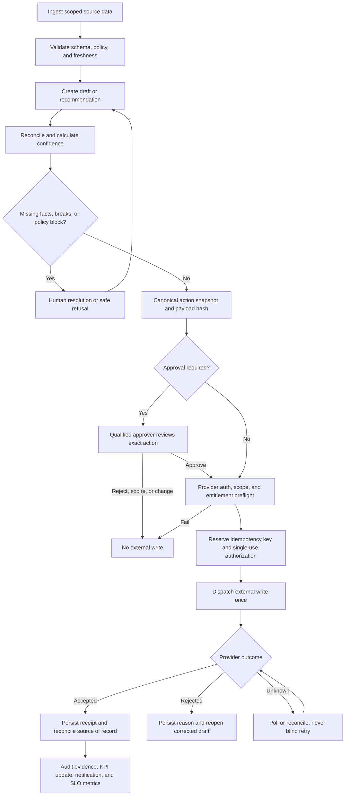
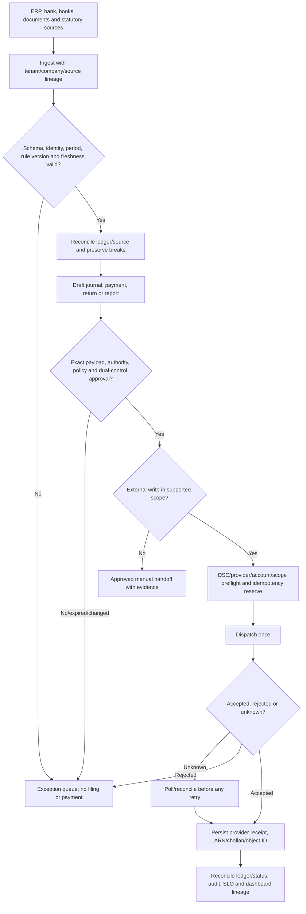
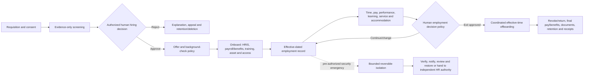
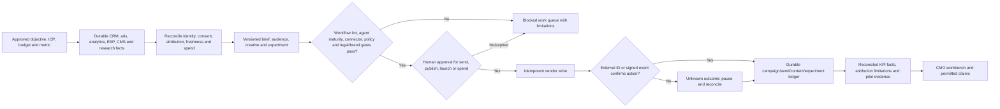
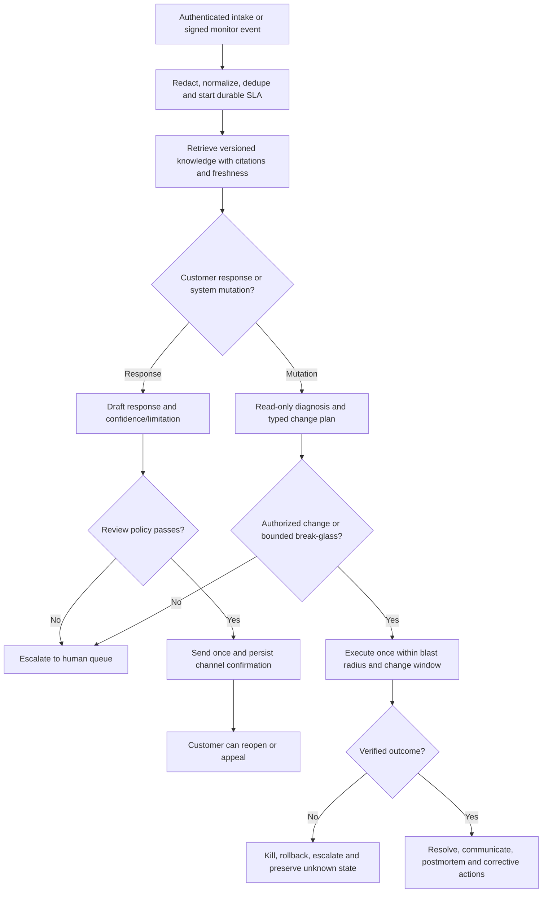
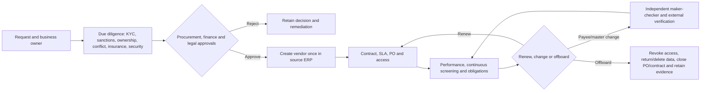
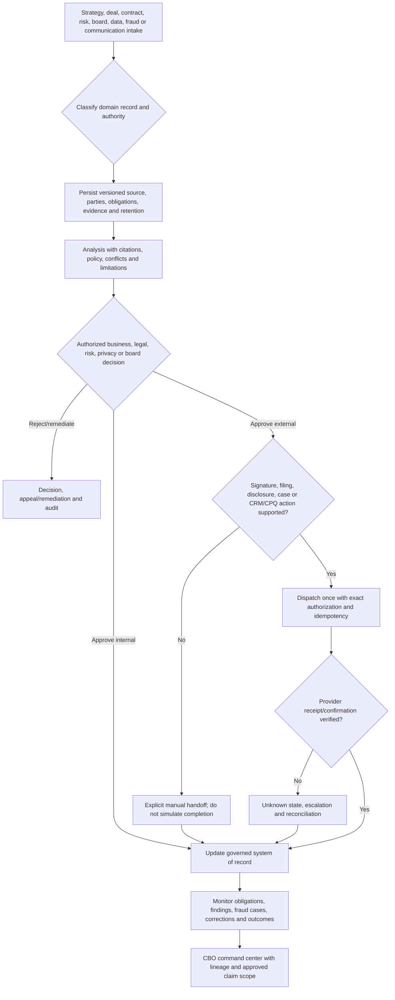

# Domain Readiness Standard

**Status:** proposed release standard pending owner/domain/legal/security sign-off
**Baseline:** product 4.8.0, repository commit `384543788bcd1f66aed8cff8ab03699ae384926e`, 2026-07-13
**Accountable owner:** unassigned until `W0-05`
**Last reviewed:** 2026-07-15
**Next review:** owner assignment or 2026-07-27
**Prerequisite/control record:** [Capability readiness and evidence register](CAPABILITY_READINESS_REGISTER.md)
**Limitations:** target release requirements; current satisfaction is recorded separately
**Related test:** `tests/regression/test_readiness_documentation.py`
**Related runbook:** [promotion lifecycle](BUILD_ROADMAP.md#promotion-lifecycle)

This document defines the complete target scope for Marketing, Finance, CA firms, HR, COO, and CBO. It is a release standard, not a statement that the current product satisfies it.

## Mandatory cross-domain gates

Every domain must satisfy all of these gates before GA.

| Gate | Required outcome |
|---|---|
| Product workflow | A real user can complete the primary journey without hidden admin scripts, fake state, or manual database edits. |
| Data contract | Canonical entities, required fields, ownership, validation, lineage, retention, and deletion are defined. |
| Tenant and company isolation | Database, cache, object storage, connector credentials, jobs, logs, and exports are tenant- and company-scoped. |
| Connector lifecycle | Configure, test, authorize, scope, sync, backfill, monitor, retry, rotate, revoke, and disconnect are supported. |
| Agent contract | Inputs, tools, deterministic validation, confidence, outputs, refusal, degraded mode, and escalation are versioned. |
| Workflow durability | Runs survive restarts, waits are durable, retries are idempotent, and every state transition is auditable. |
| External-write safety | Policy and approval run before dispatch; approval binds to action and payload; unknown outcomes reconcile before retry. |
| KPI trust | Source, formula, entity, period, currency/unit, freshness, reconciliation, confidence, and drill-down are visible. |
| Security and privacy | Least privilege, secret management, encryption, audit, data minimization, consent, retention, deletion, and incident controls pass. |
| Reliability | SLOs, alerts, dashboards, runbooks, capacity, rate limits, backpressure, backups, restore, and rollback are exercised. |
| Quality | Unit, contract, integration, sandbox, E2E, failure injection, accessibility, performance, and security tests pass. |
| Documentation | User, admin, developer, API, connector, data dictionary, runbook, troubleshooting, and release notes are current. |
| Commercial and entitlement truth | Pricing, billing interval, taxes, discounts, entitlements, runtime enforcement, trial/signup/checkout mode, support terms, signed-order precedence, and change notice are versioned and consistent. |
| Customer lifecycle | Qualification, onboarding, implementation, migration, training, acceptance, adoption, renewal, suspension, offboarding, export, retention/deletion, connector revocation, and completion receipts are governed. |
| Support | Named product, engineering, security, compliance, and business owners plus entitlement, severity, channels/hours, escalation, customer communication, known-limitations, and evidence-expiry policies exist. |
| Evidence | Sandbox and production-pilot bundles are retained, redacted, reviewable, dated, and linked from the readiness record. |
| Public truth | Landing pages, README, pricing, demos, and sales material never claim a higher state than the evidence register. |

## Shared governed action lifecycle

## Finance / CFO

| Capability | Ready means | Minimum release evidence |
|---|---|---|
| Finance foundation | Multi-entity chart of accounts, fiscal calendars, currencies, dimensions, accounting policies, periods, and opening balances are governed. | Reconciled seeded ledger plus accountant-approved data dictionary and migration tests. |
| Accounts payable | Invoice capture, duplicate detection, tax validation, PO/GRN matching, exceptions, approval, posting, payment proposal, and remittance work end to end. | ERP sandbox write, negative cases, approval-before-post/payment proof, and reconciliation to GL. |
| Accounts receivable | Customer ledger, invoice state, cash application, disputes, credit control, collections, and write-off approvals are complete. | CRM/ERP/bank sandbox evidence and aging-to-GL reconciliation. |
| Expenses and cards | Policy evaluation, receipt validation, mileage/per-diem, approvals, reimbursements, card feeds, and accounting entries are complete. | Policy golden cases, fraud/duplicate tests, and payroll/ERP posting proof. |
| Bank reconciliation | Statement ingestion, matching, tolerance, split/merge, stale items, unidentified cash, review, and posting are complete. | Multi-bank sandbox data, measured precision/recall, break queue, and GL balance proof. |
| Treasury | Cash position, account hierarchy, liquidity forecast, sweeps, debt, investments, FX, limits, and approvals are complete. | Bank/AA read proof; no-money-movement mode until separately authorized and certified. |
| Revenue recognition | Contract/performance obligations, schedules, modifications, deferrals, journals, disclosures, and review are complete. | Standard-specific golden cases and ERP journal/reconciliation proof. |
| Fixed assets and leases | Capitalization, componentization, depreciation, transfer, impairment, disposal, tax books, and reconciliation are complete. Lease classification, right-of-use assets, liabilities, payments, modifications, remeasurement, impairment, disclosures, and termination are governed for the explicitly supported standards. | Asset/lease-register-to-GL reconciliation, approved standard-specific golden cases, disclosure tests, and period-close evidence. |
| Tax and statutory | Effective-dated rules, GST/TDS/income-tax inputs, calculations, exceptions, approvals, filing handoff, receipts, and amendments are governed. | Qualified reviewer sign-off, provider sandbox proof, and versioned rule metadata. |
| Close and consolidation | Checklist, dependencies, journals, reconciliations, intercompany, consolidation, FX, review, lock, and reopen are durable. | Two complete dry-run closes with audit evidence and measured close SLO. |
| FP&A | Budget, forecast, scenarios, driver models, variance, headcount plan, cash runway, and board reporting use governed data. | Formula lineage, scenario tests, finance-owner sign-off, and export fidelity. |
| CFO command center | Cash, runway, working capital, DSO/DPO, AP/AR aging, P&L/BS/CF, forecast, close, tax, risk, and action queues are traceable. | Every card drills to reconciled source data and honestly handles empty/stale states. |
| Audit and controls | Segregation of duties, materiality, journal approval, evidence requests, period lock, access review, and immutable exports exist. | Control matrix, negative tests, audit export, and control-owner sign-off. |

## Chartered Accountant firm operations

| Capability | Ready means | Minimum release evidence |
|---|---|---|
| Firm and client onboarding | Firm, partner, staff, client entity, engagement, authorization, PAN/GSTIN/TAN/CIN, fiscal profile, and consent are verified and scoped. | Real verification/provider strategy, role matrix, and tenant/company isolation tests. |
| Books intake | Tally/Zoho/ERP imports, bank statements, payroll, invoices, prior returns, and document requests have completeness and quality checks. | Backfill evidence, duplicate handling, mapping approval, and source lineage. |
| Partner workbench | Cross-client deadlines, blockers, reconciliations, approvals, notices, staff assignments, capacity, and SLA breaches are actionable. | Multi-client scenario with role restrictions and no cross-company leakage. |
| GST lifecycle | Registration context, 1/3B/9 preparation, 2B reconciliation, amendments, payment/challan, DSC, submission, ARN, rejection, and status polling are governed. | Approved exact-payload sandbox filing, valid DSC, idempotency, receipt, and unknown-outcome reconciliation. |
| TDS lifecycle | Applicable sections, deductee/master data, challans, returns, corrections, certificates, 26AS/TRACES reconciliation, approval, and receipt are complete. | Effective-dated CA-reviewed cases and provider/sandbox proof. |
| Professional tax and local compliance | State-specific registration, slabs, returns, payment/manual handoff, acknowledgement, and change management are explicit. | Per-state adapter certification or clearly labeled manual workflow with evidence. |
| Income tax and MCA work | Supported forms, eligibility, data sources, notices, response packages, approval, filing boundary, and receipts are explicit. | Supported-scope matrix; no generic portal wrapper is marketed as certified integration. |
| Compliance calendar | Effective due dates, holidays/extensions, entity applicability, dependencies, reminders, escalation, and delivery receipts are durable. | Scheduler, retry, delivery, timezone, extension, and missed-deadline tests. |
| Filing authorization | Approval binds tenant, client, form, period, provider, exact payload hash, signing identity, expiry, and one-time dispatch. | Zero connector calls before approval and exactly one after approval in regression tests. |
| Client portal | Secure invite, document request/upload, approval, status, receipt, comment, revocation, expiry, and audit are available. | Token, authorization, malware/file-boundary, accessibility, and mobile E2E evidence. |
| Billing and collections | Engagement pricing, recurring invoices, tax, delivery, payment link/manual payment, webhook reconciliation, credit note, and aging are supported. | Gateway sandbox, idempotent webhook, ledger reconciliation, and client receipt. |
| Practice quality | Review notes, maker-checker, sampling, evidence packs, retention, conflict checks, and partner sign-off are durable. | Qualified CA approval of the control matrix and release evidence bundle. |

### Normative Finance and CA controlled-action workflow

Missing or provisional statutory facts never reach `W`; live filing requires a valid signing identity, strict sandbox/live separation, and a qualified owner for the effective-dated rule set.

## Human Resources / CHRO

| Capability | Ready means | Minimum release evidence |
|---|---|---|
| Workforce planning and org design | Positions, budget, skills, location, spans/layers, succession, scenarios, and approvals share a canonical workforce model. | HR/finance reconciliation and scenario-owner sign-off. |
| Recruiting | Requisition, inclusive job description, sourcing, consent, screening, interview, scorecard, offer, background check, and handoff are complete. | ATS sandbox E2E, bias/adverse-impact review, deletion/consent tests, and human decision gate. |
| Employment decision governance | Hiring, scheduling/accommodation, performance, promotion, compensation, discipline, and termination decisions retain authorized human judgment; use job-relevant evidence; exclude protected data; provide explanation, fairness/adverse-impact review, appeal, anti-retaliation, and retention controls. | Cross-lifecycle negative tests, representative group-quality review, HR/legal/privacy sign-off, and proof that no model/tool produces an autonomous final adverse decision. |
| Onboarding | Preboarding, documents, identity, provisioning, payroll/benefits enrollment, training, equipment, buddy, and day-30 follow-up are durable. | HRIS/IdP/ticketing/e-sign sandbox proof and compensating rollback. |
| Employee master and HRIS | Effective-dated identity, employment, manager, position, compensation, location, documents, and lifecycle events have one source of truth. | Bidirectional sync rules, conflict policy, and field-level lineage. |
| Time, attendance, and leave | Policies, calendars, shifts, accruals, requests, exceptions, approvals, and payroll export are governed. | Policy golden cases across location/grade/timezone and payroll reconciliation. |
| Payroll and benefits | Earnings, deductions, reimbursements, PF/ESI/PT/TDS, arrears/off-cycle/reversal/final settlement, bank file, payslip, and GL are controlled. Benefit plans, eligibility, dependents, enrollment/life events, carrier feeds, deductions, termination, and continuation are effective-dated and reconciled. | Parallel payroll, zero-unexplained-difference reconciliation, qualified payroll/labor owner sign-off, benefit-carrier reconciliation, and bank-file approval gate. |
| Performance and compensation | Goals, evidence, check-ins, calibration, review, promotion, merit/bonus planning, explanation, appeal, and employee acknowledgement are complete under the employment-decision policy. | Role/privacy controls, calibration/fairness audit, human decision evidence, and compensation-to-payroll proof. |
| Learning and skills | Skills taxonomy, assignments, learning paths, certifications, expiry, completion, and effectiveness are supported. | LMS sandbox proof and certification-expiry alerts. |
| Engagement and employee service | Surveys, policy questions, restricted case partitions, grievance, investigation, discipline, witness protection, anti-retaliation, legal hold, appeal, confidentiality, SLA, and restricted reporting are governed. | Anonymous/confidential handling and denial tests, investigation/grievance golden cases, HR/legal/privacy approval, and case runbook. |
| Compliance and wellbeing | EPFO/ESI/PT, POSH workflows, labor-policy acknowledgements, workplace accommodations, and statutory reporting have human/legal ownership. | Counsel/HR sign-off and jurisdiction-specific supported-scope matrix. |
| Offboarding | Resignation/termination, independent authority, effective time, knowledge transfer, access/assets, final pay/benefits, legal hold/retention, employee documents, and receipts are coordinated. Approved termination uses a pre-authorized revoke at the effective time. Emergency security isolation is a separate time-limited break-glass action with notification, verification, rollback, and post-event review; it never makes the employment decision. | HRIS/IdP/IT/finance/benefits E2E covering approved termination, emergency isolation, failed/replayed revocation, rollback, final records, and owner sign-off. |
| CHRO command center | Headcount, vacancies, time-to-hire, attrition, diversity, payroll exceptions, leave, performance, skills, engagement, cases, and compliance are traceable. | Drill-down, small-cohort privacy controls, freshness, and HR-owner sign-off. |

### Normative employee lifecycle

## Marketing / CMO

| Capability | Ready means | Minimum release evidence |
|---|---|---|
| Strategy and planning | Objectives, ICP, personas, segments, positioning, channel plan, budget, forecast, and approvals are versioned. | Approved plan linked to campaigns, spend, pipeline, and outcome metrics. |
| Research and insight | Market, customer, win/loss, voice-of-customer, category, and competitor evidence have provenance and freshness. | Source citations, consent/licensing review, and reproducible insight runs. |
| Campaign operations | Brief, audience, creative, budget, UTM/taxonomy, channel setup, review, launch, pacing, optimization, pause, and retrospective are durable. | Vendor sandbox launch with pre-write approval, idempotency, confirmation, and rollback/pause proof. |
| Content and editorial | Ideation, brief, draft, brand/legal review, originality, accessibility, localization, CMS publication, refresh, and retirement are governed. | CMS sandbox proof plus brand, legal, citation, and accessibility checks. |
| SEO and website growth | Technical audit, keyword/topic model, internal linking, schema, content changes, experiment, monitoring, and rollback are supported. | Search/CMS sandbox evidence and measured, non-fabricated experiment record. |
| Lifecycle and email | Consent, preference, segmentation, trigger, template, deliverability, frequency cap, send, event ingestion, suppression, and attribution are complete. | ESP sandbox proof, unsubscribe/consent negative tests, and send confirmation. |
| Paid media | Account/campaign/ad group/creative/audience/bid/budget, policy, pacing, optimization, and finance reconciliation are governed. | Ads sandbox proof and spend-to-invoice reconciliation. |
| ABM and CRM | Account selection, intent provenance, contacts, consent, orchestration, scoring, lifecycle, sales handoff, and feedback loop are complete. | CRM/intent sandbox E2E and reversible write proof. |
| Social, community, and brand | Calendar, draft, approval, publish, moderation, sentiment, crisis detection, escalation, response, and archive are governed. | Platform sandbox or controlled account proof; crisis responses always human-approved. |
| Product marketing and launches | Positioning, messaging, enablement, release coordination, competitive battlecards, launch plan, adoption, and feedback are connected. | One controlled launch with artifact versioning and cross-functional sign-off. |
| Events, partners, and field | Event/partner plan, registration, consent, lead capture, routing, follow-up, cost, and attribution are supported. | Registration/CRM integration and lead SLA proof. |
| Experimentation and CRO | Hypothesis, assignment, sample guard, metric, duration, stopping rule, winner approval, rollout, and archive are reproducible. | Statistical review, holdout tests, and no auto-winner without policy. |
| Marketing analytics | CAC, MQL/SQL, funnel, pipeline, revenue attribution, ROAS, LTV, content, brand, and experiment metrics are reconciled and traceable. | CRM/ads/analytics/finance source reconciliation and pilot evidence. |
| CMO command center | Trusted KPIs, budgets, campaigns, content, experiments, approvals, incidents, connector health, and prioritized work queue are actionable. | Real-vendor pilot with no demo/test-double proof accepted as production evidence. |

### Normative Marketing evidence-to-action workflow

## Chief Operating Officer

| Capability | Ready means | Minimum release evidence |
|---|---|---|
| Operating model | Services, processes, owners, controls, demand, staffing, capacity, cost, dependencies, SLAs, unit economics, forecast, and improvement targets are governed by a versioned catalog. | Approved service/process catalog, ownership matrix, reconciled sources, and formula-owner sign-off. |
| Customer support | Authenticated context, intake, PII/PCI redaction, classification, priority, routing, versioned/cited knowledge, staleness, suggestion, review policy, outbound confirmation, escalation, closure, QA, appeal/reopen, and CSAT are complete. | Helpdesk sandbox E2E, knowledge citation/staleness tests, measured model quality, privacy/security review, and customer-facing response gate. |
| IT service management | Incident, request, problem, change, asset/configuration, on-call, status/customer communication, postmortem, and corrective action are durable. Mutations are typed, allowlisted, blast-radius limited, kill-switch protected, verified, and rollback-aware. Break-glass authority is pre-approved, bounded, logged, reversible, and reviewed. | Jira/ServiceNow/PagerDuty sandbox proof, incident game day, unauthorized/timeout/rollback/kill-switch tests, and closed corrective actions. |
| Vendor and procurement operations | Request, sourcing, beneficial ownership/conflicts, KYC/sanctions/continuous refresh, insurance/certificates, data-security/DPA review, onboarding, maker-checker vendor/payee changes, contract, PO, performance/SLA, renewal, and offboarding with access/data-return proof are connected. | ERP/procurement/contract sandbox proof, verified bank-detail change, segregation-of-duties tests, sanctions refresh, and complete offboarding evidence. |
| Facilities and physical operations | Sites, access, work orders, inspections, safety, maintenance, assets, visitors, incidents, and vendors are supported where in scope. | Supported-site matrix, mobile workflow, and emergency escalation test. |
| Supply chain and fulfillment | Demand, inventory, replenishment, supplier, order, fulfillment, exception, return, and logistics are supported where in scope. | ERP/WMS sandbox scenario and inventory/order reconciliation. |
| Quality and process excellence | SOPs, controls, sampling, nonconformance, CAPA, root cause, audit, and continuous improvement are durable. | Closed-loop CAPA scenario and evidence pack. |
| Business continuity | Business impact, dependencies, recovery strategies, crisis roles, communications, exercises, and corrective actions are maintained. | Tabletop and technical recovery exercise with measured outcomes. |
| Operational risk and compliance | Control checks, exceptions, sanctions/vendor risk where applicable, attestations, remediation, and evidence are governed. | Risk-owner sign-off and negative/failure tests. |
| Capacity, cost, and productivity | Demand, staffing, backlog, throughput, cycle time, utilization, unit cost, quality, and forecast are traceable. | Reconciled source data and operator-approved formulas. |
| COO command center | Service health, incidents, SLA, backlog, vendors, facilities, supply chain, quality, continuity, risk, capacity, cost, and actions are traceable. | Drill-down, live freshness, role scoping, and operations-owner sign-off. |

Facilities, supply chain/fulfillment, quality/CAPA, and customer business continuity are conditional product modules until `W0-04` records supported scope, owner, provider/jurisdiction matrix, and explicit out-of-scope rows. Customer business continuity is not AgenticOrg platform backup/DR.

### Normative support and incident workflow

### Normative vendor lifecycle

## Chief Business Officer / back office

| Capability | Ready means | Minimum release evidence |
|---|---|---|
| Business strategy and OKRs | Strategic themes, initiatives, owners, dependencies, economics, risks, milestones, and outcomes are governed. | Leadership-approved strategy model and traceable KPI updates. |
| Business development and partnerships | Account/partner discovery, qualification, diligence, opportunity, business case, negotiation, approval, onboarding, and review are complete. | CRM/contract sandbox E2E and stage/control evidence. |
| Commercial pipeline and forecasting | Products, territories, pricing, pipeline, probability, forecast, coverage, handoff, and revenue feedback are reconciled. | CRM-to-finance reconciliation and forecast backtest. |
| Pricing and deal desk | Price book, discount, margin, terms, tax, approvals, quote, exception, and audit are governed. | CPQ/CRM sandbox proof and margin/approval negative tests. |
| Contract and legal operations | Intake, template, clause review, risk, redline, approval, signature, obligation, renewal, dispute, and retention are supported. | CLM/e-sign sandbox proof; licensed counsel retains legal decisions. |
| Enterprise risk and compliance | Risk register, controls, testing, issues, remediation, attestations, evidence, and reporting are durable. | Control-owner sign-off and audit evidence export. |
| Corporate secretarial and board | Entity records, board calendar, agenda, papers, minutes, resolutions, actions, filings, and access controls are governed. | Secure board workflow, signature, retention, and access-review evidence. |
| Internal and corporate communications | Internal policy/town-hall communications and external stakeholder disclosures are separate workflow classes. Audience, draft, review, legal/communications approval, consent/privacy, publication, monitoring, correction, archive, and crisis escalation are governed. Employee sentiment is aggregated and privacy-protected; no unsupervised material disclosure occurs. | Internal and external approval/correction scenarios, access/privacy tests, channel confirmation, archive evidence, and legal/communications sign-off. |
| Information privacy and data governance | Classification, PII inventory, purpose/legal basis, access, lineage, retention/deletion, subject rights, DLP signals/incidents, remediation, legal hold, and evidence are governed. | Privacy/security/data-owner sign-off plus access, leakage, deletion, retention, and incident golden cases. |
| Fraud signals and investigations | Signals, alerts, cases, evidence, human disposition, remediation, recovery, reporting, retention, and appeal are governed; no model autonomously takes adverse, account, legal, or financial action. | Representative golden cases, measured detection/false-positive quality, security/legal/finance sign-off, and adverse-action negative tests. |
| Business metric governance | Metric catalog, ownership, formula, quality, lineage, reconciliation, access, retention, and decision records are connected. | Data/business-owner sign-off, source reconciliation, change history, and decision trace. |
| Portfolio economics | Initiative, partner, customer, product, and channel economics connect revenue, cost, risk, and strategic value. | Finance reconciliation and scenario evidence. |
| CBO command center | Strategy, pipeline, partnerships, pricing/deals, contracts, obligations, risk, board actions, internal/external communications, information-governance incidents, fraud cases, metric governance, and portfolio economics are actionable. | Role-specific data, drill-down, approvals, privacy controls, and leadership pilot evidence. |

### Normative CBO business-governance workflow

## Promotion rule

A domain cannot be promoted by averaging its rows. Every safety-, compliance-, money-, employment-, disclosure-, customer-write-, and source-of-record row is mandatory and fail-closed. Optional industry-specific rows must be explicitly marked out of scope rather than silently omitted.
