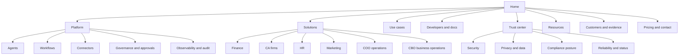
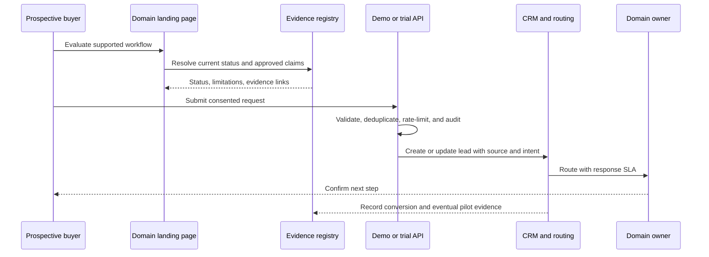
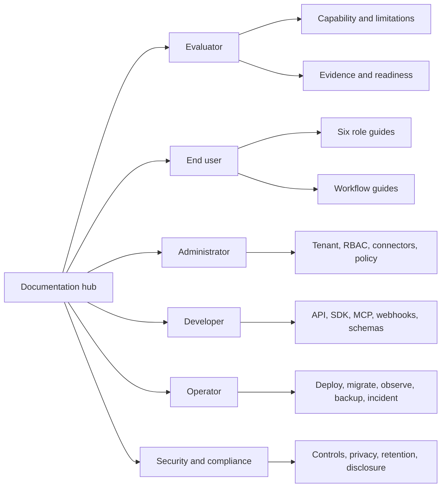

# Landing Pages and Documentation Blueprint

**Status:** proposed content/design system pending product, domain, legal, security, SEO, accessibility, and design sign-off
**Baseline:** product 4.8.0, repository commit `384543788bcd1f66aed8cff8ab03699ae384926e`, 2026-07-13
**Accountable owner:** unassigned until `W0-05`
**Last reviewed:** 2026-07-15
**Next review:** owner assignment or 2026-07-27
**Prerequisite:** [capability readiness and evidence register](CAPABILITY_READINESS_REGISTER.md)
**Limitation:** public-copy remediation is local and provisional; retained cross-browser, accessibility, performance, CTA, route-rendering, and production screenshot evidence is still pending.
**Related test:** `tests/regression/test_readiness_documentation.py` plus the public-route/accessibility/visual suites required by `WEB-05`
**Related runbook:** [Wave 4 delivery plan](BUILD_ROADMAP.md#wave-4--product-experience-landing-pages-readme-and-documentation)

This blueprint defines the public information architecture, visual language, claims governance, documentation set, and acceptance gates required before the site or README can represent the six-domain product as ready.

## Baseline findings and local delta

- Public routes exist for the home page, CFO, CHRO, CMO, COO, CBO, CA firms, three paid-search use cases, pricing, playground, evals, blog, resources, integrations, and OACP.
- The six solution components are large, mostly parallel TSX implementations. Their dashboard previews and outcome figures are hardcoded marketing illustrations rather than evidence-fed case studies.
- Only the CA solution has meaningful dedicated E2E coverage. The CFO/CHRO/CMO/COO/CBO solution pages lack equivalent route, CTA, responsive, accessibility, metadata, and claim tests.
- React Helmet sets route metadata after hydration, but the initial HTML and structured data are generic. A crawler inspection of `/solutions/cmo` returned the generic platform title/content rather than the CMO page. Route-specific prerendering or SSR remains required.
- At the audited baseline, `ui/index.html` advertised unverified ratings, template maturity, tool volume, retention, and availability. A local truth-remediation pass has removed or qualified those classes of claims, but merge, deployment, and production-crawler evidence remain pending.
- The tracked development sitemap is intentionally stale and the build generates a fresh artifact, but the static-page list still omits some public explainers. Sitemap coverage needs a route-source-of-truth test.
- Demo-request forms call a real API, but the pages do not expose the complete lead lifecycle, consent, routing, delivery, CRM synchronization, deduplication, spam control, or conversion analytics contract.
- The baseline audit lacked a working browser session. Local browser inspection, automated accessibility, tablet coverage, visual baselines, and retained production screenshots must all be attached before `WEB-05` can pass.

## Target public information architecture

## Page delivery matrix

| Page family | Required pages | Primary job | Required proof |
|---|---|---|---|
| Home | `/` | Explain the platform, governance boundary, supported domains, and next action. | Runtime-derived facts, real screenshots, evidence-qualified outcomes, working CTAs. |
| Domain solutions | Finance/CFO, CA firms, HR/CHRO, Marketing/CMO, COO, CBO | Show the role problem, supported workflow, control boundary, integrations, dashboard, implementation path, and proof. | Domain readiness status, supported-scope matrix, case-study/evidence links, no invented KPI values. |
| Platform | Agents, workflows, connectors, governance, observability, knowledge, SDK/MCP | Explain architecture and operational behavior. | Versioned contracts and inspectable product screens. |
| Use cases | AP, reconciliation, close, payroll, onboarding, campaigns, support, vendor ops, contracts, compliance | Match high-intent problems to a safe end-to-end workflow. | Workflow state diagram, prerequisites, limitations, and evidence state. |
| Trust center | Security, privacy, responsible AI, compliance, availability, subprocessors, vulnerability disclosure | Answer enterprise diligence questions. | Current policies, control/evidence status, no certification claim without certificate. |
| Developers | Quickstart, API, SDKs, MCP, webhooks, schemas, examples, changelog | Let a developer reach a successful governed run quickly. | Tested snippets, version selector, error model, auth and tenancy guidance. |
| Customers | Case studies, benchmarks, evidence methodology | Establish credible outcomes. | Named or anonymized methodology, sample size, dates, baselines, exclusions, reviewer. |
| Commercial | Pricing, comparison, demo, contact, trial | Set expectation and capture qualified demand. | Entitlements, limits, taxes, support, privacy consent, routing and response SLA. |
| Education | Blog, resources, glossary, guides | Build category understanding without overstating product availability. | Author, reviewer, date, sources, freshness, product-status disclaimer. |

## Exact public-route evidence ledger

This ledger is the minimum route manifest for the current truth-remediation scope. `Local` means source copy exists in the working tree; it does not mean merged, server-rendered, deployed, accessible, or production-proven. `Pending` is a blocking evidence state, not a waiver. Owners remain placeholders until `W0-05` closes.

| Route or representative pattern | Owner | Index policy | Claim source | Metadata / schema / sitemap | CTA evidence | Accessibility | Desktop / tablet / mobile evidence |
|---|---|---|---|---|---|---|---|
| `/` | WEB-O / PLAT-O | Index | Claim registry plus `/product-facts`; local truth pass | SPA metadata local; route-specific server response and schema validation pending | Demo/signup local; consent, delivery, CRM, retry, analytics E2E pending | Automated and manual WCAG pending | All three pending retained screenshots |
| `/pricing` | WEB-O / COM-O | Index | `/api/v1/billing/plans`; signed terms control purchase | Local metadata; offer schema and crawler response pending | Checkout/contact behavior and offer-version E2E pending | Pending | All three pending |
| `/solutions/cfo` | WEB-O / FIN-O | Index | `FIN-C*`; illustrative samples only | Local route metadata; SSR/schema/sitemap proof pending | Pilot/contact E2E pending | Pending | All three pending |
| `/solutions/ca-firms` | WEB-O / CA-O | Index | `CA-C*`; filing/payment unavailable | Local route metadata; SSR/schema/sitemap proof pending | Evaluation/contact E2E pending; no paid activation claim | Pending | All three pending |
| `/solutions/chro` | WEB-O / HR-O | Index | `HR-C*`; preview and human-decision boundary | Local route metadata; SSR/schema/sitemap proof pending | Pilot/contact E2E pending | Pending | All three pending |
| `/solutions/cmo` | WEB-O / MKT-O | Index | `MKT-C*`; beta and vendor-proof boundary | Local route metadata; SSR/schema/sitemap proof pending | Pilot/contact E2E pending | Pending | All three pending |
| `/solutions/coo` | WEB-O / OPS-O | Index | `OPS-C*`; preview and governed-remediation boundary | Local route metadata; SSR/schema/sitemap proof pending | Pilot/contact E2E pending | Pending | All three pending |
| `/solutions/cbo` | WEB-O / CBO-O | Index | `CBO-C*`; preview and licensed-authority boundary | Local route metadata; SSR/schema/sitemap proof pending | Pilot/contact E2E pending | Pending | All three pending |
| `/solutions/ai-invoice-processing` | WEB-O / FIN-O | Index | Finance draft/evaluation claims | Local metadata; SSR/schema/sitemap proof pending | Demo/contact E2E pending | Pending | All three pending |
| `/solutions/automated-bank-reconciliation` | WEB-O / FIN-O | Index | Reconciliation evaluation claims; no outcome benchmark | Local metadata; SSR/schema/sitemap proof pending | Demo/contact E2E pending | Pending | All three pending |
| `/solutions/payroll-automation` | WEB-O / HR-O | Index | Payroll draft/evaluation claims; no autonomous payroll | Local metadata; SSR/schema/sitemap proof pending | Demo/contact E2E pending | Pending | All three pending |
| `/integration-workflow` | WEB-O / PLAT-O | Index | Configured-connector compatibility only | Local metadata; SSR/schema/sitemap proof pending | SDK/contact links pending link/E2E proof | Pending | All three pending |
| `/open-agentic-commerce-protocol` | WEB-O / COMMERCE-O | Index | Repository OACP paths and explicit non-execution limits | Local metadata; SSR/schema/sitemap proof pending | Documentation/handoff links pending E2E proof | Pending | All three pending |
| `/how-grantex-works` | WEB-O / PLAT-O | Index | Repository authorization architecture; no latency/conformance claim | Local metadata; SSR/schema/sitemap proof pending | Developer links pending E2E proof | Pending | All three pending |
| `/blog` and `/blog/:slug` | DOC-O / MKT-O | Index approved entries; stale entries must noindex | Educational content with product-status disclaimer and sources | Collection metadata local; article schema, freshness, sitemap, SSR pending | Related-content/contact analytics pending | Pending | Index plus representative article at all three pending |
| `/resources` and `/resources/:slug` | DOC-O / domain owner | Index approved entries; stale entries must noindex | Educational content; scenario language does not authorize capability | Collection metadata local; FAQ/article schema, freshness, sitemap, SSR pending | Related-content/contact analytics pending | Pending | Index plus representative resource at all three pending |
| `/support`, `/contact` | CS-O / WEB-O | Index according to support policy | Support channels and response terms require signed/operational evidence | Canonical/noindex decision and route response pending | Submission, consent, routing, escalation, deletion E2E pending | Pending | All three pending |
| `/privacy`, `/terms`, `/refund` aliases | LEGAL-O / WEB-O | Index one canonical per policy | Approved legal text only | Canonical/alias/noindex and freshness review pending | Legal-contact/deletion paths pending | Pending | Representative canonical pages pending |

Before release, replace every `Pending` cell with an immutable artifact URI, checksum, commit, environment, execution time, reviewer, and expiry. Dynamic collections require full automated coverage plus a manually reviewed representative page; one representative page does not clear the collection's claim/freshness gate.

## Required domain-page structure

Each domain page must use the same evidence-aware component model while retaining domain-specific content.

1. Outcome-oriented hero with one primary CTA and one proof CTA.
2. A conservative page-level public availability summary plus capability- and connector-level badges: unavailable, preview, beta, limited availability, GA, or deprecated. Internal maturity and sandbox/pilot evidence are shown separately and sourced from the readiness register.
3. Role pain and supported scope; unsupported scope is visible.
4. End-to-end workflow showing data, agent, approval, system of record, and audit.
5. Real product screenshot or recorded flow with sample/demo labeling.
6. Capability matrix linked to the domain readiness standard.
7. Connector prerequisites with read/write scope, deployment, and certification state.
8. Governance section covering approval, policy, idempotency, rollback, and audit.
9. KPI section using traceable definitions, not decorative sample cards presented as live results.
10. Evidence-qualified customer proof or an honest pilot invitation when proof is absent.
11. Security, privacy, residency, retention, and regulatory boundaries.
12. Implementation timeline, prerequisites, responsibilities, and support model.
13. FAQ with product limitations and data requirements.
14. Final CTA wired to the lead lifecycle and conversion analytics.

## Visual system

The site should use maintainable product-native visuals rather than decorative stock art.

| Visual | Purpose | Implementation rule |
|---|---|---|
| Workflow map | Show handoffs among user, agent, policy, connector, and system of record. | Shared accessible component generated from versioned workflow metadata. |
| Data-lineage map | Explain where a KPI came from and why it is trusted. | Show source, transform, reconciliation, freshness, and owner. |
| Approval snapshot | Make the exact proposed action and impact understandable. | Use real redacted payload examples; label sample data. |
| Product screenshot | Demonstrate the actual UI. | Capture from a versioned release; include alt text and last-reviewed version. |
| Evidence card | Summarize a benchmark or pilot. | Include scope, baseline, sample, period, methodology, and evidence link. |
| Readiness matrix | Compare supported capability states. | Use text labels and icons in addition to color; never imply GA through decorative color. |

### Visual design tokens and art direction

The public system should feel like an inspectable operating console rather than a collection of decorative AI effects. These rules apply to shared components and route-specific visuals.

| Layer | Contract |
|---|---|
| Typography | Use one neutral sans family for interface/body and one legible mono family for identifiers, evidence, and payloads. Maintain a documented type scale, 1.5+ body line height, stable heading hierarchy, and no text baked into images. |
| Color | Define semantic tokens for canvas, surface, text, border, action, focus, success, warning, blocked, preview, beta, and evidence. State is never color-only; contrast must pass WCAG 2.2 AA in every theme. |
| Spacing and grid | Use a documented spacing scale, max content width, 12-column desktop grid, 8-column tablet grid, and 4-column mobile grid. Workflow cards preserve reading order when stacked. |
| Breakpoints | Validate at minimum compact mobile, large mobile, tablet portrait, small desktop, and wide desktop. Breakpoints are layout decisions, not device-name assumptions. |
| Icons | Use one stroke family with accessible labels. Icons indicate object type or state; decorative robot/brain imagery must not imply autonomy or certification. |
| Motion | Motion explains state transitions and must stop when off-screen. Honor `prefers-reduced-motion`; avoid autoplay that obscures sample/demo labels or approval boundaries. |
| Component states | Every proof, connector, KPI, workflow, and CTA component defines loading, empty, stale, partial, blocked, error, offline, unauthorized, and success states. Sample data remains visibly labeled in every state. |
| Workflow visuals | Use consistent lanes for human, agent, policy, connector, and system of record. External writes use a distinct boundary and show reject, expiry, unknown-outcome, and reconciliation paths. |
| Screenshot direction | Capture only a versioned build with synthetic/redacted data. Record route, viewport, theme, commit, product version, capture time, alt text, reviewer, and expiry; never crop away limitations or sample labels. |
| Evidence cards | Show scope, baseline, method, period, exclusions, reviewer, artifact link, and expiry. When proof is absent, render a pilot invitation rather than a fabricated result. |

### Canonical landing-page workflow

## Claims governance

Create a versioned claim registry with these fields:

| Field | Requirement |
|---|---|
| Claim ID and exact text | Stable identifier and approved wording. |
| Scope | Domain, workflow, connector, tenant type, geography, and plan. |
| Claim type | Inventory, capability, performance, customer outcome, security, compliance, or certification. |
| Capability IDs | Stable readiness-register rows that authorize the claim; no domain-average inheritance. |
| Evidence | Reproducible test, sandbox bundle, pilot report, certificate, or customer approval. |
| Internal maturity and gate | Highest evidence-backed maturity plus current mandatory-gate result. |
| Public availability | Unavailable, preview, beta, limited availability, GA, or deprecated. |
| Claim treatment | Hidden, illustrative, qualified, or evidence-backed. |
| Owner and approver | Product owner plus security/compliance/legal/business reviewer as applicable. |
| Validity | Review date, expiry date, product version, and invalidation conditions. |
| Surfaces | README, route, pricing, sales deck, schema markup, demo, and documentation locations. |

A local v1 registry and scanner now exist. They are seed controls, not complete claim approval: owners and approvers are unassigned, evidence records are not production evidence, surface coverage is still being expanded, and records expire unless reviewed. Unsupported throughput, accuracy, ROI, cycle-time, zero-error, rating, certification, commercial, support/SLA, and universal-connector statements remain hidden or explicitly illustrative until an unexpired evidence record authorizes exact wording and surfaces.

## SEO, AEO, accessibility, and performance

- Pre-render or server-render every indexable page with route-specific title, description, canonical, Open Graph, Twitter, headings, and structured data.
- Generate sitemap entries from the actual public router plus content collections; fail CI on missing or orphaned indexable routes.
- Generate structured data per route and validate it. Do not publish aggregate ratings, offers, search actions, or certifications without real backing.
- Publish `robots.txt`, `llms.txt`, and `llms-full.txt` from the same approved claim and route sources.
- Add Breadcrumb, Organization, SoftwareApplication, Article, FAQ, and Product/Service schemas only where the page visibly satisfies the schema.
- Set route budgets for LCP, INP, CLS, JavaScript, images, and fonts. Lazy-load noncritical media and honor reduced motion.
- Meet WCAG 2.2 AA: semantics, keyboard, focus, dialog behavior, contrast, zoom, motion, error messaging, and alt text.
- Add automated link, metadata, schema, accessibility, visual-regression, responsive, and performance tests for all priority pages.

## Analytics and lead operations

- Define a consent-aware event taxonomy for page view, proof view, workflow interaction, CTA click, form start, validation error, submit, qualification, meeting booked, pilot started, and conversion.
- Carry source, campaign, content, domain, use case, product version, and consent state to the server and CRM.
- Deduplicate leads, enforce rate limits and bot protection, publish privacy purpose/retention, and provide deletion/opt-out handling.
- Monitor form availability, delivery failures, CRM sync failures, routing latency, response SLA, and funnel drop-off.
- Never send sensitive finance, HR, statutory, or credential data through marketing analytics.

## Documentation architecture

## Required documentation set

| Audience | Required documentation |
|---|---|
| Evaluator | Product overview, supported-scope matrix, readiness status, architecture, security overview, evidence methodology, pricing/entitlements, FAQ. |
| Finance | CFO quickstart, accounting data model, AP/AR/recon/treasury/close/FP&A/tax guides, approval policy, dashboard dictionary, troubleshooting. |
| CA firm | Firm setup, client onboarding, books intake, GST/TDS/PT supported scope, filing authorization, DSC/credential lifecycle, portal, billing, calendar, partner operations. |
| HR | CHRO quickstart, recruiting, onboarding, HRIS, payroll, leave, performance, L&D, employee service, offboarding, privacy/bias/compliance. |
| Marketing | CMO quickstart, connector/data mapping, campaigns, content/SEO, lifecycle, ads, ABM/CRM, social/brand, experiments, KPI dictionary, pilot proof. |
| COO | COO quickstart, support, ITSM, vendor/procurement, facilities, supply chain, quality, continuity, risk, KPI dictionary, incident operations. |
| CBO | CBO quickstart, strategy/OKRs, partnerships, pipeline, pricing/deal desk, legal/contracts, risk, board, internal/corporate communications, information privacy/data governance, metric governance, fraud/investigations. |
| Administrator | Tenant/company model, identity/SSO/RBAC, connector lifecycle, policy/approvals, secrets, retention, billing, audit export. |
| Developer | 15-minute quickstart, auth, tenancy, error model, pagination/idempotency, OpenAPI, SDKs, MCP, webhooks, schemas, examples, compatibility, changelog. |
| Operator | Environments, configuration, migrations, deploy/rollback, workers/schedulers, SLOs/alerts, capacity, backup/restore, DR, incidents, security operations. |

Every document needs an owner, status, product version, last review, next review, prerequisites, limitations, related tests, and related runbook.

## GitHub README contract

The root README should be a concise, truth-aligned entry point, not a second PRD. It must contain:

- current version and runtime-derived inventory with an as-of date;
- a clear readiness boundary and link to this program;
- an architecture and governed-action diagram;
- an honest domain status table;
- quickstart, test, and deployment paths that are exercised in CI;
- security disclosure and production-operations links;
- links to the canonical documentation hub, API/SDK docs, roadmap, and changelog;
- no unsupported outcome, integration, certification, rating, or test-count claims.

## Acceptance gate for each priority page

1. Route-specific server-rendered or pre-rendered content is retrievable without JavaScript.
2. Content, status, limitations, and claims match the evidence registry.
3. The primary workflow and governance boundary are visible and accessible.
4. CTA submission, consent, CRM routing, confirmation, retry, and analytics pass E2E.
5. Desktop, tablet, mobile, keyboard, screen-reader, reduced-motion, and 200% zoom checks pass.
6. Metadata, canonical, sitemap, structured data, social cards, links, and noindex policy pass.
7. Performance budgets and visual-regression baselines pass.
8. Product, domain, legal/compliance, security, design, SEO, and accessibility owners approve.

## Delivery order

1. Freeze unsupported claims and create the claim/evidence registry.
2. Build shared route, metadata, proof, CTA, workflow, and domain-page components.
3. Publish the trust center and documentation hub.
4. Rebuild Finance and CA pages only to the safe implemented scope.
5. In Wave 0, immediately remove or qualify unsupported Marketing and CBO claims and label current capability rows conservatively; perform the evidence-led Marketing redesign after sandbox evidence is attached.
6. Apply the same immediate truth correction to HR, COO, and CBO, then rebuild those pages alongside their role-specific KPI/data work.
7. Expand use-case, comparison, customer, and education pages after corresponding evidence exists.
8. Run the full public-surface gate before production release.
