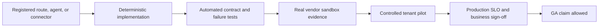

# Product Readiness Program

This directory is the canonical, documentation-first program for making AgenticOrg ready across Finance, Chartered Accountant (CA) firms, Human Resources, Marketing, Chief Operating Officer (COO), and Chief Business Officer (CBO) use cases.

**Baseline date:** 2026-07-13
**Product version inspected:** 4.8.0
**Repository baseline:** `384543788bcd1f66aed8cff8ab03699ae384926e`
**Status:** canonical planning baseline with selected local implementation deltas; this directory does not claim approval or production readiness.
**Accountable owner:** unassigned until roadmap item `W0-05` closes
**Last reviewed:** 2026-07-15
**Next review:** owner assignment or 2026-07-27, whichever occurs first
**Prerequisites:** repository baseline plus domain/security/business review
**Limitations:** repository inventory and local tests are not sandbox or pilot proof
**Related test:** `tests/regression/test_readiness_documentation.py`
**Related runbook:** [promotion and delivery roadmap](BUILD_ROADMAP.md)

## Canonical documents

| Document | Purpose |
|---|---|
| [Complete gap analysis](GAP_ANALYSIS.md) | Evidence-backed current-state assessment, release blockers, and capability gaps. |
| [Domain readiness standard](DOMAIN_READINESS_STANDARD.md) | The complete definition of “ready” for every named business function. |
| [Capability readiness and evidence register](CAPABILITY_READINESS_REGISTER.md) | Stable capability IDs, independent status dimensions, current seed states, evidence schema, owners, and promotion transaction. |
| [Build roadmap](BUILD_ROADMAP.md) | Sequenced work packages, dependencies, evidence gates, ownership, and rollout order. |
| [Landing and documentation blueprint](LANDING_AND_DOCUMENTATION_BLUEPRINT.md) | Page inventory, content architecture, claims policy, visual system, SEO/AEO, analytics, and documentation plan. |
| [Program memory](PROGRAM_MEMORY.md) | Durable decisions, scope, non-negotiables, and the next execution checkpoint. |

## Authority model

These documents supersede older point-in-time gap reports for current planning. Older PRDs, audits, release summaries, and backlogs remain useful evidence, but they are not proof of current runtime readiness. In particular:

- `docs/PRD_CxO_v5.0.md` is a detailed requirements source, not current-state evidence.
- `docs/PRD.md`, `docs/api-reference.md`, `docs/architecture.md`, and `docs/deployment.md` contain historical or illustrative sections and must be reconciled with runtime inventories and retained release evidence.
- The CFO, CMO, CA, CHRO, COO, and CBO guides distinguish evaluation/target behavior from promoted capability; guide presence is not domain readiness.
- `docs/AGENT_MATURITY_MATRIX.md` and `docs/agents.md` are stale relative to the runtime registry and must not be used alone for availability claims.
- [Root ROADMAP](../../ROADMAP.md) is the concise GitHub-facing summary; [BUILD_ROADMAP.md](BUILD_ROADMAP.md) is the detailed execution source.
- Runtime registration, unit tests, mocked connector tests, and UI presence do not by themselves establish production readiness.

## Internal maturity vocabulary

| State | Meaning |
|---|---|
| **Missing** | No usable end-to-end capability exists. |
| **Scaffolded** | A route, class, prompt, schema, or mock exists without a complete operating path. |
| **Implemented** | The deterministic code path exists and has local automated coverage. |
| **Integrated** | Tenant-scoped systems, credentials, data, approvals, retries, and audit are wired end to end. |
| **Sandbox-proven** | The complete path has passed against a real vendor sandbox with retained evidence. |
| **Production-proven** | A controlled production pilot passed SLO, security, reconciliation, rollback, and business-owner sign-off gates. |
| **GA** | Production-proven, documented, supported, monitored, and governed by a release and compatibility policy. |

## Evidence hierarchy

A claim may only use the highest state for which evidence exists. Demo values, test doubles, screenshots, and historical release notes cannot raise the state.

Internal maturity is only one dimension. Gate result, public availability, and claim treatment use separate enumerations and conservative mappings in the [capability register](CAPABILITY_READINESS_REGISTER.md). Terms such as beta, preview, illustrative, blocked, and approved must not be substituted for internal maturity.

## Program rules

1. External writes must fail closed and be approved before dispatch when policy requires approval.
2. Every KPI must identify its source, entity, period, currency/unit, formula, freshness, and reconciliation state.
3. Every connector must expose configuration, scopes, health, retry, rate-limit, idempotency, degraded-mode, and credential-rotation behavior.
4. Every advertised outcome must link to reproducible evidence or be clearly labeled illustrative.
5. Every domain must ship its user guide, operator runbook, API contract, test traceability, SLOs, and support escalation before GA.
6. Documentation changes and product changes must land in the same pull request when they change capability truth.
7. Historical reports remain immutable; new evidence updates the canonical readiness documents and program memory.

## Review cadence

- Update the gap register after each merged work package.
- Update the program memory whenever scope, sequencing, or a non-negotiable changes.
- Re-run the complete readiness gate before any domain promotion.
- Record the evidence URI, owner, review date, and expiry date for every production claim.
