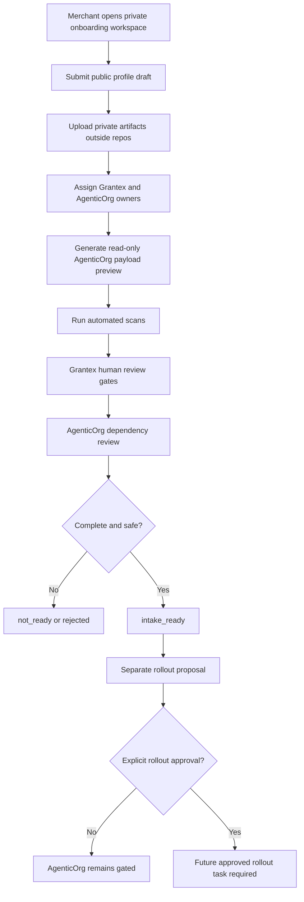

# Commerce Agent C5O Merchant Self-Onboarding Plan

Status: planning only
Date: 2026-05-26
Scope: synthetic demo packet and AgenticOrg dependency self-onboarding plan
before any future public commerce discovery proposal
Production changes made by this plan: none
AgenticOrg public commerce discovery changed by this plan: no
Grantex production Commerce V1 changed by this plan: no
Merchant allowlist value approved by this plan: no
Checkout or payment creation changed by this plan: no
Live payment path changed by this plan: no
Live Plural path changed by this plan: no
Named merchant approved by this plan: no
Secrets inspected or changed: no

This plan defines a demo-safe merchant self-onboarding flow for AgenticOrg
dependency review and references the synthetic packet in
`docs/examples/commerce-agent-c5o-synthetic-demo-artifact-packet.json`. It does
not approve a real merchant, approve AgenticOrg public commerce discovery,
approve a Grantex production allowlist value, or authorize any rollout.

## Current State

- Decision state: not ready.
- Synthetic packet merchant ID: `mch_synth_demo_readonly_0001`.
- Synthetic packet tenant ID: `cten_synth_demo_readonly_0001`.
- Synthetic packet agent ID: `cag_synth_demo_readonly_sales_0001`.
- No real merchant is approved.
- No allowlist value is approved.
- No AgenticOrg public commerce discovery is enabled.
- Grantex production read-only discovery remains fail-closed.
- AgenticOrg public commerce discovery remains gated.
- The synthetic packet is internal/demo-only and is not production approval.

## Synthetic Demo Packet Summary

The demo packet contains:

- Clearly synthetic merchant, tenant, and agent identifiers.
- `decision_state: not_ready`.
- Synthetic pending approval references only.
- Synthetic pending owner role labels only.
- AgenticOrg read-only public payload preview.
- Pending/demo-only scan summaries.
- Blocked state showing no real merchant approval, no allowlist value, no
  AgenticOrg public discovery, no checkout/payment creation, no live payments,
  no live Plural, and no direct provider calls.

## Merchant, Grantex, And AgenticOrg UX Flow

1. Merchant creates a private onboarding workspace.
   - Merchant starts onboarding from a private dashboard.
   - System shows that AgenticOrg public commerce discovery, production
     discovery, checkout, payment, live Plural, and provider access are not
     enabled.

2. Merchant submits a public profile draft.
   - Merchant enters proposed public merchant ID, display name, category, and
     discovery description for Grantex review.
   - UI labels each value as review input, not approval.
   - AgenticOrg can preview only synthetic or reviewed Grantex-controlled
     metadata.

3. Merchant uploads private artifacts outside repos.
   - Private contracts, signed approvals, contacts, pricing, customer data, and
     sensitive business details stay in the private artifact system.
   - Repos may receive only non-secret reference labels.

4. Merchant assigns approval owners.
   - Required owners: merchant owner, legal/compliance, product wording,
     security, ops/on-call/support, backup/RPO, AgenticOrg dependency, rollback,
     read-only smoke, and evidence retention.
   - AgenticOrg dependency owner remains separate from Grantex approval owners.

5. System generates a read-only payload preview.
   - Preview includes only reviewed Grantex-controlled, non-secret metadata.
   - Preview explicitly excludes checkout, payment creation, live payments,
     live Plural, provider credentials, direct provider calls, and
     certification/readiness claims.

6. Automated scans run.
   - Secret/private-detail scan.
   - Overclaim scan.
   - Merchant ID/name safety review.
   - Synthetic-ID production-candidate scan.
   - Config/allowlist value scan.

7. Human review gates run.
   - Grantex review must complete before AgenticOrg dependency approval.
   - Legal/compliance validates public metadata and wording.
   - Product validates user-facing wording.
   - Security validates no secret/private/provider material.
   - Ops validates support, rollback, smoke, and evidence ownership.
   - AgenticOrg dependency owner confirms public discovery remains gated until
     separate approval exists.

8. Intake state is assigned.
   - `not_ready`: required artifacts, owners, preview, or scans are missing.
   - `intake_ready`: artifacts are complete enough for a separate intake
     readiness review, but rollout remains unapproved.
   - `rollout_proposal_ready`: a separate rollout proposal may be prepared and
     still requires explicit approval.
   - `rejected`: private material, secrets, overclaims, live-provider paths, or
     synthetic production-candidate IDs appear.

9. Separate rollout proposal is prepared only after intake readiness.
   - AgenticOrg may only reference reviewed Grantex-controlled metadata.
   - No AgenticOrg public discovery is allowed from this plan.

10. Production remains fail-closed until explicit rollout approval.
    - No production allowlist value is approved by this plan.
    - `AGENTICORG_COMMERCE_PUBLIC_DISCOVERY_ENABLED` remains disabled.
    - `COMMERCE_PUBLIC_DISCOVERY_ENABLED` remains disabled.
    - Checkout/payment creation, live payments, and live Plural remain blocked.

## State Machine

| State | Entry condition | Exit condition |
| --- | --- | --- |
| `not_ready` | Onboarding starts or required input is missing. | All required public-safe summaries, owners, payload preview, dependency references, and scans are present. |
| `intake_ready` | Artifact packet is complete enough for intake review. | Separate readiness review accepts preparing a rollout proposal, or rejects the packet. |
| `rollout_proposal_ready` | Intake review says a separate proposal can be prepared. | Separate rollout approval is granted or denied. |
| `rejected` | Private data, secrets, overclaims, live-provider paths, or synthetic production-candidate IDs appear. | Unsafe material is removed outside repos and intake restarts. |

## Required Validations At Each Step

| Step | Required validation |
| --- | --- |
| Workspace creation | Confirm private workspace only; no production flags or provider paths. |
| Public profile draft | Confirm values are public-safe and not synthetic production candidates. |
| Private artifact upload | Confirm artifacts are stored outside repos. |
| Owner assignment | Confirm every owner role is present without private contacts. |
| Payload preview | Confirm read-only Grantex-controlled metadata only and no checkout/payment/live/provider claims. |
| Automated scans | All scans must pass before intake readiness. |
| Human review gates | Legal, product, security, ops, backup/RPO, Grantex, and AgenticOrg dependency approvals must exist. |
| State assignment | State must remain `not_ready` unless all required inputs are complete. |
| Rollout proposal | Separate approval required; this plan does not approve rollout. |
| Production posture | AgenticOrg remains gated until explicit rollout approval. |

## Public-Safe Versus Private-Only

| Public-safe for repo after review | Private-only outside repos |
| --- | --- |
| Approved public merchant ID or non-secret reference | Private contracts |
| Approved public display name | Private contacts |
| Approved public category | Signed approval records |
| Approved public discovery description | Pricing terms |
| Non-secret private approval references | Customer data |
| Public-safe owner role labels | Secrets and credentials |
| AgenticOrg payload preview summary | Raw payloads |
| Grantex verification summary | DB/Redis URLs and private keys |
| Scan result summaries | Direct provider material |

## AgenticOrg Dependency Sequence

1. Grantex intake packet reaches `intake_ready`.
2. Grantex read-only smoke plan is prepared and reviewed separately.
3. AgenticOrg dependency owner reviews the Grantex approval and smoke evidence.
4. AgenticOrg payload preview is limited to reviewed Grantex-controlled
   metadata.
5. AgenticOrg remains gated until separate AgenticOrg approval exists.
6. AgenticOrg public commerce discovery remains disabled until an explicit
   later rollout approval.

## Stop Conditions

Stop the demo path and keep state `not_ready` or `rejected` if any condition is
true:

- Real merchant approval is missing.
- Private artifact content appears in repo.
- Secrets or provider credentials appear in repo.
- Production config or allowlist values are included.
- Synthetic IDs are proposed as production candidates.
- Broad `COMMERCE_V1_ENABLED` is requested.
- Checkout, payment creation, live payment, live Plural, direct provider call,
  or provider credential path is requested.
- AgenticOrg public discovery is requested before Grantex read-only smoke
  passes and separate AgenticOrg approval exists.
- Any required scan fails.

## Explicit Non-Approval

- This plan does not approve a merchant.
- This plan does not approve production discovery.
- This plan does not approve a Grantex production allowlist value.
- This plan does not enable AgenticOrg public commerce discovery.
- This plan does not enable `AGENTICORG_COMMERCE_PUBLIC_DISCOVERY_ENABLED`.
- This plan does not enable `COMMERCE_PUBLIC_DISCOVERY_ENABLED`.
- This plan does not set `COMMERCE_PUBLIC_DISCOVERY_MERCHANT_ALLOWLIST`.
- This plan does not enable Commerce V1.
- This plan does not enable checkout or payment creation.
- This plan does not enable live payments.
- This plan does not enable live Plural.
- This plan does not add a direct provider path.
- This plan does not treat synthetic data as production approval.
