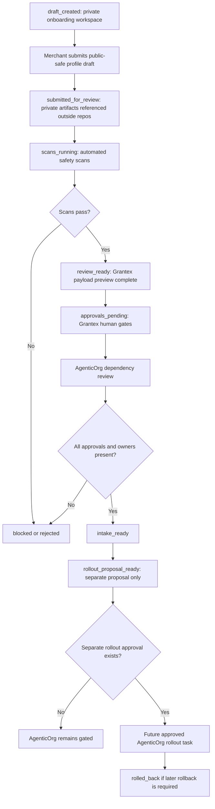
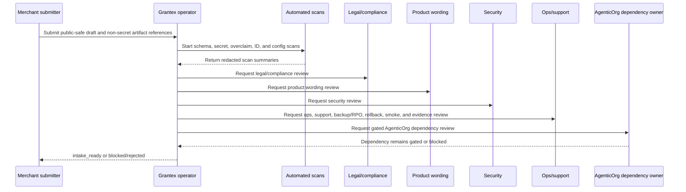
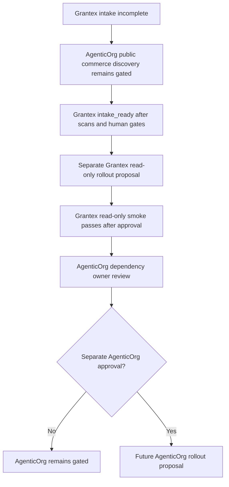

# Commerce Agent C5P Merchant Self-Onboarding Architecture

Status: planning only
Date: 2026-05-26
Scope: future AgenticOrg dependency architecture for merchant self-onboarding
and read-only Commerce discovery
Production changes made by this plan: none
AgenticOrg public commerce discovery changed by this plan: no
Grantex production Commerce V1 changed by this plan: no
Merchant allowlist value approved by this plan: no
Checkout or payment creation changed by this plan: no
Live payment path changed by this plan: no
Live Plural path changed by this plan: no
Named merchant approved by this plan: no
Secrets inspected or changed: no

This architecture plan describes a future AgenticOrg dependency path for
merchant self-onboarding. It is an internal, review-first design record for
read-only Commerce discovery. It does not implement runtime code, add
migrations, approve a merchant, approve a Grantex allowlist value, enable
AgenticOrg public commerce discovery, enable Commerce V1, enable checkout or
payment creation, enable live payments, enable live Plural, or enable provider
credentials.

## Product Scope

- Future self-onboarding is limited to read-only Commerce discovery intake and
  AgenticOrg dependency review.
- Grantex remains the source of reviewed merchant discovery metadata.
- AgenticOrg receives only reviewed public-safe summaries after Grantex intake
  and smoke evidence are accepted through separate approval.
- Completing onboarding does not automatically enable AgenticOrg public
  commerce discovery.
- The product must not enable checkout, payment creation, live payments, live
  Plural, direct provider access, or provider credential collection.
- C5I, C5J, and C5O synthetic material remains internal/demo/local/smoke-only
  and is not production approval.
- No real merchant is approved by this plan.
- AgenticOrg public commerce discovery remains gated.

## User Roles

| Role | Responsibility |
| --- | --- |
| Merchant submitter | Creates a private onboarding workspace and submits public-safe draft metadata for Grantex review. |
| Merchant owner approver | Confirms the merchant has authorized the submitted public profile and references. |
| Grantex operator | Coordinates source intake, verifies scope, and keeps the workflow read-only. |
| Legal/compliance reviewer | Confirms public metadata and consent/payment wording are non-secret and accurate. |
| Product wording reviewer | Reviews public-facing copy and removes readiness, certification, or payment overclaims. |
| Security reviewer | Reviews scans, redaction posture, and absence of secrets, private details, and provider material. |
| Ops/on-call/support owner | Confirms support posture, escalation coverage, and operational readiness for read-only discovery only. |
| Backup/RPO reviewer | Confirms backup and recovery posture for the onboarding workspace and audit records. |
| Rollback owner | Owns rollback instructions for keeping or returning AgenticOrg to a gated state. |
| Read-only smoke owner | Owns Grantex read-only smoke evidence and any later AgenticOrg dependency smoke review. |
| Evidence retention owner | Owns retention, redaction, and retrieval of audit evidence. |
| AgenticOrg dependency owner | Confirms AgenticOrg remains gated until separate AgenticOrg approval exists. |

## Future Data Model

The data model is conceptual only. This plan does not add migrations, tables,
runtime schemas, or config values.

| Entity | Conceptual fields |
| --- | --- |
| Onboarding workspace | `workspace_id`, `created_by_role`, `state`, `created_at`, `updated_at`, `source_grantex_reference`, `private_artifact_system_reference`, `retention_policy_reference` |
| Merchant identity draft | `merchant_identity_draft_id`, `proposed_public_merchant_id`, `proposed_display_name`, `proposed_category`, `proposed_discovery_description`, `source_workspace_id`, `draft_version` |
| Public payload preview | `payload_preview_id`, `merchant_identity_draft_id`, `issuer_reference`, `jwks_reference`, `agenticorg_read_only_capabilities`, `cache_header_posture`, `rate_limit_posture`, `explicit_no_payment_claims` |
| Private artifact reference | `artifact_reference_id`, `workspace_id`, `artifact_type`, `non_secret_reference_label`, `external_system_reference`, `redaction_required` |
| Approval gate | `approval_gate_id`, `workspace_id`, `gate_type`, `required_role`, `non_secret_approval_reference`, `status`, `reviewed_at` |
| Scan result | `scan_result_id`, `workspace_id`, `scan_type`, `status`, `summary`, `redacted_evidence_reference`, `reviewer_role` |
| Owner assignment | `owner_assignment_id`, `workspace_id`, `owner_role`, `public_safe_role_label`, `status` |
| Decision state | `decision_state_id`, `workspace_id`, `state`, `reason_summary`, `decided_by_role`, `decided_at` |
| Audit event | `audit_event_id`, `workspace_id`, `event_type`, `actor_role`, `event_summary`, `redacted_reference`, `created_at` |
| Rollout proposal link | `rollout_proposal_link_id`, `workspace_id`, `proposal_reference`, `created_after_intake_ready`, `approval_required` |
| Rollback plan link | `rollback_plan_link_id`, `workspace_id`, `rollback_reference`, `owner_role`, `last_reviewed_at` |

Public repository records may contain only public-safe summaries and non-secret
references. Private contracts, private contacts, signed approval records,
pricing terms, customer data, raw payloads, secrets, provider credentials,
DB/Redis URLs, and private keys must stay outside repositories.

## Workflow State Machine

| State | Entry condition | Allowed next states | Stop conditions |
| --- | --- | --- | --- |
| `draft_created` | Merchant submitter opens a private onboarding workspace. | `submitted_for_review`, `blocked`, `rejected` | Workspace asks for AgenticOrg public discovery, production config, checkout, payment, live payment, live Plural, or provider access. |
| `submitted_for_review` | Public profile draft and private artifact references are submitted for Grantex review. | `scans_running`, `blocked`, `rejected` | Private artifact content appears in repo or required public fields are unclear. |
| `scans_running` | Automated validation starts. | `review_ready`, `blocked`, `rejected` | Any scan finds secrets, private details, overclaims, config values, or synthetic production candidates. |
| `blocked` | Required input is missing or a non-fatal scan/review issue needs remediation. | `submitted_for_review`, `scans_running`, `rejected` | Blocking condition cannot be remediated with repo-safe summaries. |
| `review_ready` | Required scans pass and public payload preview is complete. | `approvals_pending`, `blocked`, `rejected` | Human reviewers identify missing owners, private data, or unsafe wording. |
| `approvals_pending` | Human review gates and AgenticOrg dependency review are open. | `intake_ready`, `blocked`, `rejected` | Any required approval is missing, rejected, or represented by private material in repo. |
| `intake_ready` | Required approvals, owners, scans, Grantex source review, and preview summaries are complete. | `rollout_proposal_ready`, `blocked`, `rejected` | New evidence changes scope or introduces unsafe material. |
| `rollout_proposal_ready` | Separate rollout proposal can be drafted after intake readiness. | `blocked`, `rejected`, `rolled_back` | Proposal attempts broad Commerce V1, checkout, payment, live Plural, AgenticOrg public discovery without approval, or provider paths. |
| `rejected` | Safety issue, missing approval, overclaim, private data, or forbidden runtime path is present. | `draft_created` | Unsafe material remains unresolved. |
| `rolled_back` | A later approved rollout is reverted by disabling discovery and clearing any approved allowlist value. | `draft_created`, `blocked` | Rollback owner or evidence is missing. |

## Self-Onboarding Workflow

## Review Gate Sequence

## AgenticOrg Dependency Sequence

## Validation Gates

| Gate | Required behavior |
| --- | --- |
| Schema validation | Confirms required public-safe fields, owner roles, approval references, AgenticOrg dependency references, and decision state are present. |
| Secret/private-detail scan | Rejects secrets, private contacts, private contracts, signed records, pricing terms, customer data, raw payloads, DB/Redis URLs, private keys, tokens, passports/JWTs, idempotency keys, webhook secrets, and provider credentials. |
| Overclaim scan | Rejects payment, live-provider, rollout, certification, or readiness claims that imply capability or approval beyond read-only discovery intake. |
| Merchant-ID/name safety review | Confirms proposed merchant ID and name are explicitly approved public metadata or are non-secret references pending approval. |
| Synthetic-ID production-candidate scan | Rejects any synthetic ID being proposed for production use or as an allowlist candidate. |
| Config/allowlist value scan | Rejects production config values, broad runtime flags, and concrete allowlist values unless a later approved rollout proposal explicitly permits repo-safe summary storage. |
| Public payload preview validation | Confirms payload is read-only, public-safe, Grantex-controlled, non-secret, and contains no checkout, payment, live Plural, provider, or certification claim. |
| AgenticOrg dependency validation | Confirms AgenticOrg remains gated until Grantex intake and separate read-only smoke evidence are accepted. |

## Human Review Gates

- Merchant owner approval must confirm the public profile was authorized.
- Legal/compliance approval must confirm public metadata is non-secret and
  consent/payment wording is accurate.
- Product wording approval must confirm public copy does not imply checkout,
  payment, live provider, certification, or rollout approval.
- Security approval must confirm scan results and repository redaction posture.
- Ops/support approval must confirm read-only support and escalation posture.
- Backup/RPO approval must confirm retention and recovery posture.
- AgenticOrg dependency approval must confirm downstream public commerce
  discovery remains gated.
- Rollback, read-only smoke, and evidence retention owners must be assigned
  before intake can move beyond `approvals_pending`.

## Audit Evidence

Record:

- State transitions and timestamps.
- Actor role labels, not private contact details.
- Grantex source reference and public-safe payload preview summaries.
- Non-secret private artifact references.
- Redacted scan summaries.
- Human gate status and non-secret approval references.
- AgenticOrg dependency review status.
- Rollout proposal and rollback plan links after separate approval.
- Evidence retention owner role label.

Never record:

- Private contracts, private contacts, signed approval records, pricing terms,
  customer data, raw payloads, secrets, provider credentials, DB/Redis URLs,
  private keys, tokens, passports/JWTs, idempotency keys, or webhook secrets.
- Production config values or concrete allowlist values unless a later approved
  rollout proposal explicitly permits a repo-safe summary.
- Synthetic IDs as production candidates.

Redaction requirements:

- Store redacted summaries in repos only after review.
- Keep raw scan output and private evidence in approved private systems.
- Redact personal contacts, credentials, customer identifiers, pricing, and
  sensitive business terms before any repository update.
- Maintain an immutable event timeline with append-only audit events and
  evidence retention ownership.

## Production Safety Controls

- Read-only discovery gate only; broad Commerce V1 remains disabled.
- AgenticOrg public commerce discovery remains gated until separate approval.
- No checkout/payment creation.
- No live payments.
- No live Plural.
- No provider credentials.
- No synthetic production candidates.
- No certification/readiness overclaims.
- No automatic production enablement from onboarding state.
- Grantex production read-only discovery remains fail-closed until a separate
  rollout approval exists.
- Rollback is performed by disabling the read-only discovery gate and clearing
  any allowlist value approved by a later rollout.

## Implementation Roadmap

| Slice | Scope | Gate posture |
| --- | --- | --- |
| C5P docs architecture | Conceptual architecture, state model, validation gates, dependency sequence, and safety controls. | Docs-only; no runtime enablement. |
| C5Q API/data model proposal | Propose API boundaries, conceptual schemas, and persistence responsibilities. | Separate review; no migrations unless later approved. |
| C5R UI wireframe/spec | Define merchant, Grantex operator, and AgenticOrg dependency UX for workspace, public draft, scans, reviews, and state. | Separate review; no public commerce discovery. |
| C5S validator/prototype in local-only mode | Prototype schema and safety validation with local/demo data only. | Local-only; no secrets, provider paths, or production config. |
| C5T approval workflow implementation | Implement review gate workflow after separate approval. | Gated; no automatic rollout. |
| C5U read-only rollout automation proposal | Propose narrow read-only rollout automation and rollback controls. | Separate approval required before any production change. |

Each future slice remains gated, separately reviewed, and insufficient by itself
to approve a real merchant, enable production discovery, enable checkout or
payment creation, enable live payments, enable live Plural, or enable
AgenticOrg public commerce discovery.
