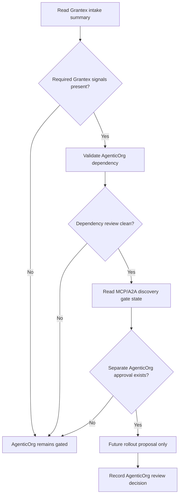
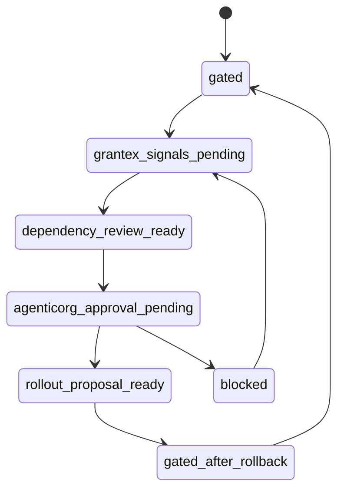

# Commerce Agent C5Q Self-Onboarding API/Data Dependency Proposal

Status: planning only
Date: 2026-05-26
Scope: conceptual AgenticOrg dependency contract for future merchant
self-onboarding and read-only Commerce discovery metadata
Production changes made by this proposal: none
Runtime code changed by this proposal: no
Migrations added by this proposal: no
AgenticOrg public commerce discovery changed by this proposal: no
Grantex production Commerce V1 changed by this proposal: no
Merchant allowlist value approved by this proposal: no
Checkout or payment creation changed by this proposal: no
Live payment path changed by this proposal: no
Live Plural path changed by this proposal: no
Named merchant approved by this proposal: no
Secrets inspected or changed: no

This proposal describes the future AgenticOrg dependency contract for Grantex
self-onboarding. It does not implement runtime code, add migrations, approve a
merchant, approve a Grantex allowlist value, enable AgenticOrg public commerce
discovery, enable Commerce V1, enable checkout or payment creation, enable live
payments, enable live Plural, or introduce provider credentials.

## Current State

- AgenticOrg public commerce discovery is gated and not approved by this
  proposal.
- Grantex production read-only discovery remains fail-closed.
- No real merchant is approved.
- No allowlist value is approved.
- C5I, C5J, C5O, C5P, and C5Q synthetic/demo planning artifacts are not
  production approval.
- AgenticOrg must not expose commerce metadata from self-onboarding until the
  required Grantex signals and separate AgenticOrg approval exist.

## Dependency Contract With Grantex Self-Onboarding

AgenticOrg treats Grantex as the source of reviewed merchant discovery metadata.
The dependency contract is read-only and review-gated:

| Contract item | Required behavior |
| --- | --- |
| Source authority | Grantex owns merchant intake state, reviewed public payload preview, read-only smoke evidence, and rollback posture. |
| AgenticOrg input | AgenticOrg may consume only redacted, public-safe summaries and non-secret references. |
| AgenticOrg output | AgenticOrg may expose no commerce metadata until separate approval exists. |
| State dependency | AgenticOrg remains gated while Grantex is below `intake_ready`, during Grantex rollout proposal review, and until Grantex read-only smoke passes. |
| Failure posture | Missing Grantex signal, failed scan, missing review gate, or rollback event keeps AgenticOrg gated. |
| Rollback posture | AgenticOrg must return to gated behavior when Grantex disables discovery or clears any later approved allowlist. |

## Required Grantex Signals

Before AgenticOrg can consider exposing commerce metadata, it needs all of the
following repo-safe signals:

- Grantex onboarding workspace reference.
- Grantex decision state of `intake_ready` or later separate rollout proposal
  state.
- Reviewed public payload preview summary.
- Public-safe merchant identity summary.
- Redacted scan summaries showing no blocking findings.
- Review gate summaries for merchant owner, legal/compliance, product wording,
  security, ops/support, backup/RPO, rollback owner, read-only smoke owner,
  evidence retention owner, and AgenticOrg dependency owner.
- Read-only smoke evidence summary after separate Grantex approval.
- Rollback plan reference and owner role label.
- Evidence retention owner role label.

These signals are not production approval by themselves. AgenticOrg still needs
a separate AgenticOrg approval before any public commerce discovery proposal.

## MCP/A2A Public Discovery Gating Contract

The future MCP/A2A contract must stay fail-closed:

- AgenticOrg public commerce discovery remains disabled by default.
- No MCP/A2A public discovery response includes self-onboarded commerce
  metadata unless a later approved rollout explicitly allows it.
- Discovery payloads are read-only metadata only.
- Discovery payloads include no checkout, payment creation, live payment, live
  Plural, provider credential, direct provider call, certification, or readiness
  claim.
- Missing Grantex signal, expired evidence, rollback state, failed scan, or
  missing AgenticOrg approval returns a gated/no-commerce response.
- AgenticOrg does not store private Grantex artifact content.

## No-Provider, No-Live, No-Checkout Constraints

- No provider credentials.
- No provider credential references that could be used to create payments.
- No checkout/payment creation.
- No live payments.
- No live Plural.
- No direct provider calls.
- No broad Commerce V1 enablement.
- No synthetic production candidates.
- No public commerce discovery until separate AgenticOrg approval exists.

## AgenticOrg Review Gates And Rollback

Required AgenticOrg gates:

- AgenticOrg dependency owner confirms all required Grantex signals are present.
- Security reviewer confirms no private details, secrets, provider material, or
  raw payloads are stored.
- Product wording reviewer confirms no checkout, payment, live-provider,
  certification, or readiness overclaims are present.
- Ops/support owner confirms gated behavior, rollback owner, and smoke evidence
  review posture.
- Evidence retention owner confirms redacted evidence can be retrieved.

Rollback requirements:

- A Grantex rollback signal keeps or returns AgenticOrg to gated behavior.
- AgenticOrg rollback records only public-safe summaries and non-secret
  references.
- Rollback must not create checkout/payment, live payment, live Plural, or
  provider credential paths.

## Read-Only Smoke Expectations After Grantex Approval

Read-only smoke can be considered only after Grantex has a separate approved
read-only rollout and smoke owner. Expected AgenticOrg evidence:

- Grantex read-only smoke summary reference.
- AgenticOrg gated/no-provider test summary.
- Confirmation that no checkout/payment creation was attempted.
- Confirmation that no live payment, live Plural, or provider credential path
  was used.
- Confirmation that public commerce discovery remains disabled unless a later
  separate AgenticOrg approval changes that state.
- Confirmation that rollback returns AgenticOrg to gated/no-commerce behavior.

## Conceptual Dependency APIs

These are conceptual contract boundaries only and are not implemented here.

### Read Grantex Intake Summary

Request shape:

```json
{
  "grantex_workspace_reference": "<GRANTEX_WORKSPACE_REFERENCE>",
  "redacted_only": true
}
```

Response shape:

```json
{
  "grantex_state": "<GRANTEX_DECISION_STATE>",
  "payload_preview_summary_reference": "<PAYLOAD_PREVIEW_SUMMARY_REFERENCE>",
  "scan_summary_reference": "<SCAN_SUMMARY_REFERENCE>",
  "production_effect": "none"
}
```

### Validate AgenticOrg Dependency

Request shape:

```json
{
  "grantex_workspace_reference": "<GRANTEX_WORKSPACE_REFERENCE>",
  "required_signals": [
    "intake_state",
    "payload_preview",
    "scan_summaries",
    "review_gate_summaries",
    "read_only_smoke_summary",
    "rollback_reference"
  ]
}
```

Response shape:

```json
{
  "agenticorg_dependency_state": "gated_or_review_ready_or_blocked",
  "public_discovery_enabled": false,
  "blocker_summary": "<REDACTED_BLOCKER_SUMMARY>"
}
```

### Read MCP/A2A Discovery Gate State

Request shape:

```json
{
  "agenticorg_dependency_reference": "<AGENTICORG_DEPENDENCY_REFERENCE>",
  "redacted_only": true
}
```

Response shape:

```json
{
  "commerce_public_discovery_state": "gated",
  "metadata_exposure": "none",
  "requires_separate_agenticorg_approval": true
}
```

### Record AgenticOrg Review Decision

Request shape:

```json
{
  "agenticorg_dependency_reference": "<AGENTICORG_DEPENDENCY_REFERENCE>",
  "review_gate": "<AGENTICORG_REVIEW_GATE>",
  "decision": "approved_or_blocked_or_rejected",
  "non_secret_review_reference": "<REVIEW_REFERENCE_PENDING>"
}
```

Response shape:

```json
{
  "review_decision_reference": "<REVIEW_DECISION_REFERENCE>",
  "agenticorg_state": "gated_or_review_ready_or_blocked",
  "production_effect": "none"
}
```

## Conceptual Dependency Data Model

| Record | Conceptual fields |
| --- | --- |
| Grantex intake signal | `grantex_workspace_reference`, `grantex_state`, `payload_preview_summary_reference`, `scan_summary_reference`, `rollback_reference` |
| AgenticOrg dependency review | `dependency_reference`, `grantex_workspace_reference`, `dependency_state`, `reviewer_role`, `redacted_reason_summary` |
| MCP/A2A discovery gate | `gate_reference`, `dependency_reference`, `gate_state`, `metadata_exposure`, `requires_separate_approval` |
| Read-only smoke summary | `smoke_summary_reference`, `grantex_smoke_reference`, `agenticorg_no_provider_summary`, `reviewed_by_role` |
| Rollback dependency event | `rollback_event_reference`, `grantex_rollback_reference`, `agenticorg_gate_state_after_rollback`, `redacted_summary` |
| Audit event | `audit_event_id`, `dependency_reference`, `event_type`, `actor_role`, `redacted_summary`, `created_at` |

## Mermaid API Flow



## Mermaid Data And State Diagram



## Future Implementation Slice Map

| Slice | Scope | Gate posture |
| --- | --- | --- |
| C5R schema/API prototype proposal | Propose dependency schemas and local contract checks. | Separate review; no runtime discovery enablement. |
| C5S UI wireframe/spec | Define AgenticOrg dependency review screens and gated-state display. | Separate review; no public commerce discovery. |
| C5T local-only validator prototype | Validate placeholder Grantex summaries and AgenticOrg gating locally. | Local-only; no secrets, provider paths, or production config. |
| C5U review workflow implementation | Implement dependency gate recording after approval. | Gated; no automatic rollout. |
| C5V rollout automation proposal | Propose narrow read-only dependency rollout and rollback controls. | Separate approval required before any production change. |

## Stop Conditions

Stop and keep AgenticOrg gated if:

- Required Grantex signals are missing.
- Grantex read-only smoke has not passed after separate approval.
- AgenticOrg dependency approval is missing.
- Private material appears in repository docs.
- Any secret, token, passport/JWT, idempotency key, webhook secret, provider
  credential, raw payload, DB/Redis URL, or private key appears.
- Production config or concrete allowlist values appear without separate
  approval for repo-safe summary storage.
- Synthetic IDs are proposed for production use or allowlist use.
- Checkout/payment creation, live payment, live Plural, broad Commerce V1, or
  provider credential path is requested.
- Public commerce discovery is requested before separate AgenticOrg approval.
- Any required scan fails.

## Production Safety Controls

- AgenticOrg public commerce discovery remains gated and not approved by this
  proposal.
- No runtime enablement.
- No broad Commerce V1 enablement.
- No checkout/payment creation.
- No live payments.
- No live Plural.
- No provider credentials.
- No public commerce discovery until a separate AgenticOrg approval and a later
  rollout proposal exist.
- No synthetic production candidates.
- No automatic state-changing production request from any dependency state.
