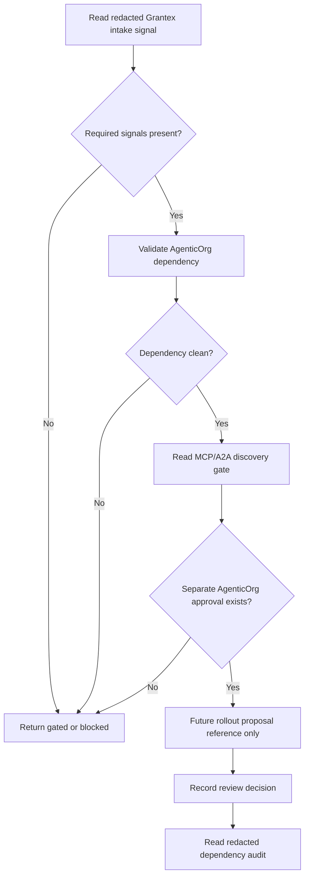
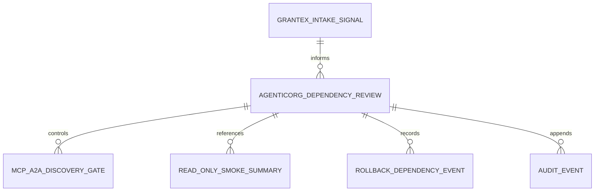

# Commerce Agent C5R Self-Onboarding Schema/API Prototype Dependency

Status: historical planning artifact; superseded by the current OACP runtime path in docs/oacp-end-to-end-flow.md.
Date: 2026-05-26
Scope: local-only AgenticOrg schema/API dependency prototype proposal for
future merchant self-onboarding metadata
Production changes made by this proposal: none
Runtime code changed by this proposal: no
Migrations added by this proposal: no
AgenticOrg public commerce discovery changed by this proposal: no
Grantex production Commerce V1 changed by this proposal: no
Merchant allowlist value approved by this proposal: no
Checkout or payment creation changed by this proposal: no
Live payment path changed by this proposal: no
Live Plural path changed by this proposal: no
Named merchant approved by this proposal: no
Secrets inspected or changed: no

This proposal narrows C5Q into local-only AgenticOrg dependency schema and
endpoint prototype sketches. It is not a runtime implementation. It does not add
migrations, approve a merchant, approve a Grantex allowlist value, enable
AgenticOrg public commerce discovery, enable Commerce V1, enable checkout or
payment creation, enable live payments, enable live Plural, or introduce
provider credentials.

## Local-Only Prototype Scope

- Prototype inputs use redacted Grantex summaries and placeholders only.
- Prototype outputs keep AgenticOrg in a gated/no-commerce state unless later
  separately approved tasks define otherwise.
- Prototype endpoints are contract sketches, not deployed handlers.
- Prototype storage, if later approved, must be local-only and disposable until
  a separate implementation task defines persistence.
- The prototype cannot expose public commerce metadata, create checkout/payment
  flows, call providers, use live payments, use live Plural, or accept provider
  credentials.

## Proposed Dependency Schema Sketches

The following sketches are conceptual and are not migrations or runtime schemas.

### Grantex Intake Signal

```json
{
  "grantex_workspace_reference": "<GRANTEX_WORKSPACE_REFERENCE>",
  "grantex_state": "blocked_or_intake_ready_or_rollout_proposal_ready",
  "payload_preview_summary_reference": "<PAYLOAD_PREVIEW_SUMMARY_REFERENCE>",
  "scan_summary_reference": "<SCAN_SUMMARY_REFERENCE>",
  "read_only_smoke_summary_reference": "<READ_ONLY_SMOKE_REFERENCE_PENDING>",
  "rollback_reference": "<ROLLBACK_REFERENCE_PENDING>"
}
```

Required validation:

- Grantex state must be a reviewed summary, not private evidence.
- Missing smoke summary keeps AgenticOrg gated.
- Rollback reference is non-secret and contains no private operational details.

### AgenticOrg Dependency Review

```json
{
  "dependency_reference": "<AGENTICORG_DEPENDENCY_REFERENCE>",
  "grantex_workspace_reference": "<GRANTEX_WORKSPACE_REFERENCE>",
  "dependency_state": "gated_or_review_ready_or_blocked",
  "reviewer_role": "<AGENTICORG_DEPENDENCY_OWNER_ROLE>",
  "redacted_reason_summary": "<REDACTED_REASON_SUMMARY>"
}
```

Required validation:

- Dependency state defaults to gated.
- Reviewer is a role label, not a private contact.
- Reason summary is redacted and public-safe.

### MCP/A2A Discovery Gate

```json
{
  "gate_reference": "<DISCOVERY_GATE_REFERENCE>",
  "dependency_reference": "<AGENTICORG_DEPENDENCY_REFERENCE>",
  "gate_state": "gated",
  "metadata_exposure": "none",
  "requires_separate_approval": true
}
```

Required validation:

- Gate state remains `gated` in the local prototype.
- Metadata exposure remains `none`.
- No public discovery flag or allowlist value is produced.

### Read-Only Smoke Summary

```json
{
  "smoke_summary_reference": "<SMOKE_SUMMARY_REFERENCE>",
  "grantex_smoke_reference": "<GRANTEX_SMOKE_REFERENCE_PENDING>",
  "agenticorg_no_provider_summary": "<NO_PROVIDER_SUMMARY_PENDING>",
  "reviewed_by_role": "<READ_ONLY_SMOKE_OWNER_ROLE>"
}
```

Required validation:

- Smoke summaries are redacted.
- Smoke does not include checkout/payment creation, live payment, live Plural,
  direct provider calls, or provider credentials.

### Rollback Dependency Event

```json
{
  "rollback_event_reference": "<ROLLBACK_EVENT_REFERENCE>",
  "grantex_rollback_reference": "<GRANTEX_ROLLBACK_REFERENCE_PENDING>",
  "agenticorg_gate_state_after_rollback": "gated",
  "redacted_summary": "<REDACTED_ROLLBACK_SUMMARY>"
}
```

Required validation:

- Rollback keeps or returns AgenticOrg to gated behavior.
- Rollback stores redacted summaries only.

## Endpoint Contract Sketches

All endpoint paths are placeholders for local-only prototype discussion. They
are not implemented here.

| Endpoint sketch | Purpose | State effect | Production effect |
| --- | --- | --- | --- |
| `GET /local/agenticorg/commerce-dependency/grantex-intake` | Read redacted Grantex intake signal. | dependency summary only | none |
| `POST /local/agenticorg/commerce-dependency/validate` | Validate required Grantex signals and gated posture. | gated/review-ready/blocked summary | none |
| `GET /local/agenticorg/commerce-dependency/discovery-gate` | Read MCP/A2A discovery gate state. | none | none |
| `POST /local/agenticorg/commerce-dependency/review-decisions` | Record AgenticOrg review gate decision. | recomputed dependency state | none |
| `POST /local/agenticorg/commerce-dependency/smoke-summary` | Attach redacted read-only smoke summary reference. | dependency summary only | none |
| `POST /local/agenticorg/commerce-dependency/rollback` | Record rollback dependency event. | gated | none |
| `GET /local/agenticorg/commerce-dependency/audit` | Read redacted dependency audit events. | none | none |

## Placeholder Request/Response Examples

### Validate Dependency

Request:

```json
{
  "grantex_workspace_reference": "<GRANTEX_WORKSPACE_REFERENCE>",
  "required_signals": [
    "grantex_intake_state",
    "payload_preview_summary",
    "scan_summary",
    "review_gate_summary",
    "read_only_smoke_summary",
    "rollback_reference"
  ]
}
```

Response:

```json
{
  "agenticorg_dependency_state": "gated_or_review_ready_or_blocked",
  "public_discovery_enabled": false,
  "metadata_exposure": "none",
  "production_effect": "none",
  "redacted_blocker_summary": "<REDACTED_BLOCKER_SUMMARY>"
}
```

### Read Discovery Gate

Request:

```json
{
  "dependency_reference": "<AGENTICORG_DEPENDENCY_REFERENCE>",
  "redacted_only": true
}
```

Response:

```json
{
  "gate_state": "gated",
  "metadata_exposure": "none",
  "requires_separate_agenticorg_approval": true,
  "production_effect": "none"
}
```

### Record Dependency Rollback

Request:

```json
{
  "dependency_reference": "<AGENTICORG_DEPENDENCY_REFERENCE>",
  "grantex_rollback_reference": "<GRANTEX_ROLLBACK_REFERENCE_PENDING>",
  "redacted_summary": "<REDACTED_ROLLBACK_SUMMARY>"
}
```

Response:

```json
{
  "agenticorg_gate_state_after_rollback": "gated",
  "metadata_exposure": "none",
  "production_effect": "none"
}
```

## Validation Behavior

- Schema validation checks required Grantex signal placeholders, dependency
  state enum values, redacted summaries, and default gated posture.
- Secret/private-detail scan rejects private contracts, private contacts,
  signed approval records, pricing terms, customer data, secrets, tokens,
  passports/JWTs, idempotency keys, webhook secrets, provider credentials, raw
  payloads, DB/Redis URLs, and private keys.
- Overclaim scan rejects checkout, payment creation, live payment, live Plural,
  provider, readiness, certification, and rollout authorization claims.
- Merchant-ID/name safety review rejects production-looking IDs and realistic
  merchant identities unless a later approved intake task supplies a repo-safe
  approval reference.
- Synthetic-ID production-candidate scan rejects synthetic IDs being proposed
  for production or allowlist use.
- Config/allowlist scan rejects production config values and concrete allowlist
  values.
- MCP/A2A gate validation requires gated metadata exposure until separate
  AgenticOrg approval exists.

## Audit Examples

Dependency validation completed:

```json
{
  "event_type": "agenticorg_dependency_validated",
  "actor_role": "<AGENTICORG_DEPENDENCY_OWNER_ROLE>",
  "redacted_event_summary": "Local-only dependency validation completed with gated output.",
  "production_effect": "none"
}
```

Discovery gate read:

```json
{
  "event_type": "discovery_gate_read",
  "actor_role": "<LOCAL_VALIDATOR_ROLE>",
  "redacted_event_summary": "MCP/A2A discovery gate returned gated/no-commerce state.",
  "production_effect": "none"
}
```

Rollback event recorded:

```json
{
  "event_type": "dependency_rollback_recorded",
  "actor_role": "<ROLLBACK_OWNER_ROLE>",
  "redacted_event_summary": "Rollback dependency event recorded with gated state.",
  "production_effect": "none"
}
```

## Safety And Rollback Controls

- AgenticOrg remains gated by default.
- Missing Grantex signal keeps AgenticOrg gated.
- Failed scan keeps AgenticOrg gated.
- Missing separate AgenticOrg approval keeps AgenticOrg gated.
- Grantex rollback signal keeps or returns AgenticOrg to gated behavior.
- Rollback references do not expose public commerce metadata and do not call
  providers.

## AgenticOrg Dependency Examples

Accepted redacted signal set:

```json
{
  "grantex_state": "intake_ready",
  "payload_preview_summary_reference": "<PAYLOAD_PREVIEW_SUMMARY_REFERENCE>",
  "scan_summary_reference": "<SCAN_SUMMARY_REFERENCE>",
  "read_only_smoke_summary_reference": "<READ_ONLY_SMOKE_REFERENCE_PENDING>",
  "agenticorg_dependency_state": "review_ready",
  "public_discovery_enabled": false
}
```

Blocked signal set:

```json
{
  "grantex_state": "blocked",
  "missing_signal": "read_only_smoke_summary",
  "agenticorg_dependency_state": "blocked",
  "public_discovery_enabled": false,
  "metadata_exposure": "none"
}
```

Rollback signal set:

```json
{
  "grantex_rollback_reference": "<GRANTEX_ROLLBACK_REFERENCE_PENDING>",
  "agenticorg_dependency_state": "gated",
  "metadata_exposure": "none",
  "production_effect": "none"
}
```

## Mermaid Endpoint Flow



## Mermaid Schema Relationship Diagram



## Future Implementation Notes

- C5S UI wireframe/spec should define dependency review screens, gated state
  display, missing-signal messaging, smoke summary review, and rollback status.
- C5T local-only validator prototype should validate placeholder Grantex
  summaries, no-provider posture, and MCP/A2A gated outputs without production
  config, public discovery, checkout, live payment, live Plural, or provider
  paths.
- Neither C5S nor C5T should enable AgenticOrg public commerce discovery.

## Stop Conditions

Stop the dependency prototype path if:

- Required Grantex signals are missing.
- Grantex read-only smoke has not passed after separate approval.
- Separate AgenticOrg approval is missing.
- Private material appears in repository docs.
- A secret, token, passport/JWT, idempotency key, webhook secret, provider
  credential, raw payload, DB/Redis URL, or private key appears.
- A production config value or concrete allowlist value appears.
- A synthetic ID is proposed for production or allowlist use.
- Checkout/payment creation, live payment, live Plural, broad Commerce V1, or
  provider credential path is requested.
- Public commerce discovery is requested before separate AgenticOrg approval.

## Production Safety Controls

- Local-only prototype scope.
- No runtime code.
- No migrations.
- No production config.
- AgenticOrg public commerce discovery remains gated.
- No broad Commerce V1.
- No checkout/payment creation.
- No live payments.
- No live Plural.
- No provider credentials.
- No public commerce discovery until separate AgenticOrg approval.
- No synthetic production candidates.
