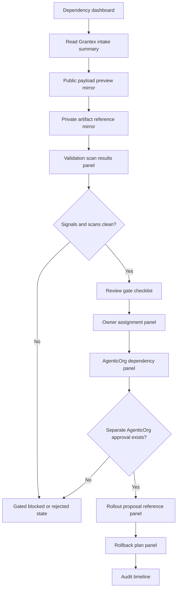

# Commerce Agent C5S Self-Onboarding UI Wireframe Spec

Status: historical planning artifact; superseded by the current OACP runtime path in docs/oacp-end-to-end-flow.md.
Date: 2026-05-26
Scope: local-only AgenticOrg UI wireframe/spec for future merchant
self-onboarding dependency review
Production changes made by this spec: none
Runtime UI code changed by this spec: no
Migrations added by this spec: no
Production config changed by this spec: no
AgenticOrg public commerce discovery changed by this spec: no
Grantex production Commerce V1 changed by this spec: no
Merchant allowlist value approved by this spec: no
Checkout or payment creation changed by this spec: no
Live payment path changed by this spec: no
Live Plural path changed by this spec: no
Named merchant approved by this spec: no
Secrets inspected or changed: no

This C5S record describes a local-only UI wireframe/spec for AgenticOrg
dependency visibility in a future merchant self-onboarding workflow. It is not
an implementation. It does not add UI code, runtime handlers, migrations,
config values, allowlist values, public commerce discovery, Commerce V1
enablement, checkout/payment creation, live payments, live Plural, provider
credentials, real merchant approval, or rollout approval.

## Local-Only UI Scope

- Historical UI wireframe; the current runtime UI is implemented in ui/src/pages/CommerceRuntimeDemo.tsx.
- Screens show redacted Grantex signals and AgenticOrg dependency state only.
- The default AgenticOrg posture is gated/no-commerce.
- No merchant is approved by this UI spec.
- No public commerce discovery is enabled or proposed for immediate use.
- No checkout, payment creation, live payment, live Plural, direct provider, or
  provider credential path is enabled.
- The UI must fail closed when a required Grantex signal, AgenticOrg owner,
  review gate, smoke summary, or rollback reference is missing.
- The UI must never write production config or concrete allowlist values.

## Merchant Submitter UX Flow

AgenticOrg does not collect merchant private artifacts directly in this C5S
spec. The merchant submitter sees only dependency-facing status after the
Grantex local workflow has a repo-safe summary.

1. Submitter creates the onboarding workspace in Grantex.
2. Submitter fills merchant identity and payload preview drafts in Grantex.
3. Submitter attaches non-secret private artifact references in Grantex.
4. Submitter runs local validation preview in Grantex.
5. Submitter submits for Grantex human review.
6. Submitter later sees AgenticOrg dependency status as gated, blocked, or
   review-ready using public-safe summaries only.
7. Submitter can view blocked/not-ready dependency states but cannot request
   public discovery from AgenticOrg.

Submitter guardrails:

- AgenticOrg screens never display private artifacts.
- AgenticOrg screens never accept checkout/payment, live payment, live Plural,
  provider credential, public discovery, production config, or concrete
  allowlist instructions.
- Any synthetic ID proposed for production remains a hard-stop condition.

## Grantex Operator UX Flow

1. Operator reviews the Grantex workspace and scan summaries.
2. Operator inspects the read-only public payload preview.
3. Operator verifies non-secret private artifact references without showing
   private artifacts.
4. Operator records review gate decisions and owner assignments in Grantex.
5. Operator computes the Grantex intake state.
6. Operator exposes only a redacted Grantex signal summary to AgenticOrg.
7. Operator reviews the AgenticOrg dependency panel for missing signals.
8. Operator records AgenticOrg dependency owner review only as a non-secret role
   and redacted summary.
9. Operator links rollout proposal and rollback references only after Grantex
   gates are complete; the links still have no production effect.

Operator guardrails:

- AgenticOrg dependency visibility is read-only and gated.
- AgenticOrg does not expose MCP/A2A commerce metadata from this spec.
- Dependency approval, if later supplied, requires a separate task and does not
  replace Grantex rollout approval.

## Screen Inventory

| Screen | Primary users | Purpose | Production effect |
| --- | --- | --- | --- |
| Dependency dashboard | Operator, reviewer | List Grantex signal summaries and AgenticOrg gate states. | none |
| Grantex intake summary panel | Operator, reviewer | Show redacted Grantex state and blockers. | none |
| Public payload preview mirror | Operator, reviewer | Show read-only metadata summary without private data. | none |
| Private artifact reference mirror | Operator, reviewer | Show non-secret reference status only. | none |
| Validation scan results panel | Operator, reviewer | Show redacted Grantex and AgenticOrg scan summaries. | none |
| Review gate checklist | Operator, reviewers | Record AgenticOrg dependency review decisions by role. | none |
| Owner assignment panel | Operator | Assign dependency, rollback, smoke, and evidence role labels. | none |
| Audit timeline | Operator, reviewers | Read redacted dependency audit events. | none |
| AgenticOrg dependency panel | Operator, reviewer | Show gated MCP/A2A commerce state and missing signals. | none |
| Rollout proposal reference panel | Operator | Link a separate future rollout proposal reference. | none |
| Rollback plan panel | Operator | Link non-secret rollback dependency reference. | none |

## Field-Level Wireframe Spec

### Dependency Dashboard

Fields:

- `dependency_reference`: `<AGENTICORG_DEPENDENCY_REFERENCE>`.
- `grantex_workspace_reference`: `<GRANTEX_WORKSPACE_REFERENCE>`.
- `grantex_intake_state`: blocked, intake_ready, rollout_proposal_ready, or
  rejected.
- `agenticorg_dependency_state`: gated, blocked, review-ready, or rejected.
- `metadata_exposure`: none.
- `missing_signal_count`: local-only count.
- `last_redacted_audit_event`: public-safe summary.

Wireframe notes:

- Dashboard defaults to dependency-gated and missing-signal filters.
- Rows expose view, validate local dependency, open review, and open audit-log only.
- No row action enables public discovery.

### Grantex Intake Summary Panel

Fields:

- `grantex_workspace_reference`: `<GRANTEX_WORKSPACE_REFERENCE>`.
- `grantex_state`: `<GRANTEX_STATE_SUMMARY>`.
- `payload_preview_summary_reference`:
  `<PAYLOAD_PREVIEW_SUMMARY_REFERENCE>`.
- `scan_summary_reference`: `<SCAN_SUMMARY_REFERENCE>`.
- `review_gate_summary_reference`: `<REVIEW_GATE_SUMMARY_REFERENCE>`.
- `read_only_smoke_summary_reference`:
  `<READ_ONLY_SMOKE_REFERENCE_PENDING>`.
- `rollback_reference`: `<ROLLBACK_REFERENCE_PENDING>`.

Validation:

- Missing Grantex read-only smoke keeps AgenticOrg blocked or gated.
- Missing rollback reference keeps AgenticOrg blocked or gated.
- Private Grantex evidence is not displayed.

### Public Payload Preview Mirror

Fields:

- `merchant_id_status`: pending, reviewed, blocked, or rejected.
- `display_name_status`: pending, reviewed, blocked, or rejected.
- `category_status`: pending, reviewed, blocked, or rejected.
- `discovery_description_status`: pending, reviewed, blocked, or rejected.
- `read_only_capabilities`: discovery metadata only.
- `issuer_jwks_reference_status`: pending, reviewed, blocked, or rejected.
- `metadata_exposure`: none.

Validation:

- AgenticOrg mirror does not expose merchant metadata publicly.
- Reject checkout, payment creation, live payment, live Plural, provider
  credential, provider certification, rollout authorization, or broad runtime
  claims.
- Reject config and concrete allowlist values.

### Private Artifact Reference Mirror

Fields:

- `artifact_reference_status`: present, missing, blocked, or rejected.
- `artifact_type`: merchant owner, legal/compliance, product wording, security,
  ops/support, backup/RPO, AgenticOrg dependency, rollback, read-only smoke, or
  evidence retention.
- `non_secret_reference_label`: `<PRIVATE_APPROVAL_REFERENCE_PENDING>`.
- `private_content_visible`: false.
- `redaction_required`: true.

Validation:

- Only non-secret reference labels are visible.
- Private contracts, signed approvals, contacts, pricing terms, customer data,
  secrets, tokens, passports/JWTs, idempotency keys, webhook secrets, provider
  credentials, raw payloads, DB/Redis URLs, and private keys are rejected.

### Validation Scan Results Panel

Fields:

- `scan_batch_reference`: `<SCAN_BATCH_REFERENCE>`.
- `scan_source`: Grantex or AgenticOrg dependency.
- `scan_type`: secret/private-detail, overclaim, merchant-ID/name safety,
  synthetic-ID production-candidate, config/allowlist value, public payload
  preview, no-provider posture, or gated discovery posture.
- `scan_status`: passed, blocked, or rejected.
- `redacted_summary`: `<REDACTED_SCAN_SUMMARY>`.
- `required_action`: `<REDACTED_REQUIRED_ACTION>`.

Validation:

- Any blocked Grantex or AgenticOrg dependency scan keeps public commerce
  discovery gated.
- Raw scan output is not shown in repository-safe summaries.

### Review Gate Checklist

Fields:

- `gate_type`: AgenticOrg dependency, Grantex smoke summary, MCP/A2A gate,
  rollback owner, evidence retention owner, security, ops/support, or product
  wording dependency.
- `decision`: pending, approved, blocked, or rejected.
- `reviewer_role`: `<REVIEWER_ROLE>`.
- `non_secret_approval_reference`: `<APPROVAL_REFERENCE_PENDING>`.
- `redacted_decision_summary`: `<REDACTED_DECISION_SUMMARY>`.

Validation:

- Missing AgenticOrg dependency gate keeps state gated or blocked.
- Private reviewer contacts are rejected.
- Approval references are labels to private systems, not signed records.

### Owner Assignment Panel

Fields:

- `owner_role`: AgenticOrg dependency owner, rollback owner, read-only smoke
  owner, evidence retention owner, ops/support owner, or security owner.
- `owner_assignment_status`: pending, assigned, blocked, or rejected.
- `public_safe_role_label`: `<OWNER_ROLE_LABEL_PENDING>`.
- `assignment_reference`: `<OWNER_ASSIGNMENT_REFERENCE_PENDING>`.

Validation:

- Owner assignments use role labels only.
- Private names, emails, phone numbers, and private contacts are rejected unless
  later approved for repo-safe storage in a separate task.

### Audit Timeline

Fields:

- `audit_event_id`: `<AUDIT_EVENT_ID>`.
- `event_type`: grantex_signal_read, dependency_validated,
  discovery_gate_read, review_gate_decision_recorded, owner_assigned,
  smoke_summary_linked, rollback_reference_added, dependency_blocked, or
  dependency_rejected.
- `actor_role`: `<ACTOR_ROLE>`.
- `redacted_event_summary`: `<REDACTED_EVENT_SUMMARY>`.
- `metadata_exposure`: none.
- `production_effect`: none.

Validation:

- Timeline is append-only in future implementations.
- Redacted summaries only.
- Private evidence and raw payloads never appear.

### Rollout Proposal Reference Panel

Fields:

- `rollout_reference_id`: `<ROLLOUT_REFERENCE_ID_PENDING>`.
- `grantex_intake_state_at_reference`: intake_ready or rollout_proposal_ready.
- `agenticorg_dependency_state_at_reference`: review-ready.
- `redacted_rollout_summary`: `<REDACTED_ROLLOUT_SUMMARY>`.
- `separate_agenticorg_approval_required`: true.
- `production_effect`: none.

Validation:

- Panel is disabled until Grantex intake signals, read-only smoke summary,
  AgenticOrg dependency owner, rollback reference, evidence owner, and
  no-provider/gated-discovery scans are complete.
- Creating a reference does not enable public discovery.

### Rollback Plan Reference

Fields:

- `rollback_reference_id`: `<ROLLBACK_REFERENCE_ID_PENDING>`.
- `rollback_owner_role`: `<ROLLBACK_OWNER_PENDING>`.
- `agenticorg_gate_after_rollback`: gated.
- `rollback_summary`: "Keep AgenticOrg public commerce discovery gated or clear
  later approved config after a separately approved rollout."
- `production_effect`: none.

Validation:

- Rollback plan is a non-secret summary.
- No private operational contacts or secrets are accepted.

## Validation And Error-State Behavior

| Detected condition | UI response | State effect |
| --- | --- | --- |
| Secret/private detail detected | Hide value, show redacted blocking error, require removal. | blocked or rejected |
| Overclaim detected | Highlight claim and require wording removal. | blocked |
| Production-looking ID without approval | Block field and require a future repo-safe approval reference. | blocked |
| Synthetic ID proposed as production candidate | Block and explain synthetic IDs cannot be production candidates. | rejected |
| Config/allowlist value pasted | Remove from mirror, show hard stop, require separate rollout process. | rejected |
| Missing owner | Show owner assignment task. | blocked |
| Missing approval gate | Show gate checklist blocker. | blocked |
| AgenticOrg dependency incomplete | Show gated dependency panel with missing signal list. | blocked |
| Broad Commerce V1/live/payment request detected | Show hard stop and require scope reduction to read-only discovery. | rejected |

Error messages must name the category of failure without echoing secret or
private content.

## Public-Safe Vs Private-Only Boundaries

May be shown or stored in repo-safe summaries:

- Redacted Grantex intake state.
- Redacted payload preview summary.
- Non-secret private system references.
- Reviewer role labels.
- Owner role labels.
- Redacted Grantex and AgenticOrg scan summaries.
- Redacted dependency audit events.
- MCP/A2A gate state as gated/no-commerce.

Must remain outside repositories and private systems only:

- Signed approvals.
- Private contracts.
- Private contacts.
- Pricing terms.
- Customer data.
- Secrets.
- Tokens/passports/JWTs.
- Idempotency keys.
- Webhook secrets.
- Provider credentials.
- Raw payloads.
- DB/Redis URLs.
- Private keys.
- Private support contacts.
- Sensitive business details.

## AgenticOrg Dependency Visibility

- Show Grantex intake state only as a public-safe summary.
- Keep AgenticOrg public commerce discovery gated in all views.
- Show dependency blocked until Grantex read-only smoke passes after separate
  approval.
- Show missing Grantex signals without exposing private evidence.
- Require separate AgenticOrg approval before any future MCP/A2A commerce
  metadata exposure proposal.
- Hide private AgenticOrg review details and store only role labels and
  redacted summaries.

## Accessibility And Auditability Notes

- All controls must be keyboard reachable.
- Error messages must be visible next to the affected field and summarized at
  the top of the screen.
- Dependency tables need stable sorting, filtering, and row focus states.
- Review decision controls must record role, decision, non-secret reference, and
  redacted summary.
- Audit events must be append-only in future implementations.
- Evidence views must show redacted summaries only.
- Gated, blocked, and rejected states must be visually distinct without relying
  only on color.

## Production Safety Controls

- No public commerce discovery.
- No broad Commerce V1.
- No checkout/payment creation.
- No live payments.
- No live Plural.
- No provider credentials.
- No synthetic production candidates.
- No production config values.
- No concrete allowlist values.
- Rollback posture is to keep AgenticOrg gated or clear later approved config
  after a separately approved rollout.
- AgenticOrg public commerce discovery remains gated.

## Mermaid UI Flow Diagram

## Future Implementation Notes

- C5T local-only validator prototype should validate redacted Grantex summaries,
  no-provider posture, gated discovery posture, and placeholder-only dependency
  records.
- C5U review workflow implementation should implement dependency gate decision
  recording without private evidence in repositories.
- C5V rollout automation proposal must remain separate and require explicit
  approval before any production change is considered.
- None of C5T, C5U, or C5V may bypass Grantex read-only smoke, AgenticOrg
  gating, no-provider posture, or fail-closed production posture.

## Stop Conditions

Stop UI planning or later prototype work if:

- Required Grantex signals are missing.
- Grantex read-only smoke has not passed after separate approval.
- Separate AgenticOrg approval is missing.
- Private material appears in repository docs.
- A secret, token, passport/JWT, idempotency key, webhook secret, provider
  credential, raw payload, DB/Redis URL, or private key appears.
- A production config value or concrete allowlist value appears.
- A synthetic ID is proposed for production or allowlist use.
- Checkout/payment creation, live payment, live Plural, broad Commerce V1, or
  provider credential path is requested.
- Public commerce discovery is requested before separate AgenticOrg approval.
