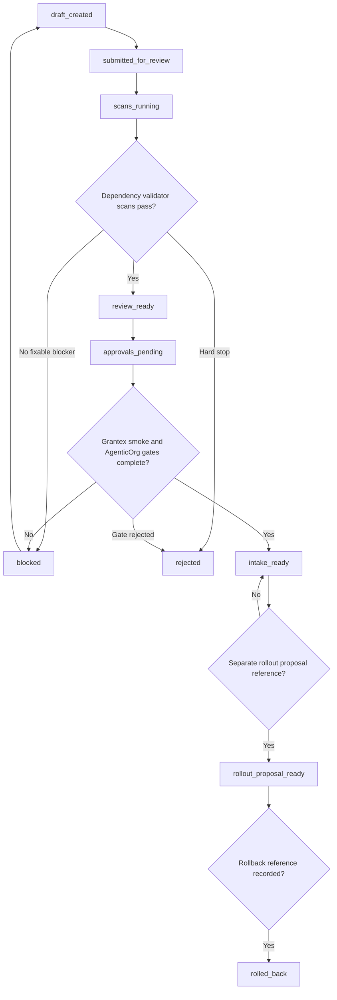

# Commerce Agent C5U Self-Onboarding Review Workflow Implementation Plan

Status: historical planning artifact; superseded by the current OACP runtime path in docs/oacp-end-to-end-flow.md.
Date: 2026-05-26
Scope: future AgenticOrg review workflow implementation plan for merchant
self-onboarding dependency review
Production changes made by this plan: none
Runtime code changed by this plan: no
Workflow code changed by this plan: no
Migrations added by this plan: no
Production config changed by this plan: no
AgenticOrg public commerce discovery changed by this plan: no
Grantex production Commerce V1 changed by this plan: no
Merchant allowlist value approved by this plan: no
Checkout or payment creation changed by this plan: no
Live payment path changed by this plan: no
Live Plural path changed by this plan: no
Named merchant approved by this plan: no
Secrets inspected or changed: no

This C5U record describes a future AgenticOrg dependency review workflow for
merchant self-onboarding. It is not an implementation. It does not add runtime
code, workflow code, migrations, config values, allowlist values, public
commerce discovery, Commerce V1 enablement, checkout/payment creation, live
payments, live Plural, provider credentials, real merchant approval, or rollout
approval.

## Planning-Only Review Workflow Scope

- No runtime workflow implementation.
- No production config.
- No public commerce discovery enablement.
- No real merchant approval.
- No rollout approval.
- No checkout, payment, live payment, live Plural, provider, or broad runtime
  path.
- Review workflow records are conceptual and local-only until a separate
  implementation task is approved.
- Repository-visible data is limited to redacted Grantex summaries, non-secret
  references, role labels, and gated-state summaries.
- Any missing Grantex signal, required review gate, owner assignment, validator
  pass, smoke status, or AgenticOrg approval fails closed.

## Review Gate Model

AgenticOrg depends on Grantex review results plus its own dependency gates.

| Gate | Required decision | Repo-safe record | Blocking condition |
| --- | --- | --- | --- |
| Grantex intake state | intake_ready or rollout_proposal_ready | redacted summary | Grantex intake incomplete |
| Grantex read-only smoke | passed after separate approval | non-secret smoke reference | smoke missing or failed |
| AgenticOrg dependency owner | approved, blocked, or rejected | role label and non-secret reference | dependency owner missing |
| MCP/A2A gated discovery | gated/no-commerce | gated-state summary | metadata exposure requested |
| Security | approved, blocked, or rejected | role label and non-secret reference | unresolved security concern |
| Ops/on-call/support | approved, blocked, or rejected | role label and support posture summary | support owner missing |
| Product wording dependency | approved, blocked, or rejected | redacted wording summary | overclaiming metadata wording |
| Rollback owner | assigned, blocked, or rejected | public-safe role label | rollback owner missing |
| Read-only smoke owner | assigned, blocked, or rejected | public-safe role label | smoke owner missing |
| Evidence retention owner | assigned, blocked, or rejected | public-safe role label | retention owner missing |

Gate rules:

- A gate can be pending, approved, blocked, or rejected.
- Approval references are non-secret references to private systems.
- Placeholders do not count as approval.
- A single blocked or rejected gate keeps AgenticOrg gated.
- AgenticOrg dependency completion does not imply rollout approval.

## Owner Assignment Model

Required roles:

- AgenticOrg dependency owner.
- Security reviewer.
- Ops/on-call/support owner.
- Product wording dependency reviewer.
- Rollback owner.
- Read-only smoke owner.
- Evidence retention owner.
- Grantex intake summary owner.

Role responsibilities:

- AgenticOrg dependency owner reviews Grantex redacted signals and gated-state
  posture.
- Security reviewer confirms no secret, private artifact, raw payload, provider
  credential, or unsafe disclosure is present.
- Ops/on-call/support owner confirms support posture for dependency review.
- Product wording dependency reviewer confirms public metadata wording remains
  read-only and does not overclaim readiness.
- Rollback owner owns AgenticOrg gate disablement or continued gated behavior.
- Read-only smoke owner owns dependency smoke summary review.
- Evidence retention owner owns redacted evidence retention rules.
- Grantex intake summary owner confirms upstream summary is public-safe.

Allowed repo-safe role labels:

- `<AGENTICORG_DEPENDENCY_OWNER_ROLE>`.
- `<SECURITY_REVIEWER_ROLE>`.
- `<OPS_SUPPORT_OWNER_ROLE>`.
- `<PRODUCT_WORDING_REVIEWER_ROLE>`.
- `<ROLLBACK_OWNER_ROLE>`.
- `<READ_ONLY_SMOKE_OWNER_ROLE>`.
- `<EVIDENCE_RETENTION_OWNER_ROLE>`.
- `<GRANTEX_INTAKE_SUMMARY_OWNER_ROLE>`.

Private owner/contact details remain outside repositories. Missing-owner
behavior is fail-closed: AgenticOrg stays gated or blocked and cannot advance
to review-ready dependency posture.

## State Transition Rules

| From state | Allowed next state | Required conditions | Blockers |
| --- | --- | --- | --- |
| `draft_created` | `submitted_for_review` | Redacted dependency packet present. | missing Grantex summary |
| `submitted_for_review` | `scans_running` | Local dependency validator requested. | validator unavailable |
| `scans_running` | `review_ready` | Required dependency scans pass. | any scan blocker |
| `scans_running` | `blocked` | At least one fixable blocker. | missing smoke, missing owner, missing gate |
| `scans_running` | `rejected` | Hard-stop blocker. | secret retained, live/provider path, public discovery request |
| `blocked` | `draft_created` | Submitter or operator updates redacted summary. | blocker still present |
| `review_ready` | `approvals_pending` | AgenticOrg dependency review begins. | missing required gate row |
| `approvals_pending` | `intake_ready` | Dependency gates complete and AgenticOrg remains gated. | missing gate, missing owner, smoke incomplete |
| `approvals_pending` | `blocked` | Fixable gate or owner blocker. | incomplete review record |
| `approvals_pending` | `rejected` | Gate rejection or hard-stop finding. | rejected required gate |
| `intake_ready` | `rollout_proposal_ready` | Separate rollout proposal reference created. | rollout reference missing |
| `rollout_proposal_ready` | `rolled_back` | Later rollback event reference recorded. | rollback owner missing |
| any non-terminal state | `rejected` | Hard-stop condition. | private material, live/provider path, config value |

Terminal states:

- `rejected` is terminal for the current dependency packet.
- `rolled_back` is terminal for a later approved rollout record.

`rollout_proposal_ready` is not AgenticOrg public discovery approval.

## Validator Integration Points

Before submit:

- Validate redacted Grantex summary is present.
- Validate no private material is included.
- Expected blocker codes: `missing_grantex_summary`,
  `private_material_detected`, `secret_detected`.

Before `review_ready`:

- Run all C5T dependency scan categories.
- Expected blocker codes: `overclaim_detected`,
  `production_looking_id`, `synthetic_production_candidate`,
  `config_allowlist_value`, `metadata_not_gated`.

Before `intake_ready`:

- Validate all required AgenticOrg gates and owners.
- Validate Grantex read-only smoke reference is present after separate approval.
- Expected blocker codes: `missing_review_gate`, `missing_owner`,
  `grantex_smoke_missing`, `agenticorg_approval_missing`.

Before `rollout_proposal_ready`:

- Validate dependency state, rollback owner, smoke owner, and evidence retention
  owner.
- Expected blocker codes: `dependency_not_ready`, `rollback_owner_missing`,
  `smoke_owner_missing`, `evidence_owner_missing`.

After rollback:

- Validate rollback evidence summary and gated/no-commerce posture.
- Expected blocker codes: `rollback_reference_missing`,
  `rollback_evidence_not_redacted`, `metadata_still_exposed`.

## Redacted Audit Evidence Behavior

Record:

- Event type.
- Actor role.
- Timestamp reference.
- Decision.
- Blocker code.
- Redacted hash if needed.
- Redacted event summary.
- Metadata exposure, expected `none`.
- Production effect, always `none` in this plan.

Never record:

- Private contracts.
- Private contacts.
- Signed approval records.
- Pricing terms.
- Customer data.
- Secrets.
- Tokens/passports/JWTs.
- Provider credentials.
- Raw payloads.
- DB/Redis URLs.
- Private keys.
- Production config values.
- Concrete allowlist values.

The audit timeline must be append-only in any future implementation. Repository
docs may include only redacted examples and non-secret references.

## Human Approval Recording Rules

- Private approvals stay outside repositories.
- Repository records store only non-secret references and public-safe summaries.
- Placeholders are not approval.
- Approval completion does not imply rollout approval.
- Reviewers are represented by role labels, not private contacts.
- Approval record bodies, signatures, contracts, private emails, pricing terms,
  and sensitive business details are never stored in repositories.
- If any approval reference cannot be represented safely, AgenticOrg remains
  gated until a non-secret reference is supplied.

## AgenticOrg Dependency Review Sequence

1. Grantex review workflow reaches `intake_ready` or
   `rollout_proposal_ready`.
2. A separate approved Grantex read-only smoke task runs and passes.
3. AgenticOrg receives only a redacted Grantex summary and smoke reference.
4. AgenticOrg dependency owner reviews the gated-state summary.
5. AgenticOrg remains gated until separate AgenticOrg approval exists.
6. MCP/A2A public commerce discovery remains disabled during Grantex intake and
   read-only smoke.
7. AgenticOrg rollback/disable path remains independent and can keep or return
   metadata exposure to `none`.

The AgenticOrg workflow cannot create Grantex config or allowlist changes.

## Rollback Coordination

Required rollback roles:

- Grantex read-only discovery rollback owner.
- AgenticOrg rollback owner.
- Evidence retention owner.

Rollback expectations:

- Rollback references are non-secret summaries.
- AgenticOrg can remain gated or return to gated behavior.
- Any later approved metadata exposure can be disabled by a separate rollback
  process.
- Rollback smoke verifies that public commerce metadata is not exposed.
- If rollback owner, rollback reference, or rollback smoke is missing, the
  workflow fails closed.

## Stop Conditions

Stop the workflow if:

- Required review gate is missing.
- Required owner is missing.
- Validator scan fails.
- Private material appears in repository docs.
- Real merchant approval is absent.
- Synthetic value is proposed for real rollout or allowlist use.
- Production config or allowlist value appears.
- Broad Commerce V1, live payment, checkout/payment, live Plural, or provider
  path is requested.
- AgenticOrg public discovery is requested before Grantex read-only smoke and
  separate AgenticOrg approval.

## Mermaid Review Workflow Diagram

## Future Notes

- C5V rollout automation proposal must remain separate from this review
  workflow plan.
- A local-only prototype should precede any runtime implementation.
- No production enablement can occur without separate explicit approval.
- This plan does not approve a merchant, allowlist value, config value, public
  discovery, checkout, payment, live payment, live Plural, or provider path.

## Production Safety Controls

- Grantex remains fail-closed.
- AgenticOrg remains gated.
- No public commerce discovery.
- No broad Commerce V1.
- No checkout/payment creation.
- No live payments.
- No live Plural.
- No provider credentials.
- No synthetic production candidates.
- No production config values.
- No concrete allowlist values.
- No rollout approval from this plan.
