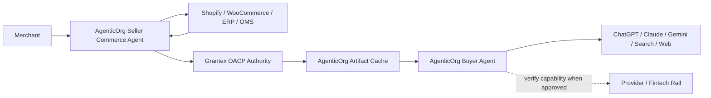
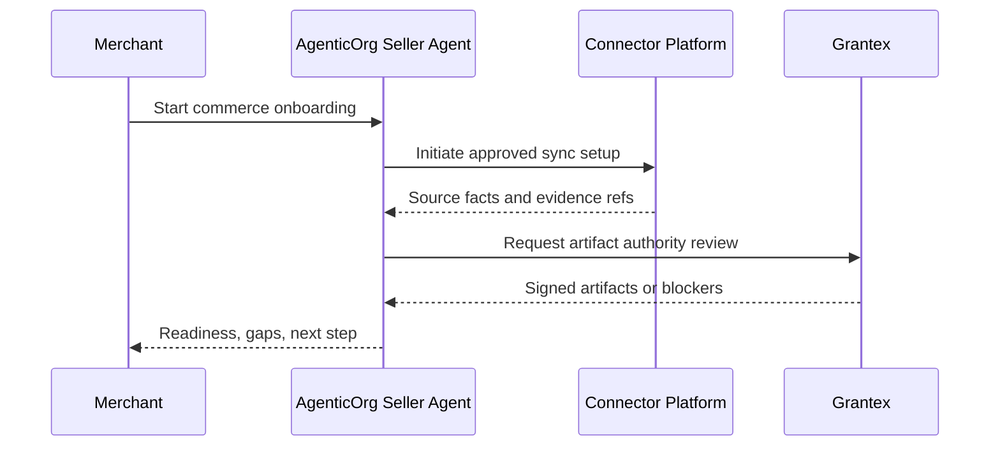
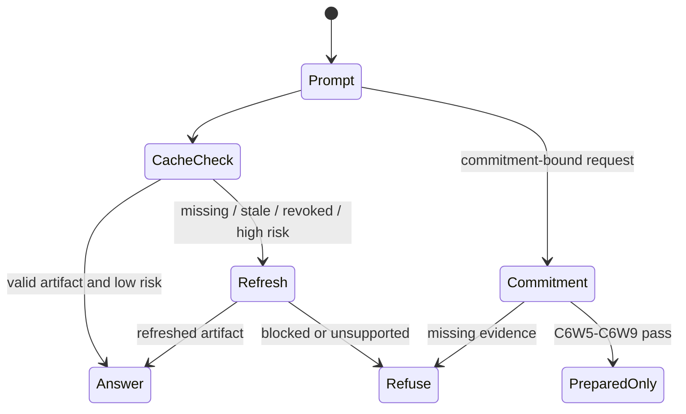
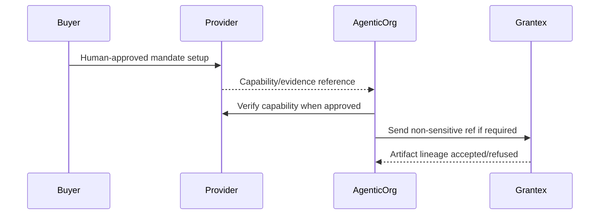

# AgenticOrg OACP Landing Page And Blog Plan

Status: historical internal planning artifact; superseded by the current OACP runtime path in docs/oacp-end-to-end-flow.md.

This document plans how AgenticOrg should explain Open Agentic Commerce Protocol
work without publishing a protocol, enabling public discovery, enabling
checkout/payment, enabling live provider rails, changing production
configuration, or claiming certification/compliance/conformance.

## Corrected Public Position

AgenticOrg is the AI-agent runtime for commerce:

- Seller Commerce Agents onboard merchants and start connector workflows.
- Buyer agents run chat/channel experiences and use OACP artifacts.
- Artifact cache is scoped by buyer agent, seller agent, tenant, and merchant.
- Non-binding discovery can continue from valid cached artifacts.
- Commitment-bound actions require refresh, refusal, or prepared handoff.

Grantex is the trust, protocol, policy, and canonical-artifact authority.
Merchant systems remain operational sources of record. Provider and fintech
rails own mandate and payment execution.

## Current Implementation Summary

AgenticOrg has internal C6W3-C6Z consumer behavior, but the production C6Z
vertical is currently blocked. The June 18, 2026 production run found
Shopify `401 Unauthorized` for the mounted C6Z Shopify token and Grantex
`422 tenant_not_provisioned` for the AgenticOrg-configured internal token.

Implementation status:

| Slice | AgenticOrg behavior | Public posture |
| --- | --- | --- |
| C6W3 | Consumes OACP artifact schemas and public-safe fixtures. | Internal only. |
| C6W4 | Consumes adapter previews without treating them as transaction authority. | Preview only. |
| C6W5 | Classifies non-binding, adjacent, bound, and blocked actions. | Non-executing. |
| C6W6 | Consumes prepared-only envelopes. | Prepared only. |
| C6W7 | Reconciles local/cached response evidence. | Reconciled only. |
| C6W8 | Consumes eligibility/audit packets. | Eligibility only. |
| C6W9 | Consumes dry-run verifier results. | Dry-run only. |
| C6Z | Seller onboarding, Shopify sync path, Grantex authority handoff, 11-family artifact cache, buyer answer, web/OpenAPI/A2A/MCP bridge contracts, WhatsApp/Telegram blocked-missing-credential routes, and Plural/Pine capability verifier. | Implemented locally in the launch-closure branch; full production vertical blocked until valid Shopify and Grantex tenant-token mapping are present. |

## Landing Page Plan

Recommended first viewport:

- H1: "Seller And Buyer Agents For Safe Agentic Commerce"
- Supporting line: "AgenticOrg runs commerce agents that connect merchant
  systems, consume Grantex-signed OACP artifacts, and show source/freshness
  before any commitment."
- Primary CTA: "Explore Seller Commerce Agent"
- Secondary CTA: "Read the OACP trust model"

Sections:

1. Seller Commerce Agent
   - merchant self-serve starts here;
   - connector setup;
   - source/freshness evidence;
   - Grantex authority request.
2. Buyer Agent Runtime
   - ChatGPT-style, Claude/MCP-style, Gemini-style, Perplexity/search-style,
     WhatsApp, Telegram, web, and mobile channel bridges;
   - source/freshness labels;
   - refusal and refresh behavior.
3. Artifact Cache
   - cache per buyer agent, seller agent, tenant, and merchant;
   - TTL and revocation snapshot;
   - risk-tier action gating.
4. Connector Workflows
   - Shopify;
   - WooCommerce;
   - ERP/PIM;
   - OMS/WMS;
   - logistics;
   - support;
   - CSV/API.
5. Mandate Boundary
   - mandates and payment execution belong to provider/fintech rails;
   - AgenticOrg may verify capability where approved;
   - Grantex receives non-sensitive evidence refs only when needed.
6. Current Status
   - C6W9 internal foundation complete;
   - no public discovery, live checkout/payment, or protocol certification.

## Landing Page Visual

## Required Blog Drafts

Each draft must stay non-executing and must include the stated Mermaid diagram.
None may claim certification, conformance, standardization, public discovery,
merchant approval, payment approval, or live-provider readiness.

| Draft | Core message | Required diagram |
| --- | --- | --- |
| How OACP Connects Seller Agents, Buyer Agents, Grantex, Shopify, and Plural/Pine | AgenticOrg runs agents, Grantex issues authority artifacts, Shopify remains source of record, and providers own execution. | Four-party architecture. |
| Why Grantex Is A Trust Authority, Not A Transaction Toll Booth | Valid cached artifacts can support non-binding answers until TTL, revocation, risk, freshness, or commitment boundaries require refresh. | Buyer question through cache. |
| From Shopify To ChatGPT/Claude/Gemini: Buyer-Safe Commerce Through OACP | Shopify read-only sync becomes OACP artifacts consumed through MCP/OpenAPI/channel bridges. | Shopify sync to OACP artifacts plus channel bridge flow. |
| Mandates And Payments In Agentic Commerce: Provider-Owned Execution, Agent-Owned Context | AgenticOrg verifies capability metadata only where approved; providers own mandates and payments. | Mandate capability evidence flow plus refusal/fail-closed flow. |

## Blog Series

| Blog | Core message | Visual |
| --- | --- | --- |
| Seller Commerce Agents: Where Merchant Self-Serve Begins | Merchant onboarding should start in the agent runtime and flow into Grantex authority. | Seller-agent onboarding sequence. |
| Buyer Agents With Source And Freshness Labels | Buyers can trust answers only when agents show where facts came from and when they expire. | Cache/refresh/refusal state machine. |
| Artifact Cache Across Four Scopes | Cache must be scoped by buyer agent, seller agent, tenant, and merchant to avoid cross-context leakage. | Four-scope cache key diagram. |
| Connecting Shopify, WooCommerce, And ERP For Agents | Existing systems stay source of record; seller agents initiate approved sync jobs. | Connector custody and evidence flow. |
| Provider-Owned Mandates | Payment mandates belong with fintech rails; AgenticOrg verifies capability where approved. | Provider capability verification sequence. |
| Channels For ChatGPT, Claude, Gemini, And Search | Different surfaces need different bridges and action labels. | Channel bridge matrix. |
| The Remaining Gap To Autonomous Commerce | C6W9 is a contract dry run, not live execution. | Gap ladder to controlled pilot. |

## Blog Visuals

### Seller Onboarding

### Buyer Cache Decision

### Provider Mandate Capability

## Approval Checklist

- Product approves page copy.
- Legal approves OACP naming and non-standardization language.
- Security verifies no secret, private merchant data, production ID, or raw
  provider payload appears.
- Engineering confirms C6W9 implementation status.
- No claim implies production readiness, public discovery, live checkout/payment,
  live provider rails, certification, compliance, conformance, or merchant
  approval.
- Grantex Commerce payment-control pilot wording remains separate from OACP
  runtime artifact protocol wording.
