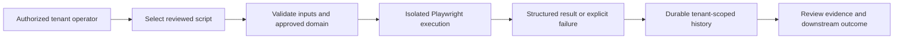

# RPA Runtime

AgenticOrg uses Playwright-based browser automation for bounded tasks on legacy
or web-only systems. RPA is an external action, not a fallback that an agent may
invoke without tenant authorization.

## Shipped Runtime

- Built-in script discovery from `rpa/scripts/`.
- Tenant-scoped script catalog and execution history.
- Explicit script execution through `POST /api/v1/rpa/scripts/{script_id}/run`.
- Tenant-scoped schedules and manual `run now` dispatch.
- Durable execution history with replay-safe state updates.
- Per-run timeout, structured status, result metadata, and safe failure states.
- Screenshots or evidence references where the script supports them.
- Approved-domain egress policy with private, loopback, link-local, metadata,
  and DNS-rebinding protections.

## Runtime Flow

## Safety Boundary

- Listing a script does not authorize execution.
- The operator must intend the external action and supply approved inputs.
- A target domain must pass tenant and network egress controls.
- Credentials belong in the approved secret or connector path, not script
  source, logs, screenshots, or result payloads.
- Browser success does not prove the target business operation succeeded unless
  the target system returns and persists an authoritative result.
- Changes to selectors, target pages, authentication, CAPTCHAs, or provider
  policy can make a script fail. Failure must remain visible and retryable only
  when safe.

## API And SDK Surfaces

| Surface | Purpose |
| --- | --- |
| `GET /api/v1/rpa/scripts` | List available scripts for the authenticated tenant |
| `GET /api/v1/rpa/history` | Read tenant-scoped execution history |
| `POST /api/v1/rpa/scripts/{script_id}/run` | Execute one explicit reviewed script action |
| `/api/v1/rpa-schedules` | Create, inspect, update, delete, or manually dispatch schedules |
| Python and TypeScript SDK `rpa` resources | List scripts/history and make an explicit run call |

Exact request and response contracts come from generated OpenAPI and the
current SDK version.

## Operator Checklist

1. Confirm the target site permits the automation and identify an accountable
   business owner.
2. Approve the exact target domains and credential custody path.
3. Run locally or in an isolated non-production environment with synthetic
   data.
4. Verify success, timeout, target change, authentication failure, blocked
   egress, and duplicate-run behavior.
5. Enable the minimum tenant scope and review schedule frequency.
6. Monitor failure rate, duration, target changes, and evidence retention.
7. Pause the schedule or script when the target contract changes.

See [current product status](PRODUCT_STATUS.md), generated OpenAPI, and the
security guidance in [SECURITY.md](../SECURITY.md).
