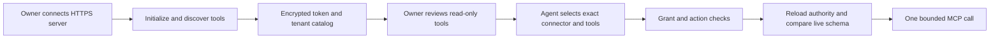

## Connector readiness is more than a green badge

A connector links the agent runtime to a business service. It needs the right tenant/company binding, credentials, provider permissions, tool implementation and operational health. A registered connector or successful health check does not prove that every advertised business action works.

This existing product screenshot illustrates the integration catalog, not live readiness in your tenant.

## Prepare the connection

Name the integration owner and system-of-record owner. Obtain an approved sandbox or read-only account. List the exact data and actions needed. For BFSI, a core banking, LOS, claims or screening service requires the institution's approved API contract and access process; selecting a generic connector does not create that integration.

## Register and bind

1. Open **Connectors**, find the provider in the native catalog, and select **Register**. Use the general **Register Connector** button only for a reviewed custom integration.
2. When native prefill is enabled, confirm the fixed provider name matches the registry entry. Otherwise enter the canonical registry name manually; a display label is not enough.
3. Enter the connector name, reviewed base URL, category, authentication type and rate limit.
4. Use the provider-specific protected credential fields or approved secret reference. Do not put secrets in prompts, screenshots or ordinary task inputs.
5. Review extra JSON configuration against the provider's contract. Do not assume arbitrary configuration creates a tool implementation.
6. Bind the connector to the correct company or documented tenant-wide scope.
7. Run the supported health/test action and inspect the safe result.

The native catalog's **Register** button can prefill the connector's exact registry name, category, endpoint and authentication type when the deployment enables the native-prefill rollout. Check the name before registering; a display label is not the registry ID. An unknown or outdated catalog link is refused rather than creating a generic connector. Without that rollout, the form remains the existing manual registration flow. For the four commonly requested providers, the reviewed credential keys are `access_token` and `phone_number_id` (WhatsApp), `account_sid` and `auth_token` (Twilio), `client_id`, `client_secret` and `refresh_token` (Gmail), and `client_id`, `client_secret` and `merchant_id` (Plural sandbox). A connector may also need provider-side permissions or additional settings. Do not paste real credentials into an issue or test report.

Registration stores credentials in the encrypted connector vault; it does not prove that the upstream account is authorized. A green connection probe proves only the operation it exercised. For external MCP tools, use the dedicated **Remote MCP** path below instead of registering a generic REST connector. Listing tools in another deployment is not evidence that this deployment has the same catalog or permissions.

Customers can bring credentials for their own provider accounts. WhatsApp needs a permitted business token and phone-number ID; Twilio needs an account SID and auth token; the guided Gmail form needs a customer OAuth client plus refresh token; Plural needs merchant-issued sandbox credentials before any live-rail review. The Gmail connection test now reads the authenticated user's profile without returning the mailbox address, and a successful profile check does not authorize sending mail. Register first, run the provider's bounded connection test, then separately prove each intended tool and scope with that customer's approved sandbox account. Leave the connector unverified if consent, scope, or provider access is missing.

The exact credential form differs by provider. Protected storage is not permission to grant unlimited upstream scopes. Prefer read-only scopes for the first pilot.

## Connect a remote MCP server

The server must honor `Accept-Encoding: identity`; compressed responses are
refused to keep the response-size limit effective before decompression.

1. Obtain the server owner's approved public HTTPS **Streamable HTTP** endpoint and bearer token. Use the MCP endpoint itself, for example `https://tools.example.com/mcp`, not a website home page. OAuth consent flows, legacy HTTP+SSE endpoints and local stdio commands are not supported by this incoming connector path.
2. Open **Connectors > Remote MCP**. Enter a unique name such as `mcp_support`, the endpoint and token. Choose **Connect and discover tools**. AgenticOrg performs protocol initialization and paginated tool discovery before saving. A rejected token or incompatible server produces an error; it does not create a healthy connection.
3. Review the discovered descriptions and input schemas with the server owner. Server annotations are hints, not permission. All tools begin as write/unreviewed. Only tools advertised as read-only can be reviewed as reads, and obvious write names remain writes. A remote server can still misrepresent its behavior: register only trusted servers and use minimally scoped provider tokens.
4. Select the read-only tools you have reviewed and choose **Save read-only review**. Run one **Read-only connection probe** with non-sensitive arguments. A successful probe verifies that tool, not every server capability or any real speech/payment provider behind it.
5. In **Create Agent > Behavior**, or **Agent > Config > Edit**, select the remote connector and its exact tools. Save and reload the agent. Names are connector-qualified, such as `mcp_support__search`; a tool from another connection is not interchangeable.
6. Run a company-scoped agent with an appropriate delegated grant. The runtime rechecks persisted ownership, active connector, selected tools and current schema before dispatch. MCP registration and a read probe do not bypass agent grants, operator overrides or action policies.

**Current boundary:** write/unreviewed tools may be selected but remain contained by the platform's action policy. This path does not enable arbitrary messaging, voice replies, payments or destructive actions. Grant labels remain conservatively write-scoped; the reviewed read classification is a separate execution-policy check. Tools and their output are untrusted source data, never instructions to expand permissions.

Use **Refresh** to rediscover a changed server or rotate its token. Unchanged read reviews are preserved; changed tools require another review. If a server changes between discovery and execution, the call is refused with a connection/schema error. Archive the connection to block subsequent calls across workers. A request already sent cannot be recalled by archiving.

Only public HTTPS destinations are permitted: no redirects, IP literals, internal hosts, URL-embedded credentials or query tokens. Requests have bounded durations, arguments, responses and discovery pages. Calls are not automatically retried, because a lost response does not prove an external action failed. Raw credentials are not sent to the model or returned in connector responses. Tenant/company credential bindings and personal connector ownership still apply.

Supported limits: 100 tools across at most 10 discovery pages; a 64-character
connector-qualified tool name; 32 KiB object input schema; 64 KiB arguments;
1 MiB response; 30 seconds for a complete protocol operation. Local JSON pointer
schema definitions are supported within bounded complexity. Recursive/dynamic
references, external references and regex-based schemas are refused explicitly.
Ask the server owner for a bounded compatible schema; do not remove network or
validation protections to make an incompatible server connect.

| Symptom | Next action |
| --- | --- |
| Connection rejected | Check endpoint transport, bearer token, server health and public network reachability |
| Tool not selectable or save rejected | Refresh the catalog and select the tool from the linked connector, not a copied name |
| Changed schema or unavailable tool | Refresh discovery, review permissions again and start a new run |
| Write / approval required | Use an approved governed action integration; a read-only review cannot authorize a write |
| Agent call refused but probe works | Check company binding, selected tools, agent lifecycle, grant and operator policy |

Keep real tokens and private server responses out of screenshots and support issues. Share the request ID, sanitized error and affected tool reference instead.

## Grant the agent only what it needs

Open the agent configuration and select the appropriate connector and **Authorized Tools**. Verify that a permitted read call works for the selected company. Then verify that an ungranted tool and another company's resource are refused. Model access and connector access must be tested independently.

## Validate the real contract

| Check | Evidence to collect |
| --- | --- |
| Authentication | A successful bounded provider request, without logging its secret |
| Scope | Required read/action allowed; forbidden action rejected |
| Mapping | Identifiers, dates, amounts, currencies and pagination are correct |
| Freshness | Timestamp/source state reaches the user-facing output |
| Failure | Rate limit, expired credential and unavailable provider are visible |
| Recovery | Safe retry/idempotency and an accountable escalation path |

Health freshness and credential presence are readiness signals, not an error-budget or sustained-sync guarantee. Run representative volume tests before relying on a connection operationally.

## Maintain and troubleshoot

Rotate credentials through the approved secret path. Re-test after provider API, schema, scopes or tenant-binding changes. Monitor latency, failures and rate limits. Disable dependent schedules when the source contract changes.

If company A works and company B does not, inspect binding before changing the code or copying IDs. If a custom URL is rejected by network policy, have security approve the legitimate endpoint; do not turn off SSRF or private-network protections.

Next: [Workflows](/docs/workflows), [Model setup](/docs/model-setup), [BFSI reconciliation](/docs/bfsi-reconciliation).
