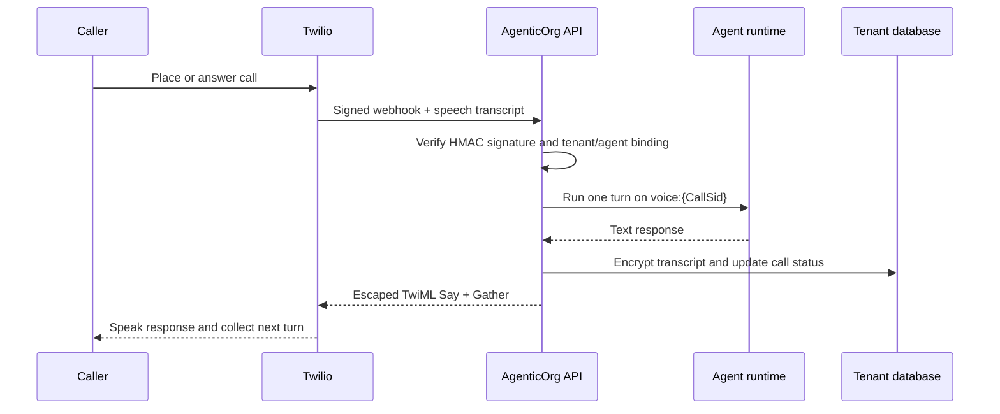

# Voice agent runtime

Status: shipped for the signed Twilio path with provider-managed speech-to-text
and text-to-speech. Tenant provider setup and real call verification remain
configuration-dependent. See [current product status](PRODUCT_STATUS.md).

AgenticOrg voice agents use the same agent prompt, tools, tenant boundary, and
approval controls as web sessions. The first production runtime is a signed
Twilio webhook loop with provider-managed speech recognition and speech
synthesis.

## Call flow

## Setup

1. Open the target agent and choose **Voice Setup**.
2. Select Twilio and enter the account SID, auth token, and Twilio number.
3. Test the provider credentials.
4. Select **Provider speech recognition** and **Provider text-to-speech**.
5. Select the call language and save.
6. Configure the displayed inbound and status callback URLs in Twilio if the
   number is not managed by an automated provisioning process.

The SIP credentials are envelope-encrypted and scoped to the tenant and agent.
The UI only returns masked phone numbers and credential identifiers.

## Runtime API

| Route | Purpose |
| --- | --- |
| `GET /api/v1/voice/runtime/health?agent_id=...` | Truthful provider/STT/TTS readiness |
| `POST /api/v1/voice/calls/outbound` | Admin-initiated real outbound call |
| `GET /api/v1/voice/calls?agent_id=...` | Tenant-scoped masked call history |
| `POST /api/v1/voice/webhooks/twilio/.../incoming` | Signed speech turn webhook |
| `POST /api/v1/voice/webhooks/twilio/.../status` | Signed call lifecycle webhook |

## Privacy and failure behavior

- AgenticOrg does not store call audio or expose transcripts through the call
  history API.
- Conversation text is encrypted at rest and bounded to the most recent turns.
- Full phone numbers are not returned by list APIs.
- Invalid signatures, cross-tenant agents, inactive agents, unavailable
  credentials, and provider failures fail closed.
- A model/tool failure produces a short safe spoken error. It is never reported
  as a successful business action.
- Vonage, custom SIP, local Whisper/Piper, and cloud Deepgram/Azure choices are
  configuration-only until their runtime workers are shipped and health-checked.

## Production verification

Deployment is complete only after migrations run, API and UI health checks pass,
the runtime-health endpoint reports `ready`, a signed inbound test call completes,
an outbound test call completes, and call history shows the real provider status.
Never use an unsigned webhook or synthetic call row as production evidence.

Before a provider canary, run the [local multichannel simulation](local-multichannel-simulation.md).
It executes the signed webhook lifecycle, STT text intake, TwiML TTS response,
encrypted persistence, masking, and tenant isolation against fresh PostgreSQL.
It intentionally does not place a paid call; PSTN/audio quality still needs one
explicitly approved test number and calling window.
