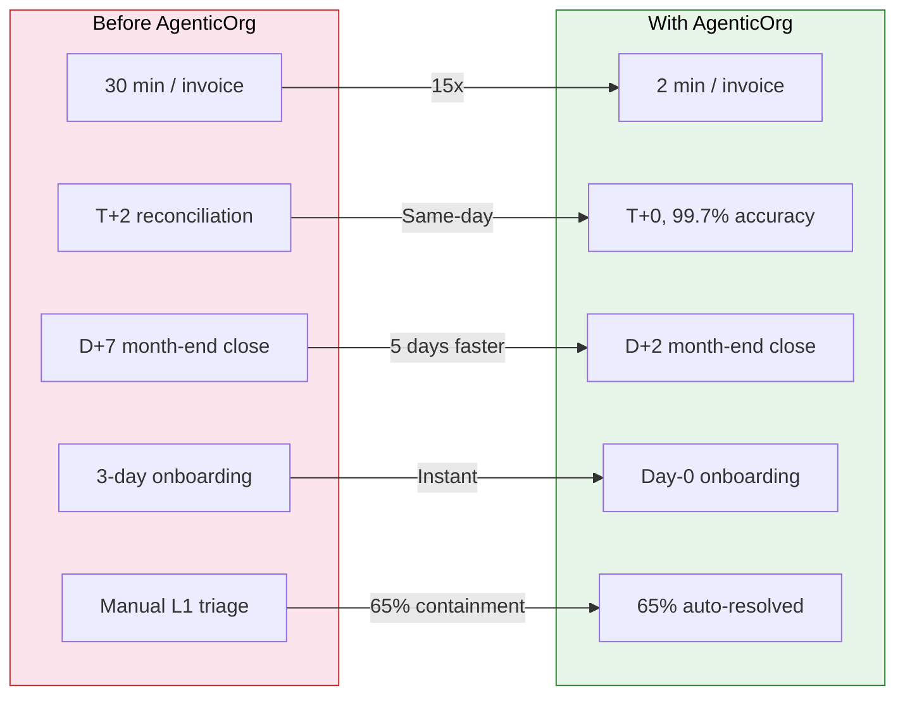
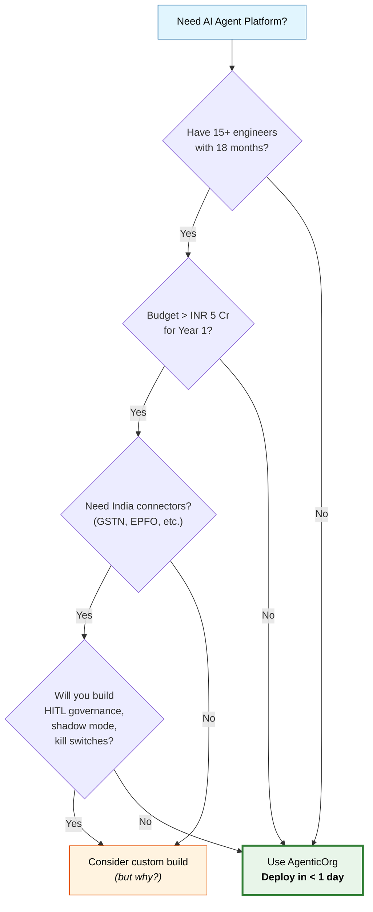
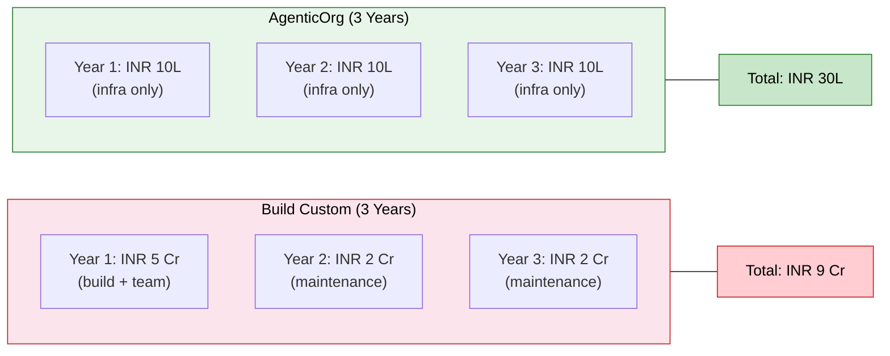
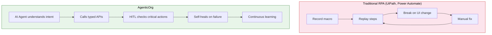
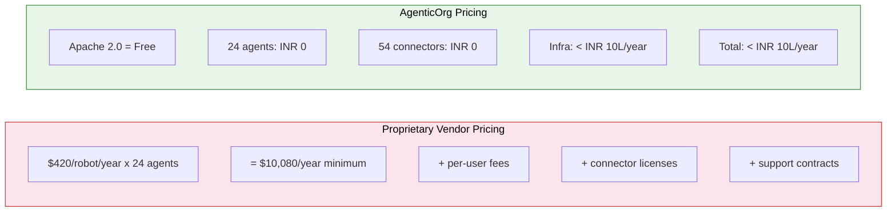
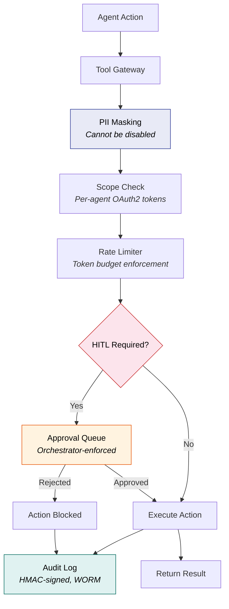

# Why AgenticOrg?

A comprehensive comparison of **AgenticOrg** against manual operations, custom-built solutions, and market competitors. This document is designed for CTOs, CIOs, and engineering leaders evaluating enterprise AI agent platforms.

---

## Table of Contents

1. [AgenticOrg vs Manual Operations](#1-agenticorg-vs-manual-operations)
2. [AgenticOrg vs Build-Your-Own](#2-agenticorg-vs-build-your-own)
3. [AgenticOrg vs Competitors](#3-agenticorg-vs-competitors)
4. [Why Open Source Matters for Indian Enterprises](#4-why-open-source-matters-for-indian-enterprises)
5. [Enterprise-Grade by Default](#5-enterprise-grade-by-default)

---

## 1. AgenticOrg vs Manual Operations

Every enterprise runs hundreds of repeatable processes across Finance, HR, Operations, and Marketing. Here is what changes when AgenticOrg automates them:

| Process | Manual | With AgenticOrg | Improvement |
|---------|--------|-----------------|-------------|
| Invoice processing | 30 min/invoice | 2 min/invoice | **15x faster** |
| Bank reconciliation | T+2, 80% accuracy | T+0, 99.7% accuracy | **Same-day, near-perfect** |
| Month-end close | D+7 | D+2 | **5 days faster** |
| Employee onboarding | 3 days | Instant (Day-0) | **Zero delay** |
| Payroll processing | 2 days | 4 hours | **12x faster** |
| Support L1 resolution | Manual triage | 65% auto-resolved | **65% containment** |
| Vendor onboarding | 3 days | 4 hours | **18x faster** |
| Regulatory filing prep | Manual, risk of missed deadlines | Auto D-7, zero missed | **100% compliance** |

### The Impact at Scale

### Weekly Savings Breakdown

| Department | Weekly Savings | Key Driver |
|------------|---------------|------------|
| Finance | INR 3.2L/week | AP automation, same-day reconciliation |
| HR | INR 1.8L/week | Instant onboarding, payroll in 4 hours |
| Operations | INR 2.1L/week | L1 containment, vendor automation |
| Marketing | INR 0.9L/week | Campaign optimization, content automation |
| **Total** | **INR 8.0L/week** | **INR 4.16 Cr/year** |

---

## 2. AgenticOrg vs Build-Your-Own

Building an AI agent platform from scratch is a common temptation for engineering-heavy organizations. Here is the reality:

| Factor | Build Custom | AgenticOrg |
|--------|-------------|------------|
| Time to deploy | 12-18 months | **< 1 day** |
| Engineers needed | 15-20 full-time | **1-2 DevOps** |
| Cost (Year 1) | INR 3-5 Cr | **< INR 10L** |
| Pre-built connectors | Build each from scratch | **42 pre-built** |
| Compliance | Build from scratch | **SOC2/GDPR/DPDP built-in** |
| AI governance | Design from scratch | **HITL, shadow mode, audit trail** |
| India-specific integrations | Research + build each | **GSTN, EPFO, Darwinbox, Keka, MCA** |
| Maintenance burden | Ongoing team of 5-8 | **Community-maintained, Apache 2.0** |
| Shadow mode for validation | Must architect yourself | **Mandatory, built into lifecycle** |
| Scaling | Custom HPA, load testing | **Auto-scaling with cost controls** |

### Build vs Buy: Decision Flow

### Total Cost of Ownership (3-Year View)

---

## 3. AgenticOrg vs Competitors

| Feature | UiPath | ServiceNow | Power Automate | AgenticOrg |
|---------|--------|------------|----------------|------------|
| AI-native agents | No (RPA bots) | Limited | Copilot only | **24 specialist agents** |
| Open source | No | No | No | **Apache 2.0** |
| Self-hosted | No | No | No | **Yes, your infrastructure** |
| India connectors | Limited | Limited | Limited | **GSTN, EPFO, Darwinbox, Keka, MCA** |
| HITL governance | Basic | Basic | None | **Orchestrator-level, unskippable** |
| Shadow mode | No | No | No | **Mandatory before production** |
| Data sovereignty | Cloud-only | Cloud-only | Cloud-only | **Your infrastructure, your data** |
| Pricing | $420/robot/year | $$$$/year | $15/user/month | **Free (self-hosted)** |
| Kill switch | Restart process | Ticket-based | None | **< 30 sec, token revocation** |
| Audit trail | Limited | Partial | Minimal | **HMAC-signed, WORM, 7-year** |
| LLM backbone | Not AI-native | Limited AI | GPT only | **Claude + GPT-4o fallback** |
| PII masking | Add-on | Add-on | None | **Default-on, zero-config** |
| Multi-tenant isolation | Shared infra | Shared infra | Shared infra | **PostgreSQL RLS, full isolation** |
| Connector count | 400+ (RPA) | 200+ (ITSM) | 600+ (triggers) | **42 deep, typed, India-first** |

> **Note on connector count:** Competitors have more connectors, but they are shallow (trigger/action only). AgenticOrg has fewer connectors but each is deeply typed with circuit breakers, retry logic, and schema validation. Quality over quantity.

### Architecture Comparison

---

## 4. Why Open Source Matters for Indian Enterprises

Indian enterprises face unique regulatory, compliance, and data sovereignty requirements. Open source is not a nice-to-have — it is a strategic imperative.

### Data Stays in India

- Deploy on `asia-south1` (Mumbai) or `asia-south2` (Delhi)
- Full compliance with the **Digital Personal Data Protection (DPDP) Act, 2023**
- No data leaves your VPC — ever
- RBI data localization requirements met by default

### No Vendor Lock-in

- Apache 2.0 license — use, modify, distribute freely
- No per-user pricing that scales against you
- No annual license negotiations
- Switch hosting providers at will
- Fork and customize for your specific needs

### Full Audit Trail for Regulatory Compliance

- Every agent action is logged with HMAC-SHA256 signatures
- WORM (Write Once, Read Many) storage for immutable records
- 7-year retention policy built-in
- RBI audit requirements satisfied out of the box
- SOC2 evidence package endpoint for auditors

### Customizable for Indian Regulations

AgenticOrg ships with native support for India-specific systems and regulations:

| System/Regulation | Integration |
|------------------|-------------|
| **GST (GSTN)** | e-Invoice IRN generation, GSTR-1/2A/3B/9 filing, auto-reconciliation |
| **TDS/TCS** | 26Q/24Q filing, Form 16A generation, 26AS credit check |
| **EPFO** | ECR filing, UAN verification, passbook download |
| **ESIC** | Contribution filing, return generation |
| **MCA** | Annual returns (AOC-4, MGT-7), director KYC, charge satisfaction |
| **DPDP Act** | Automated DSAR (access, erasure, export), consent management |
| **RBI Compliance** | Account Aggregator framework, data localization, audit controls |
| **Darwinbox** | HRMS sync — payroll, attendance, performance |
| **Keka HR** | Payroll, leave, reimbursement, TDS workings |

### Deploy Unlimited Agents — Free

- No per-agent licensing fees
- No per-user seats
- No per-transaction charges
- Your only cost is infrastructure (compute, storage, LLM API calls)
- A mid-size enterprise can run 24 agents for under INR 10L/year total infra cost

---

## 5. Enterprise-Grade by Default

AgenticOrg enforces **10 non-negotiable constraints** that cannot be bypassed, overridden, or skipped. These are architectural guarantees, not configuration options.

### The 10 Non-Negotiable Constraints

| # | Constraint | How It Is Enforced |
|---|-----------|-------------------|
| 1 | **Every agent action is audited** | Append-only audit log with HMAC-SHA256 signatures. No agent can write to the log or delete entries. WORM storage with 7-year retention. |
| 2 | **HITL is orchestrator-enforced** | Human-in-the-loop gates are checked by the NEXUS orchestrator, not by agents themselves. Agents cannot skip, override, or acknowledge their own HITL requirements. |
| 3 | **Shadow mode is mandatory** | Every new agent must run in shadow mode (read-only, outputs compared against reference) before promotion. There is no flag to skip this. |
| 4 | **PII masking is default-on** | All agent inputs/outputs pass through the PII masking layer. Email, phone, Aadhaar, PAN, and bank account numbers are redacted before logging. Cannot be disabled in production. |
| 5 | **Tenant isolation is absolute** | PostgreSQL Row-Level Security on all 18 tables. Redis key namespacing. Cloud Storage prefix isolation. No tenant can access another tenant's data — enforced at the database level. |
| 6 | **Kill switch is instant** | Any agent can be paused in < 30 seconds. Token is revoked immediately, in-flight tasks are cancelled, and a mandatory incident report is created. |
| 7 | **Cost controls are enforced** | Per-agent daily token budgets and per-tenant monthly cost caps. When the budget is exhausted, the agent is auto-paused — not throttled, paused. |
| 8 | **Six quality gates must pass** | Before any agent reaches production: output accuracy >= 95%, confidence calibration r >= 0.70, HITL rate within +/- 5pp, hallucination rate = 0%, tool error rate < 2%, latency <= 1.3x reference. |
| 9 | **Error taxonomy is exhaustive** | 50 typed error codes (E1001-E5005) with severity levels, retry policies, and escalation rules. No generic "500 Internal Server Error" — every failure has a specific code and resolution path. |
| 10 | **Compliance is built-in, not bolted-on** | SOC2 Type II controls, GDPR/DPDP endpoints, RBI audit requirements, and WORM audit storage are part of the core architecture — not optional plugins or future roadmap items. |

### Enforcement Architecture

### Agent Lifecycle Quality Gates

No agent reaches production without passing all six gates:

```mermaid
flowchart LR
    Shadow["Shadow Mode<br/><i>Mandatory</i>"] --> G1["Gate 1<br/>Accuracy >= 95%"]
    G1 --> G2["Gate 2<br/>Confidence r >= 0.70"]
    G2 --> G3["Gate 3<br/>HITL rate +/- 5pp"]
    G3 --> G4["Gate 4<br/>Hallucination = 0%"]
    G4 --> G5["Gate 5<br/>Tool errors < 2%"]
    G5 --> G6["Gate 6<br/>Latency <= 1.3x"]
    G6 --> Production["Production<br/><b>Approved</b>"]

    style Shadow fill:#e1f5fe,stroke:#01579b,color:#000
    style G1 fill:#fff3e0,stroke:#e65100,color:#000
    style G2 fill:#fff3e0,stroke:#e65100,color:#000
    style G3 fill:#fff3e0,stroke:#e65100,color:#000
    style G4 fill:#fce4ec,stroke:#c62828,color:#000
    style G5 fill:#fff3e0,stroke:#e65100,color:#000
    style G6 fill:#fff3e0,stroke:#e65100,color:#000
    style Production fill:#e8f5e9,stroke:#2e7d32,stroke-width:3px,color:#000
```

---

## Summary

| Dimension | AgenticOrg Advantage |
|-----------|---------------------|
| **Speed** | Invoice processing 15x faster, month-end close 5 days sooner |
| **Cost** | < INR 10L/year vs INR 3-5 Cr for custom build |
| **Governance** | 10 non-negotiable constraints enforced at architecture level |
| **India** | Native GSTN, EPFO, Darwinbox, Keka, MCA integrations |
| **Sovereignty** | Self-hosted, data never leaves your infrastructure |
| **License** | Apache 2.0 — free forever, no vendor lock-in |
| **Compliance** | SOC2, GDPR, DPDP, RBI — built-in, not bolted-on |
| **Agents** | 24 specialists + NEXUS orchestrator, ready to deploy in < 1 day |

---

*This comparison is based on the AgenticOrg PRD v4.0 benchmarks and publicly available competitor documentation as of 2025.*
